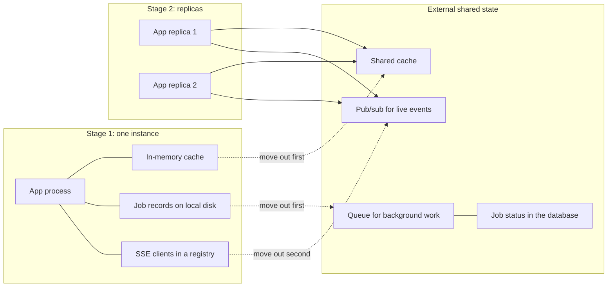

> **Section 06 · Lesson 5** · Level: advanced · ~18 min · Prereq: [Reliability patterns](06-Reliability-Patterns)

## Why this matters

Scaling is usually described as adding machines. Most of the work is removing things that only work while there is one machine: an in-memory cache, a counter, a job record on local disk, a registry of live connections. They stay invisible until you run a second instance, then fail in ways that look like random data loss.

## Scale the boring way first

Reads are cheap to fix without new infrastructure, in this order:

1. **Measure.** Find the slow query or hot endpoint before changing anything. One 20-second dashboard load was three to five sequential queries in one request, not missing hardware.
2. **Cache.** Edge-cache public pages that change rarely, and cache expensive results with a key that includes the tenant and the data version.
3. **Index.** Add indexes for the queries you actually run, verified with `EXPLAIN`.
4. **Batch and collapse.** One endpoint returning a whole screen in a single query beats five round trips; that dashboard was fixed with a snapshot endpoint returning balances, recent items and totals together.
5. **Then add replicas**, only for load that is genuinely concurrent.

Most "we need to scale" problems are a missing index and a serialiser doing N+1 queries.

## In-process state is the trap

Anything held in a process-local variable is a bug waiting for a second instance:

- **Caches** — one platform cached a lookup table in a static field for an hour; with two replicas the caches disagree and answers differ.
- **Counters and rate limiters** — per-process counts are wrong by a factor of the replica count.
- **Job state** — a job started on instance A is invisible to instance B, so a status page reports "unknown".
- **Live connections** — SSE or websocket clients are pinned to the process that accepted them; an event published on instance A never reaches a client on instance B.
- **Local files** — anything written to the container filesystem is gone on redeploy and invisible to every other instance.

State must have an owner outside the process.

## Externalise it



What each move looks like: a shared cache (a Redis-compatible store, or a table with a TTL column if you want no new infrastructure); a real queue, so workers pull work instead of one instance owning it; job status as a database row, written by whoever does the work; and live events on pub/sub — if your database supports `LISTEN`/`NOTIFY` that works with any number of replicas and needs no new service. Keep the call sites identical so the swap is one file.

Sticky sessions look like a shortcut and are not: routing a user to the same instance hides broken state sharing, breaks on redeploy, and buys nothing when that instance dies. Move the state.


## Database scaling

- **Pool the connections.** Serverless and per-request runtimes multiply connections fast. A managed pooler with a small default (one serverless Postgres pooler defaults to about 25 connections per branch) saturates once you run a few replicas — monitor the count and size it deliberately.
- **Index what you run.** Add indexes for your real queries, enable slow query logging, and alert on new slow patterns.
- **Read replicas when reads dominate.** Move analytics and reporting (`SELECT SUM`, `GROUP BY`, exports) off the primary so they stop competing with writes. Analytics blocking payments is a self-inflicted outage.
- **Branch per environment.** Copy-on-write branches give you staging that cannot touch production, and a restore that is a branch.

## Cost-aware scaling

Replicas multiply memory and CPU linearly, so make sure the load justifies them.

- **Serverless versus always-on.** Scale-to-zero is cheap when idle and slow on the first request. If cold starts matter, keep one warm instance and autoscale above it, and never download a model at boot — one app shipped a small local embedding model so cold starts never pulled weights over the network.
- **Size compute to the job.** An embedding workload runs fine on a small instance; the fine-tuning that genuinely needed a GPU cost about $19 in a day, while the serving backend itself was pennies a month. Rent the smallest thing that meets the requirement, and check whether a local CPU model beats a per-call hosted API — for embeddings it often does.

CLI deploys make the resize test cheap:

```bash
railway up --service api --environment staging
```

## Capacity notes

Write a short document: what breaks first at 10x, what you would do about it, the date you checked, and the current limits — replica count, database connection ceiling, per-instance memory, provider rate limits, largest job batch. Revisit it quarterly; the constraint that mattered at launch is rarely the one that bites at 10x.

## Try it

1. Grep your backend for module-level mutable state: `static` fields, module globals, `cache = {}`, in-process event buses.
2. For each hit, decide where that state should live instead and write the one-line change.
3. Run two instances locally against one database, repeat your main flows, and count where they disagree.
4. Run `EXPLAIN` on your three most frequent queries and add the missing indexes.

## Common mistakes

- **A module-level cache** — the second instance serves stale, different data.
- **Sticky sessions instead of shared state** — hides the bug until a redeploy or a dead instance.
- **An in-process event bus for live updates** — clients on another replica never see the event.
- **Adding replicas to fix three sequential queries** — you pay more and stay slow.
- **Renting the largest GPU** — a batch embedding job fits on a small instance; the big one is a recurring bill.

## Key takeaways

- Measure, cache, index and batch before you add a single replica.
- Anything in process memory is a bug once there are two processes; give state an owner outside the instance.
- Use pub/sub or database notifications for live events, and move job status into the database.
- Pool database connections deliberately and move analytics to a read replica.
- Write down what breaks at 10x, revisit it quarterly, and size compute to the job.

## Further learning

- [Deploying with the Railway CLI](https://docs.railway.com/cli/deploying) — deploying and targeting services and environments from a terminal.
- [Neon documentation](https://neon.com/docs/introduction) — serverless Postgres with branching, autoscaling and scale to zero.
- [Postgres on Neon](07-Postgres-On-Neon) — the database side of this lesson, step by step.
- [Cost control for side projects](07-Cost-Control) — keeping replication and GPU time affordable.
