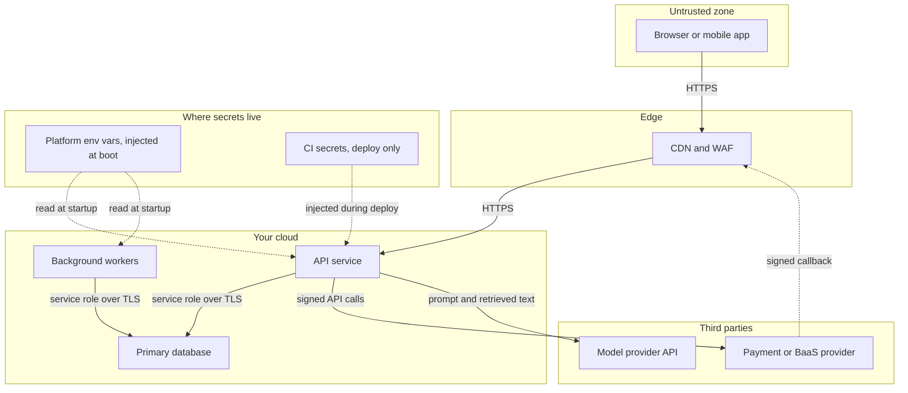

> **Section 06 · Lesson 3** · Level: advanced · ~20 min · Prereq: [Reliability patterns](06-Reliability-Patterns)

## Why this matters

Security architecture is mostly a drawing plus the gates on it: what can talk to what, with which credential, and what happens when that credential leaks. The most damaging bug in a real payments platform was three lines of code — an incoming callback's signature was computed and stored, but the handler ran regardless. A forged callback could mark a payment as paid with no money moving. The check existed. Nobody enforced it.

## Draw the trust boundaries

Start with the diagram, because every rule below attaches to an edge on it.



The drawing forces three admissions: the browser is untrusted, the model provider receives whatever you put in the prompt, and the database is reachable only from your own services. Secrets are not a box on the diagram; they are injected into the boxes at boot and never committed.


## Authentication is not authorisation

Authentication answers "who is this". Authorisation answers "are they allowed to do this, to *this* row, right now". Both run on every request, and authorisation is derived server-side from the session — never from a role or tenant id the client sent.

Sessions and tokens need four properties:

- **Rotation** — refresh tokens rotate on use, so a stolen one is good once.
- **Revocation** — a suspended or closed account loses access immediately, not at the next token expiry.
- **Suspend-aware checks** — re-read the account status in middleware on every authenticated request.
- **Server-side roles** — the capability table lives in the backend, and the client's navigation is only a mirror of it.

A working pattern: terminal provider states and admin lifecycle actions both mirrored status onto the user row and revoked every refresh token, so suspension meant locked out on every device.

## Deny by default at the data layer

Enable row-level security on every table and add **no policies**, which denies all access by default. The backend connects with a service-role credential that bypasses that layer. The browser connects to nothing at all — it only calls your API.

That layout buys three things: no direct client-to-database path to misconfigure, a leaked client key that cannot read any table because no policy grants it, and every access decision in one tier you can review and log. If your framework lets the client library reach the database, this is the rule that makes it safe: the frontend never talks to the database directly.

## Enforce upstream signatures and callbacks

Any endpoint a third party calls into must verify a signature over the raw body before it does anything. Not "compute and log" — enforce, and return early on failure.

```python
raw = await request.body()                      # raw bytes, not a re-serialised dict
if not verify_hmac(raw, request.headers["X-Signature"], key):
    await record_event(raw, handled=False, reason="bad signature")
    return Response("ok", status_code=200)      # still ack, but change nothing
```

Two traps: verify the **raw** body, because re-encoding JSON changes the bytes and the HMAC; and verify responses from the provider too, since a signed request means nothing if you accept an unsigned reply. Make the callback idempotent as well, because providers retry.

## Least privilege and blast radius

Every credential should do one job, for one environment: separate staging and production keys, dedicated deploy tokens instead of personal logins, and scopes trimmed to what the service uses.

Assume each key will leak and ask what it buys an attacker. A deploy token should push a container, not read production data. A model provider key should not also be your database password. Audit environment variables quarterly and delete the sandbox credentials that quietly drifted into production. Write the rotation procedure down: generate, update staging, test one real flow, update production, watch for signature failures.

## Audit logging and PII minimisation

Log the decision, not the customer. A useful audit line records who acted, what they did, which object id, the outcome, and the request id. It does not need a phone number, a full name, or a raw upstream payload.

Two real leaks to avoid: full provider responses written into application logs, and stored raw payloads returned to customers through ordinary endpoints. Strip raw payloads from customer-facing responses, keep them on an admin-only route, and set a retention window that nulls them.

For AI features the same shape applies, plus one more: untrusted text reaching a prompt is untrusted input. Read the OWASP prompt injection guidance, treat retrieved documents and tool output as data that can carry instructions, give tools least privilege, require human approval for destructive actions, and log what the agent actually called.

Nothing here is legal advice. Obligations differ by jurisdiction — read your regulator's official guidance and your provider's security documentation, and verify before relying on it.

## Try it

1. Draw the trust-boundary diagram for your own system and mark the edge you would attack first.
2. Pick one table: enable row-level security with no policies, then confirm the client key gets zero rows while the backend still works.
3. Find a webhook handler. Confirm it verifies a signature over the raw body and returns early when invalid. If it does not, fix it.
4. Grep your logs for a phone number, email, or full name. Remove the field and log an id instead.

## Common mistakes

- **Verifying a signature but not enforcing it** — the check runs, the handler executes anyway. Return early.
- **Trusting a client-supplied role or tenant id** — always derive authorisation from the session server-side.
- **Letting the frontend use a service-role key** — one devtools tab exposes the whole database.
- **One credential for everything** — a leaked key becomes a full compromise instead of a contained one.
- **Logging full upstream payloads** — customer names, phone numbers and internal ids end up in a log store.

## Key takeaways

- Draw trust boundaries first; every access rule attaches to an edge.
- Authenticate and authorise separately on every request, and re-check account status so revocation is immediate.
- Deny by default at the data layer and keep clients away from the database.
- Enforce provider signatures over raw bodies, inbound and outbound.
- Log the decision, not the person, and give every credential the smallest scope that works.

## Further learning

- [OWASP Top 10 for LLM applications](https://genai.owasp.org/llm-top-10/) — prompt injection, sensitive information disclosure, excessive agency and the rest.
- [LLM prompt injection prevention cheat sheet](https://cheatsheetseries.owasp.org/cheatsheets/LLM_Prompt_Injection_Prevention_Cheat_Sheet.html) — concrete defences, including agent-specific ones.
- [Secrets in CI](05-Secrets-In-CI) and [Secrets hygiene](09-Secrets-Hygiene) — where the credentials on the diagram actually live.
- [MCP security risks](08-MCP-Security-Risks) — what changes when your agent is the actor.
