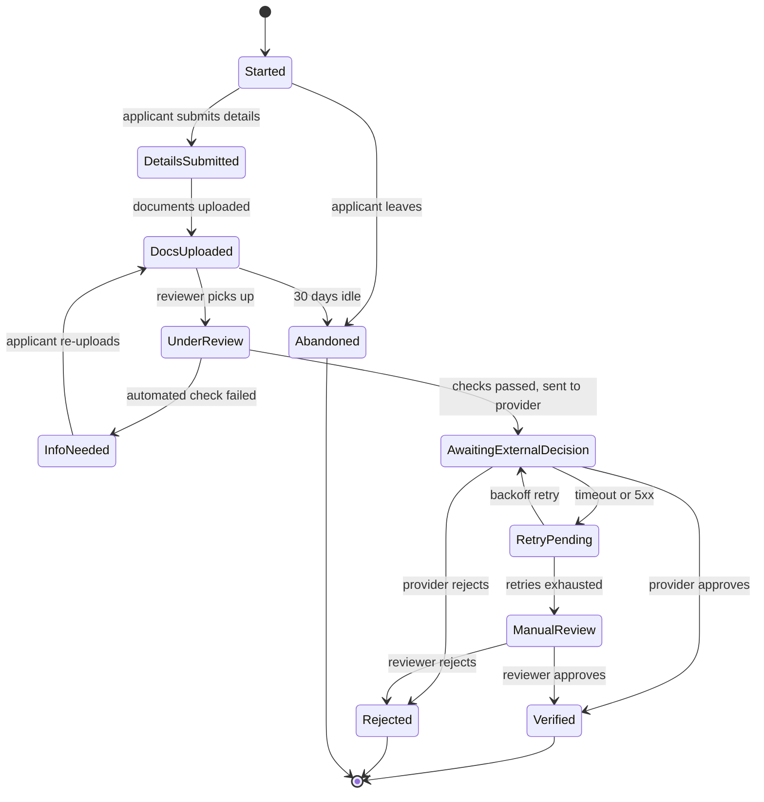

> **Section 06 · Lesson 4** · Level: intermediate · ~20 min · Prereq: [Diagrams as code](06-Diagrams-As-Code)

## Why this matters

Every feature with a status column is a state machine, whether or not you admit it. The only question is whether the machine is written down in one place or scattered across a dozen handlers, each with its own idea of what "pending" means. For flows involving money or identity, that difference is a double payment or a KYC bypass.

## The vocabulary, with a concrete example

Take a signup flow that ends in identity verification. A **state** is a condition the thing can be in, such as `UnderReview`. A **transition** is a movement between states, triggered by an event such as a reviewer approving. A **guard** is a condition that must hold for a transition, such as a verified PIN. A **terminal state** has no exit. An **event** arrives from outside: a person's action, a provider callback, a timer.

Name states after facts, not actions. `AwaitingExternalDecision` is a fact; `Processing` is a guess about what another system is doing, and it will lie to you every time a provider goes quiet.

## Why money and identity flows need one

The same status code can mean different things on different rails: one that means "settled" on one rail means "accepted but not settled" on another, and a third reports rejection with a code another uses for pending. Collapse that into one `status` integer and every report becomes ambiguous, and the bug you cannot reproduce is the one where two rails disagree.

Two more rules were earned the hard way. Terminal states must have consequences: when a provider reports a final rejection, mirror that onto the user record and revoke their sessions in the same transaction, or a rejected account keeps working until its token expires. And retries are normal: a provider that does not recognise your acknowledgement re-delivers the same event until it gets the exact body it expects — one platform saw the same callback five times because it replied with JSON instead of the literal string expected.

## Drawing the unhappy paths

The diagram below is the signup example, with the paths that usually get left out: rework, external timeouts, retries and abandonment. Copy the shape and replace the names.

Notice what the picture buys you: `RetryPending` is a state, not an exception, so a job can find everything stuck in it.

## From diagram to code

Write the transition table next to the diagram. This one ships as documentation and as a test fixture.

| State | Who may move it | Allowed transitions |
|---|---|---|
| `Started` | applicant | submit details, abandon |
| `DetailsSubmitted` | applicant | upload documents, abandon |
| `UnderReview` | automated check, reviewer | request more info, send to provider |
| `InfoNeeded` | applicant | re-upload |
| `AwaitingExternalDecision` | provider callback, retry worker | verified, rejected, retry |
| `RetryPending` | retry worker | retry, escalate to manual review |
| `ManualReview` | reviewer | approve, reject |
| `Verified`, `Rejected`, `Abandoned` | nobody | terminal |

Then implement one transition function that takes the current state, the event and the actor, checks the table, and returns either the new state plus who changed it, or a `409` with the current state. Nothing else writes the status column, and guards live in the same function.

Two rules keep the table honest. A database `CHECK` constraint limits the column to known states, so a typo cannot invent one at runtime, and an events table — state, event, actor, timestamp — answers "how did this end up rejected?" without replaying logs.

## Idempotency: making a repeat safe

A retried transition must not move money twice. The mechanism that works is an atomic claim: `INSERT INTO idempotency_keys (key, request_hash) VALUES ($1, $2) ON CONFLICT DO NOTHING RETURNING id` gives exactly one caller a row and the loser a `409`, closing the gap between "I checked for duplicates" and "I inserted".

Deleting the claim on timeout invites a second transfer, because the provider may have executed the first one already: mark the claim ambiguous and reconcile against the provider's ledger instead. Reusing a key with a *different* body must return `422` rather than overwriting the stored hash and re-executing.

The same discipline applies to the interface: a router with two state gates, one sending locked sessions to a screen and one sending un-onboarded users elsewhere, deadlocked into an infinite redirect.

## Try it

1. Pick a feature with a `status` column and write its `stateDiagram-v2`, including retries, timeouts and abandonment.
2. List every place that writes the column, for example with `rg "UPDATE .* SET status|status =" src/`.
3. Write the transition table as a parameterised test, then replace the direct writes with one transition function that returns `409` and the current state when the move is not allowed.

## Common mistakes

- **A status column with no constraint.** Free-text status means a typo creates a state your code has never seen.
- **No distinction between "waiting for them" and "waiting for us".** Both look like pending, so nobody knows what to chase.
- **Deleting an idempotency claim on timeout.** The provider may have already acted. Mark it ambiguous and reconcile.
- **Treating a re-delivered callback as an error.** Duplicate delivery is normal for webhooks; make the handler idempotent.
- **Terminal states with no side effects.** If rejection revokes nothing and abandonment never expires, the pending queue grows forever.

## Key takeaways

- States are facts, transitions are events with guards, and terminal states need consequences.
- Draw the unhappy paths — retries, timeouts, duplicate callbacks, abandonment — before writing code.
- Ship a transition table with the diagram, then implement exactly one function that may change the state.
- Make every transition idempotent with an atomic claim, and never delete a claim because a call timed out.
- One provider code can mean different things on different rails, so keep your own state explicit.

## Further learning

- [Reliability patterns](06-Reliability-Patterns) — retries, timeouts, circuit breakers and why ambiguity is worse than failure.
- [Data modeling basics](06-Data-Modeling-Basics) — status constraints, events tables and migration-safe schema changes.
- [API design basics](06-API-Design-Basics) — returning meaningful conflict responses instead of silent success.
- [Diagrams as code](06-Diagrams-As-Code) — Mermaid syntax for the diagrams on this page.
- [Test pyramid in practice](10-Test-Pyramid) — where the transition-table test belongs and what it protects.
