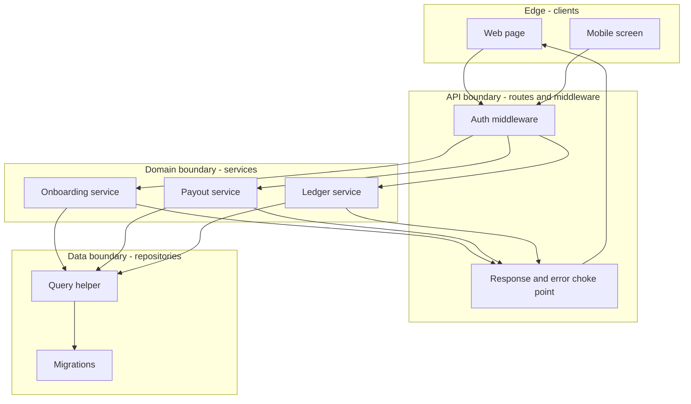

> **Section 06 · Lesson 2** · Level: intermediate · ~18 min · Prereq: [Why architecture before code](06-Why-Architecture-Before-Code)

## Why this matters

A boundary is a place where you can change what is inside without touching what is outside. Without one, every change becomes a search party: you grep for a rule, find four copies, and hope you found them all. A crossing is the only place you have to check, which is why boundaries are where bugs go to die.

## What a boundary is

Three words describe the same idea at different scales.

- A **module** is a group of files that change together and are used through a small surface.
- A **layer** is a module defined by its job: interface, API, domain rules, data access.
- An **interface** is the exact contract at the edge: a function signature, a route plus its request and response shape, a table with its columns and constraints.

The interface is what matters, because it is the only part anyone else may depend on. If swapping your database library forces edits in your screen code, the boundary is decoration.

## Cohesion and coupling in plain language

**Cohesion** asks whether the things inside a module belong together; **coupling** asks how much one module knows about another. You want high cohesion and low coupling, and the practical test is: *how many reasons does this have to change?* A file with one reason to change is a module. A 3,000-line service that owns onboarding, payouts, reconciliation and search has four, which is why every test must mock the whole thing.

The one-reason-to-change test also tells you when to split: not at an arbitrary line count, but when you catch yourself writing a comment to keep two jobs in one file apart.

## The single choke point

The cheapest boundary is one you cannot bypass. In the payments platform, every response, every outbound error and every database call went through one place, so a fix landed everywhere at once.

Three real outcomes came from that shape:

- Response keys were converted from database naming to client naming in the choke point. One route that returned a raw row skipped it, so the app showed "no data yet" while the API returned `200`.
- Transport failures became domain errors in one mapper, instead of a generic 500 for every timeout.
- A placeholder-translation guard lived inside the one query helper. A bug there — parameters bound in the wrong order — silently dropped every provider callback and broke search on four screens; fixing it once fixed all of it.

The counter-example is the lesson: the same platform kept its permission map in two places — server enforcement and client navigation — and they drifted. Two homes for one rule means one home is wrong.

## Interface first, then implementation

Write the contract before you prompt the agent: the route, the request body, the response body, the table columns, the error codes. Commit that skeleton. Then ask for the implementation.

Agents fill in whatever is missing, differently every time. A stated interface turns "invent something plausible" into "satisfy this shape", and gives the reviewer something to check the diff against.

## Where agents break boundaries

- **Duplicated logic.** Asked to add validation, an agent often copies an existing function instead of importing it; one research assistant's agent re-read existing classes as a specification and generated them again. Name the canonical module in your instructions.
- **Service monoliths.** Agents append to the nearest large file because it already has the dependencies they need. Say where the new code belongs before they start.
- **Business rules leaking into the interface.** Client-side validation is a courtesy; the server is the enforcement boundary. Share the rules where you can, but never let the interface be the only check.
- **Silent bypasses.** If the choke point is optional, some route will skip it. Make the helper the only way.

## Try it

1. Draw four boxes for your project in mermaid: edge, API, domain, data.
2. Find the response paths that bypass your shared response helper, for example with `rg "Response.json|jsonResponse" src/`. Anything that skips it is a boundary hole.
3. Pick one rule that exists in two places and move it to one, with a test that fails if the values diverge.
4. Before your next feature prompt, write the interface file — types and signatures only — commit it, and tell the agent to implement against it.

## Common mistakes

- **A layer that leaks.** Returning a database row object straight out of an API handler means the caller now depends on your tables. Convert at the boundary.
- **"Shared utils" as architecture.** A folder that everything imports is not a module; it is a dependency everyone has and nobody owns.
- **A choke point with an opt-out.** If bypassing it is a one-line import, it is not a boundary. Make the bypass impossible or make it fail loudly.
- **Splitting by file size instead of reason to change.** Twelve files sharing one mutable helper is not a boundary.
- **Trusting the interface to enforce.** Client validation never replaces a server check, and it never replaces a database constraint.

## Key takeaways

- A boundary is where you can change the inside without touching the outside, and it is the only place you must check.
- Test modules with "how many reasons does this have to change?" — one reason means one module.
- Route every response, error and database call through a single choke point, and make bypassing it impossible.
- Define the interface and commit it before the agent implements, so the agent satisfies a shape instead of inventing one.
- Watch the three agent tells: copied logic, one giant service, and business rules enforced only in the interface.

## Further learning

- [Building effective agents](https://www.anthropic.com/engineering/building-effective-agents) — workflows versus agents, and why the simplest composable structure usually wins.
- [Anthropic engineering](https://www.anthropic.com/engineering) — further writing on structuring systems that an agent operates inside.
- [Diagrams as code](06-Diagrams-As-Code) — the next lesson: drawing the boundaries so they are reviewable.
- [API design basics](06-API-Design-Basics) — where the interface contract becomes a real specification.
- [Keeping diffs small](03-Keeping-Diffs-Small) — why boundary-sized changes are the ones a reviewer can actually verify.
