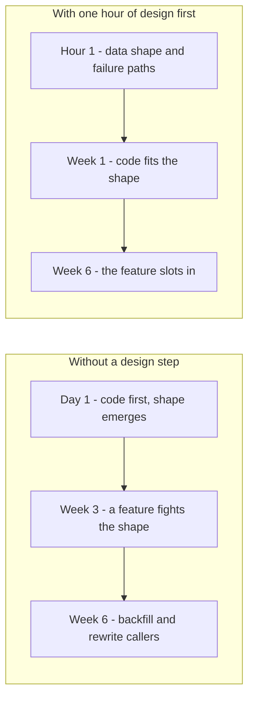

> **Section 06 · Lesson 1** · Level: beginner · ~12 min · Prereq: [Plan mode and spec-driven development](03-Plan-Mode-And-Spec-Driven-Development)

## Why this matters

An agent can write a working feature faster than you can read it. The slow, expensive part of software is no longer typing the code — it is choosing the shape the code lives in. This page is about the hour of thinking that removes a week of rework.

## Code got cheap, structure did not

Give an agent a vague prompt and it will produce a plausible file layout in seconds: internally consistent, and wrong for next month, because it optimised for the sentence you wrote rather than the migration you will run in March. Writing code is the cheap step now. Deciding where the boundaries go, what the data looks like, and what happens when a provider times out is still expensive, and still yours.

The test for whether something is architecture: what does it cost to change later? Renaming a local variable is free; adding an index is cheap; changing the column every integration treats as the tenant key is a week of backfill and release coordination.

## What an architecture decision actually is

An architecture decision is a choice that is expensive to reverse. That definition is useful because it tells you what to ignore. You do not need a written decision for your HTTP client library. You do need one when:

- a column decides which customer owns a row, and whether every table carries it;
- money is stored as an exact decimal or as a floating-point number;
- a business rule is enforced on the server or only in the interface;
- a call to an outside provider is synchronous or queued;
- a status field has a legal set of values and a legal set of transitions.

Each of those lands in the database, the API contract, or both. Those are the places where changing your mind costs more than typing — which is exactly why they deserve a written decision ([Architecture decision records](06-Architecture-Decision-Records) shows the format).

## The cost curve

The cost of a change is not flat. It starts near zero on day one and climbs steeply once real data exists, an outside integration points at your API, and other people have built on your assumption.

The left lane is the same project without the one-hour design step. Nothing breaks on day one, which is what makes it tempting. The bill arrives at week six, when the feature you want needs the shape you did not choose, and the cheapest fix is a migration with a backfill on a live table.

The bill is not only rework. A structure nobody decided has no owner, so each new session re-invents it.

## Right-sizing the rigour

Little architecture for little products. A weekend script needs a paragraph at the top of the README and one diagram. A flow that moves other people's money needs a written decision, a state machine, and a migration that lands before the code that reads it. Ceremony should track two things: how expensive it is to be wrong, and how many people or agents will touch the area without being in the room when you decide.

Beware the opposite failure. Birgitta Böckeler's survey of spec-driven development tools (Martin Fowler's site, October 2025) found the most elaborate tools generated a lot of documents for a human to review. Start with a paragraph and a diagram; add structure when you feel the pain it removes.

## Try it

1. Pick the next feature you were about to prompt an agent with.
2. Spend twenty minutes writing `docs/design/<feature>.md`: the data shape, the boundaries it touches, and the two most likely failure paths.
3. Do not write code yet. Paste the note into the agent and ask: "What is wrong with this design, and what would be expensive to change in three months?" Correct the note, commit it, then start the feature from it.
4. Correct the note, commit it, then start the feature from the corrected version.

## Common mistakes

- **Designing everything up front.** A three-week architecture phase before the first line of code is a failure the industry already paid for. Design the slice you are about to build, not the platform.
- **Calling every choice architecture.** If nothing is expensive to reverse, there is nothing to slow down for. Be honest about which choices are one-way doors.
- **Reviewing structure after the agent wrote it.** The agent will happily generate a schema. If you never said what shape the data must have, you are reviewing a guess with two thousand lines of code attached.
- **Designing in your head only.** A design that lives in one chat session dies with the session, and the next agent starts from zero.

## Key takeaways

- Agents made code cheap. Structure, data shape and failure behaviour are still expensive.
- An architecture decision is a choice that is expensive to reverse. Those are the only ones worth writing down.
- The cost of a change climbs with time and data, so move the expensive decisions earlier, where they are cheap.
- Match rigour to stakes: a paragraph for a script, a decision record and a state machine for money and identity.
- Write the design into the repository, where the next session can find it.

## Further learning

- [Understanding spec-driven development: Kiro, spec-kit and Tessl](https://martinfowler.com/articles/exploring-gen-ai/sdd-3-tools.html) — what the SDD tools actually produce, and where they overload review.
- [Spec-driven development with an open source toolkit](https://github.blog/ai-and-ml/generative-ai/spec-driven-development-with-ai-get-started-with-a-new-open-source-toolkit/) — GitHub's guide to writing a spec before code.
- [Spec-driven development: from code to contract](https://arxiv.org/html/2602.00180v1) — the academic framing of specs as the primary artifact (as of 2026).
- [Thinking in boundaries](06-Thinking-In-Boundaries) — the next lesson: what a boundary is and how to find yours.
- [Anthropic engineering](https://www.anthropic.com/engineering) — patterns for systems where the model, not the code, makes decisions.
