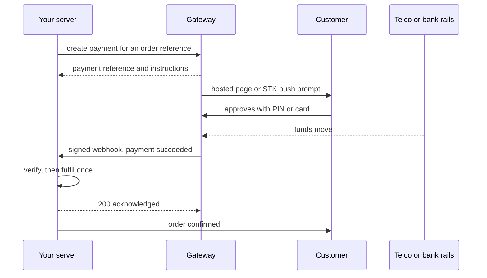

> **Section 7 · Lesson 12** · Level: intermediate · ~25 min · Prereq: [Environments and promotion](07-Environments-And-Promotion)

## Why this matters

The first time a project takes money, the tutorial you find assumes a gateway you cannot use. As of 2026, Stripe is not directly available to businesses in Kenya, so your customers pay with mobile money and local cards. Gateway choice is a business decision before a technical one — and the integration has a shape you can learn once.

## The local reality, stated plainly

The practical gateways are Paystack, Flutterwave, Pesapal and M-Pesa through Safaricom's Daraja API. Which you can use depends on things outside your code: a registered business, the documents it lets you submit, and the currency you settle into — a Kenyan bank or one abroad. Check eligibility first: a gateway you cannot be onboarded to is not a gateway. Fees, settlement timing and documents change, so read the gateway's own docs, never a blog post — including this one.

## The shape every integration shares

Every hosted payment flow is the same six steps.

1. **Create the payment.** Your server asks the gateway for a payment against an order reference and an amount. Not the browser — the customer must not be able to edit it.
2. **The customer pays.** A redirect to a hosted page, or a prompt pushed to their phone (an STK push) which they approve with a PIN.
3. **The gateway calls your webhook.** When the money moves, it sends a signed HTTP request to a URL you registered.
4. **Verify.** Check the signature, amount and currency before you believe the payload.
5. **Fulfil exactly once.** Mark the order paid and deliver what the customer bought.
6. **Reconcile.** Compare your records against the gateway's and the money in your bank.

Neither the redirect nor the phone prompt proves payment. In the loop below, the arrow that matters arrives uninvited.



## Webhooks are the source of truth

The browser callback is a hint; the webhook is the claim you act on.

**Verify the signature.** Compute the gateway's signature over the *raw* request body with the shared secret and compare. Most frameworks parse the JSON first, changing the bytes and breaking the comparison — read the raw body. An unverified body is an attacker telling you an order was paid.

**Fulfil idempotently.** A customer can pay twice, the gateway can deliver the same event twice, and your retries can run again. A unique constraint on the payment reference is what makes "exactly once" true.

```python
import os
from myapp.db import execute

GATEWAY_SECRET = os.environ["PAYSTACK_SECRET_KEY"]  # sandbox value locally, live value from the secret store

def handle_webhook(raw_body: bytes, signature: str):
    if not verify_signature(raw_body, signature, GATEWAY_SECRET):
        return 401, "bad signature"

    event = parse(raw_body)  # reference, amount_minor, status, currency
    inserted = execute(
        "INSERT INTO fulfilment (reference, amount_minor, status)"
        " VALUES (%s, %s, 'paid') ON CONFLICT (reference) DO NOTHING",
        (event.reference, event.amount_minor),
    )
    if inserted.rowcount == 0:
        return 200, "already fulfilled"  # a duplicate delivery, not an error
    ship_the_order(event.reference)
    return 200, "ok"
```

The `DO NOTHING` is the trick: the database decides who wins, and the loser returns 200 so the gateway stops retrying.

## Sandbox keys versus live keys

Every gateway gives you two sets of credentials: sandbox exists to be broken, live moves real money.

- **Environment variables, never code.** Locally a gitignored `.env`; in CI and production, the platform's secret store — see [Secrets hygiene](09-Secrets-Hygiene).
- **The frontend never holds a secret key.** A publishable key in the browser is normal; anything that creates a payment or verifies a webhook stays server-side.
- **Prefixes and dashboard mode.** Sandbox and live keys usually differ by a prefix and the dashboard shows the mode you are in. Read the current pattern from the docs, and log your own mode (`"sandbox"` or `"live"`).

## Sandbox to production

Test with the sandbox test numbers and cards the gateway documents, then walk every failure path.

| Check | What proves it |
|---|---|
| Happy path | One order, paid end to end, fulfilled once |
| Double delivery | Same webhook resent, one fulfilment row |
| Customer cancels | STK push ignored, order stays unpaid, customer is told what happened |
| Insufficient funds | Recorded as failed, not pending forever |
| Reconciliation | A join from orders to payments finds no gaps |
| Logging | Card and phone numbers absent from your logs |
| Refunds | The path a refund takes, and who presses the button |
| Ownership | A named human is paged when reconciliation shows a gap |

The reconciliation query is the one people skip.

```sql
SELECT o.reference, o.amount_minor AS expected, p.amount_minor AS settled, p.status
FROM orders o
LEFT JOIN payments p ON p.reference = o.reference
WHERE o.created_at > now() - interval '2 days'
  AND (p.reference IS NULL OR p.status <> 'paid' OR p.amount_minor <> o.amount_minor);
```

Promotion follows [Environments and promotion](07-Environments-And-Promotion): swap the key in the production secret store, re-run the smoke tests from [Integration and smoke tests](10-Integration-And-Smoke-Tests), then take one small real payment. Know who owns the alert and what [rollback](07-Rollbacks-And-Incidents) looks like; the [payments case study](14-Case-Study-Payments-Platform) prices reconciliation as an afterthought.

## Try it

1. Pick one gateway, read its acceptance documentation, and write down who is eligible and what currency you settle into.
2. Create the sandbox account and two tables, `orders` and `payments`, keyed by your own reference, with a unique index on the payment reference.
3. Send yourself a test webhook twice. Confirm the second delivery returns 200 and creates no second fulfilment.
4. Change one byte of the body and confirm your handler rejects it with 401.
5. Put the key in `.env` locally and your host's secret store for staging, then run the reconciliation query against staging.

## Common mistakes

- **Trusting the browser redirect.** The customer lands back on your "payment successful" page and you mark the order paid; anyone can load that URL. Fulfil on the webhook only.
- **No idempotency.** Two deliveries become two fulfilments, and you owe a refund for a shipped order.
- **A secret key in frontend code.** One `curl` of your bundle hands an attacker live credentials.
- **Ignoring failed or duplicate webhooks silently.** A duplicate is noise; a failure is a signal. Log both with the reference and alert on repeats.
- **Promoting to live without a reconciliation check.** It works until the numbers disagree a week later, with no query to show which order drifted.
- **Testing only the happy path.** Sandboxes exist so you can cancel a prompt and trigger insufficient funds.

## Key takeaways

- Gateway choice follows business registration and settlement currency: Paystack, Flutterwave, Pesapal or Daraja.
- Every flow is create, pay, webhook, verify, fulfil once, reconcile. Learn the shape, not the SDK.
- The webhook is the source of truth; verify the signature over the raw body.
- A unique constraint on the payment reference makes fulfilment idempotent.
- Secrets live in the environment or the platform's store, never the repo or the frontend.
- Do not promote to live until reconciliation returns empty and a human owns the gap.

## Further learning

- [Paystack: accept payments](https://paystack.com/docs/payments/accept-payments/) — the create-payment-then-webhook flow in one vendor's vocabulary.
- [Flutterwave developer documentation](https://developer.flutterwave.com/docs/) — a second vendor covering cards, mobile money and settlement.
- [Pesapal developer portal](https://developer.pesapal.com/) — Kenyan-focused API reference and checkout flow.
- [Safaricom Daraja portal](https://developer.safaricom.co.ke/) — M-Pesa APIs including STK push. Slow to load; link the root, since deep console paths move.
- [Secrets hygiene](09-Secrets-Hygiene) — where sandbox and live keys live.
- [Privacy and compliance basics](09-Privacy-And-Compliance) — what you may log and keep when money moves.
