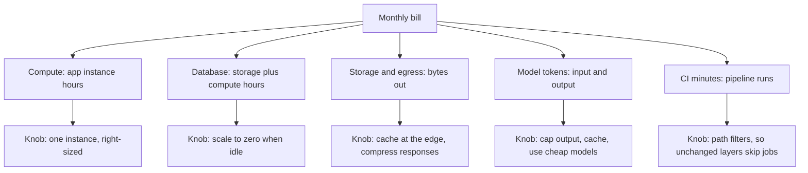

> **Section 07 · Lesson 8** · Level: intermediate · ~15 min · Prereq: [Environments and promotion](07-Environments-And-Promotion)

## Why this matters

Small projects do not die from a bill they saw coming. They die from a bill they did not see: an unattended GPU job, a free tier that expired mid-month, a workspace spending cap that trips and disables everything at once. The fixes are cheap and boring — a limit, an alert, one instance instead of three, a cache. None of them help if you set them up after the first surprise.


## Know where the floor is

Write down four numbers per service: the free allowance, the first paid tier, the price per unit after that, and the metric that unit is measured in (GB-months, requests, tokens, minutes). Providers publish all four.

Then set two things **before** you need them: a **spend limit** (a hard cap) and an **alert** at, say, 50% and 80% of it. Treat the alert as a product feature, not admin. A shared workspace hit its monthly spend cap once and the platform **disabled serving for every app in it** — including one whose own usage was about ten cents for the month. The budget had been eaten by unrelated experiments. Nothing about that app was expensive; the workspace was. Know what shares a cap with you, and never let something you care about share one with something you do not.

## Cheap by design

The largest savings come from architecture, chosen before launch:

- **Scale-to-zero databases** for side projects. Idle time should cost storage, not compute.
- **One instance.** A second replica doubles compute for capacity you probably do not have traffic for.
- **Compute sized to the job.** A small always-warm box can cost more per month than a larger occasionally-warm one. For GPU work, pick the model that fits.
- **Batching and caching.** Batch endpoints are commonly half price and cached input tokens commonly a tenth; a response cache hit costs no tokens at all.
- **Cheap models for mechanical work.** Classification, extraction and formatting do not need your best model.

## Cost telemetry: per request, not per month

A monthly total tells you that you spent money. It cannot tell you whether you are getting value. Track cost per unit of work instead:

```sql
-- cost per answered query, from your own telemetry
SELECT date_trunc('day', created_at) AS day,
       count(*)                                     AS queries,
       sum(prompt_tokens + completion_tokens)       AS tokens,
       round(avg(estimated_cost_usd), 5)            AS avg_cost_per_query,
       round(sum(estimated_cost_usd), 2)            AS daily_cost
FROM query_logs
WHERE created_at > now() - interval '14 days'
GROUP BY 1 ORDER BY 1 DESC;
```

One team measured a median of roughly **$0.0017 per uncached query** on a small RAG pipeline (measured in 2026, provider pricing from the same month). Two details are worth copying. Their first estimate was about **2× too low**, because averages had been diluted by cache hits — measure cached and uncached cost separately or you will under-plan. And the strongest lever was **answer length**, not question difficulty: cost tracked output tokens, so a medium question with a long answer cost more than a "hard" question with a shorter one. Capping output cut cost and latency together.

Your numbers will differ. The method transfers: log tokens and an estimated cost per request, then read the distribution rather than the mean.

## The stack, layer by layer



Two layers get forgotten because they are invisible until they bite. Egress appears only under heavy traffic. CI minutes appear only when a pipeline runs four jobs for a documentation-only change — a path filter that skips the database and API jobs when only the frontend changed is one of the highest-value lines in a workflow file.

## When to stop optimising

Stop when the bill is a predictable fraction of revenue (or of what you would pay for a tool doing the same job), when further savings cost engineering time worth more than the dollars saved, and when the thing you would remove is what provides resilience — the backup, the second environment, the monitoring. Expensive is fine when the product pays for itself. Write it down: "we accept up to $X/month while this service earns $Y". That sentence turns a surprise invoice into a decision.

## Try it

1. Create `docs/cost.md` with a table: service, free allowance, current usage, price per unit, and the cap you set.
2. Set a spend limit and a 50% alert on every account with a payment method. If a provider cannot cap spend, note that in the file and check weekly instead.
3. Add token and cost columns to your logs, then run the query above for the last 14 days.
4. Fire 100 requests at a staging endpoint, divide the provider's reported usage by 100, and write the per-request figure (plus its date) in `docs/cost.md`.
5. Add a path filter to one workflow so a docs-only change skips the deploy jobs, and confirm in the Actions tab that they were skipped rather than run.

## Common mistakes

- **Setting an alert instead of a limit.** An alert needs someone watching; a limit acts.
- **Sharing a spend cap with unrelated experiments.** One tripped workspace cap disabled an app that cost cents. Separate the caps.
- **Planning from the mean cost per request.** Cache hits dilute it; measure cached and uncached separately.
- **Leaving unused environments running.** Every forgotten staging service and branch keeps its own bill alive.

## Key takeaways

- Write down every free allowance and the metric that ends it, then set a limit and an alert.
- A tripped spend cap can disable everything that shares it — separate what matters from what does not.
- Cheap by design: scale to zero, one instance, right-sized compute, batching, caching, cheap models.
- Measure cost per request and read the distribution; averages hide the tail and the cache dilution.
- Decide the spend you will accept while the product earns, then stop optimising.

## Further learning

- [Railway documentation](https://docs.railway.com/) — usage-based billing, cost control and spend limits.
- [Neon documentation](https://neon.com/docs/introduction) — how scale-to-zero and compute hours appear on a bill.
- [GitHub Actions documentation](https://docs.github.com/en/actions) — runner minutes, and how to stop paying for jobs you did not need.
- [Token economics and budgets](13-Token-Economics-And-Budgets) — the same discipline applied to agent work.
- [Token and cost discipline](03-Token-And-Cost-Discipline) — keeping per-session agent cost visible.
