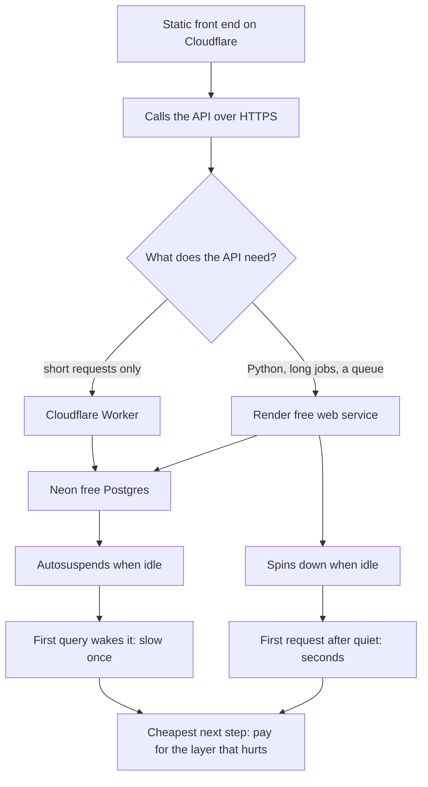

> **Section 7 · Lesson 11** · Level: beginner · ~20 min · Prereq: [Deployment concepts](07-Deployment-Concepts)

## Why this matters

You can put a real application on the internet for zero dollars, with no trial that quietly ends. But free is a different product from cheap: it sleeps, it counts requests, it hands you a database that stops when nobody queries it. Know which of those happens before you deploy, and the free path is a good start; discover it from a failed request instead, and it is not.

## What a free tier actually costs you

A free tier is not the same machine with the price removed. Four things get traded away:

- **Sleeping instances and cold starts.** A free web service stops when no traffic arrives, and the next request waits while it restarts.
- **Quota cliffs.** An allowance ends in a step, not a slope: cross the monthly limit and requests fail until the window resets.
- **Expiry and autosuspend.** Allowances do not roll over, and an idle database can be suspended or eventually removed.
- **Terms that change under you.** Providers reshape free tiers to move traffic onto paid plans; treat one as a decision with a date on it.

## The $0 options, as of September 2026

A snapshot, not a price list: the cells describe the shape of each limit, because the amounts move monthly. Re-check each provider's page before you build on it.

| Option | What $0 buys | What it costs you in practice |
|---|---|---|
| [Cloudflare Workers](https://developers.cloudflare.com/workers/) | Serverless functions served from Cloudflare's network, with a monthly request allowance and a CPU budget per invocation | No cold start in the usual sense, but the per-request CPU ceiling ends long jobs, so heavy background work needs another home |
| [Cloudflare static assets](https://developers.cloudflare.com/workers/static-assets/) | Hosting for a static front end (HTML, CSS, JavaScript), deployed with the Workers tooling | Static only. There is no server-side logic unless you add a Worker next to it |
| [Render free web service](https://render.com/docs/free) | A normal web service behind a public HTTPS URL, built from your repository | Spins down when idle, so the first request after a quiet period is slow; instance hours and bandwidth are capped per month |
| [Neon free Postgres](https://neon.com/docs/introduction) | Serverless Postgres that autosuspends: compute pauses when idle, storage stays | The first query after a pause has to wake the compute; free projects are capped on number, storage and compute hours |
| GitHub Pages | Static site hosting from a repository, free for public repositories | Static files only, built around a repository: no API, no database, no environment variables |

A Worker is not asleep between requests; a Render service and a Neon database are, so the first visitor after a quiet spell waits twice.

## The Railway correction

Railway was the default answer for years and still appears in tutorials as the free option. As of September 2026 it is not: there is no permanent free tier. A new account gets a one-time trial credit, and when that is spent the service stops until you upgrade to a paid Hobby plan.

Tutorials still say "deploy on Railway for free" because they were written when it was true. Read this as a dated observation, not a law. Pricing pages change, and the rule that survives them is general: a claim about cost with no date is a claim about the past.

## The $0 capstone path

The free pieces wire together like paid ones: a static front end, one API, one database.



The front end is static files on Cloudflare's network, so it is fast and always on. The API is the decision point: [Edge with Cloudflare Workers](07-Edge-With-Cloudflare-Workers) for the always-on choice, or [Deploy on Railway](07-Deploy-On-Railway) for a small paid plan. [Postgres on Neon](07-Postgres-On-Neon) covers the driver and pooling for the free database.

What breaks first, usually in this order:

1. **Connections.** Serverless functions open one per invocation and a free database permits few, so a burst fails. Use the pooled connection string.
2. **Cold starts under bursts.** Harmless for one visitor a day, painful for fifty arriving together: they wait on the same wake-up.
3. **The quota cliff.** A page shared widely can cross a monthly allowance in an afternoon.

The next step is deliberate: pay for the layer that hurts and leave the rest free — [Cost control](07-Cost-Control) applied to a whole stack. [Capstone 1](15-Capstone-1-Ship-A-Tiny-App) builds this shape.

## Set the alarm before you deploy

Before the first deploy, set a hard spend cap if the provider offers one and an alert at half of it if not, on the account holding the payment method rather than inside a project.

A free tier with a card on file can bill the moment usage crosses the line, and the crossing is usually a bug, not a real user. An alert emails you; a cap acts. If a provider offers neither, check usage weekly. The same discipline applies to agent tokens, in [Token and cost discipline](03-Token-And-Cost-Discipline).

## Try it

1. Measure a cold start on a free service you already have:

   ```bash
   for i in 1 2 3 4 5; do
     curl -s -o /dev/null -w "%{time_total}s\n" https://YOUR-SERVICE.onrender.com/health
     sleep 45
   done
   # expected shape: the first line is seconds, the rest are hundredths
   # 4.812s
   # 0.043s
   # 0.038s
   ```

2. Write `docs/free-tier.md` with four lines per service: the allowance, the metric it counts, what happens at the limit, and the date you read the page.

3. Deploy a static front end with a Worker behind it:

   ```bash
   npm create cloudflare@latest -- my-free-app   # answer the prompts, accept the defaults
   cd my-free-app && npx wrangler@latest deploy
   # => Uploaded my-free-app (1.21 sec)
   # => Deployed my-free-app triggers (0.52 sec)
   # =>   https://my-free-app.YOUR-SUBDOMAIN.workers.dev
   ```

4. Confirm it is live rather than trusting the deploy message, then check it in a smoke test:

   ```bash
   curl -s -o /dev/null -w "%{http_code}\n" https://my-free-app.YOUR-SUBDOMAIN.workers.dev
   # 200
   ```

   See [Integration and smoke tests](10-Integration-And-Smoke-Tests).

5. Set the cap on every account you created, and note in `docs/free-tier.md` which providers offer a hard cap and which only alert.

## Common mistakes

- **Reading "free" as "cannot bill you".** Most free tiers want a payment method, and usage past the allowance becomes an invoice. Set the cap before the first deploy.
- **Following an undated tutorial.** "Deploy on Railway for free" is the canonical example: true once, not true now.
- **Keeping state inside free compute.** Containers on a free plan are replaced, and a data file inside one goes with them. Put data in the database.
- **Testing cold starts against a warm service.** Pinging the endpoint right after a deploy hides the delay your first real visitor will see.

## Key takeaways

- A free tier trades price for sleep, quotas, expiry and terms that change. Name the trade before you accept it.
- The $0 stack in September 2026: Cloudflare for the front end and edge functions, Render's free web service or a Worker for the API, Neon for Postgres. Re-check each page — the numbers move monthly.
- Railway has no permanent free tier any more: a one-time trial credit, then a paid Hobby plan. A dated observation, not a permanent law.
- Connection limits and cold starts break first as traffic grows. Pay for the one layer that hurts instead of upgrading everything.
- Set a spend cap and an alert on every account with a payment method before you deploy.

## Further learning

- [Cloudflare Workers documentation](https://developers.cloudflare.com/workers/) — the free allowance and its limits.
- [Cloudflare static assets](https://developers.cloudflare.com/workers/static-assets/) — hosting a front end with no server to run.
- [Render free tier documentation](https://render.com/docs/free) — what spins down, and when.
- [Neon documentation](https://neon.com/docs/introduction) — autosuspend, storage and compute hours.
- [Deploy on Railway](07-Deploy-On-Railway) — the paid Hobby path, once $0 stops being right.
- [GitHub Copilot plans](https://docs.github.com/en/copilot/about-github-copilot/plans-for-github-copilot) — the same free-tier shape in a coding assistant.
