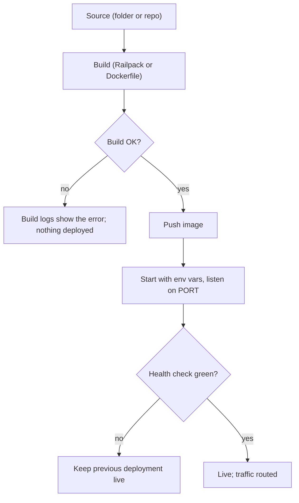

> **Section 07 · Lesson 2** · Level: beginner · ~20 min · Prereq: [Deployment concepts](07-Deployment-Concepts)

## Why this matters

Railway is the shortest path from a folder on your laptop to a URL someone else can open. It builds your code, runs it, injects your variables and gives you logs. The catch is that its convenience hides three or four decisions you still have to make deliberately — deploy path, variables, restart behaviour — and the default answers bite later. This page installs the CLI and walks the whole loop, including the failures that cost real hours.


## Project, service, environment

Three words, three levels:

- **Project** — the container for everything related to one app.
- **Service** — one deployable thing. An API service and a web service in the same project are two services.
- **Environment** — an isolated set of services and variables. `staging` and `production` are two environments in one project, each with its own copy of the services and its own variables.

Link a local folder to a project so the CLI knows where to send things:

```bash
railway login
railway link          # prompts for project + environment
railway status        # shows the linked project, service and environment
```

Linking is per directory and stored locally. If a deploy went somewhere unexpected, run `railway status` before anything else.

## Deploying from the CLI vs from a repo

The CLI ships your current folder:

```bash
railway up                       # attached: streams build + deploy logs
railway up -d                    # detached: returns immediately
railway up --ci                  # build logs only, exits when the build ends
railway up --service my-api --environment staging
railway redeploy                 # restart/rebuild the same code, no upload
```

A **repo-connected** service instead builds whatever lands on a watched branch. Prefer the repo path when you have exactly one deploy path and no migration ordering to respect. Prefer the CLI (or a pipeline calling the CLI) whenever deploys must happen in a specific sequence — migrate the database, then deploy the API. In CI, use a project token so no interactive login is needed:

```bash
RAILWAY_TOKEN=...REDACTED railway up --ci --service my-api
```

Project tokens are scoped to one environment and can only do deployment work. Keep them in your CI provider's secret store.

## Variables, secrets, and per-environment config

Set variables per environment, never in a committed file:

```bash
railway variables --service my-api --environment staging
railway variable set SERVICE_API_KEY=...REDACTED --service my-api --skip-deploys
```

`--skip-deploys` matters: without it, changing one variable triggers a restart you did not ask for, in the middle of a rollout.

## Logs, health, and one instance

Watch a rollout rather than guessing:

```bash
railway logs --service my-api            # runtime logs
railway up --ci                          # build logs, then exit
```

A failed build and a failed start look different: build logs end before your code runs, so a "started, then died" symptom never appears in them.

For reliability, keep one config file and one instance. The config contract states how to build and start, so the platform does not have to guess:

```json
{
  "build": { "builder": "DOCKERFILE", "dockerfilePath": "Dockerfile" },
  "deploy": {
    "startCommand": "./server",
    "healthcheckPath": "/health",
    "restartPolicyType": "ON_FAILURE"
  }
}
```

Exact keys and accepted values live in the Railway docs root — this file is version-sensitive, so check it there rather than copying an old example. Start with **one instance**. Multiple replicas make in-process state (caches, event streams held in memory) wrong in ways that only appear under load; scale after you have measured, not before.



## Gotchas that cost real time

**A git integration racing a gated pipeline.** A service with both a repo trigger and `railway up` from CI will autodeploy on the push *before* your pipeline's migrate step, so the API can start against a schema that does not exist yet. Choose one path; verify in the service settings that Source reads as CLI deploys, not a connected repo.

**A "failed" deploy that was skipped on purpose.** The platform reuses the previous build when the uploaded code is unchanged — for example a frontend-only change. There are no build logs to stream, so the CLI exits non-zero with a message about failing to retrieve the build log. That is a **skip, not a failure**: real build failures look different. If your pipeline treats every non-zero exit as failure, grep for the skip message and treat it as success, otherwise you will chase a phantom bug.

**TLS that worked locally and fails in the container.** A minimal base image has no CA trust store. Local runtimes often ship their own certificate roots; a compiled binary inside a slim image reads the *system* store and fails with `CERTIFICATE_VERIFY_FAILED: unable to get local issuer certificate` on the first outbound HTTPS call. Install the CA package in the runtime stage:
```dockerfile
RUN apt-get update && apt-get install -y --no-install-recommends \
      ca-certificates && rm -rf /var/lib/apt/lists/*
```

The general rule: the container is not your laptop, and network calls are where the difference shows first.

## Try it

1. Create a folder with a tiny server plus a `Dockerfile` that installs `ca-certificates` in its runtime stage, and a `/health` route.
2. `railway login`, `railway link` (pick a fresh project, environment `staging`).
3. `railway variable set GREETING=staging --service <service>` and then `railway up --ci`. Read the build logs, then `railway logs` for runtime output.
4. `curl -i https://<your-domain>/health` and confirm a 200. Then set a required variable to an empty value, redeploy, and read the restart behaviour in the logs.
5. Trigger a deploy with no code change and confirm the skipped-deploy message, so you recognise it next time.

## Common mistakes

- **Deploying to the wrong environment.** `railway status` first; link per folder so it cannot be ambiguous.
- **Setting variables without `--skip-deploys`.** You get a surprise restart mid-rollout.
- **Assuming a variable change is live.** Most processes only read the environment at startup.
- **Adding a git trigger to a service your pipeline already deploys.** Two deploy paths, one of them ungated.
- **Chasing a skipped deploy as an error.** Unchanged code means no build logs, and the CLI exits non-zero.
- **Shipping a slim image without a CA trust store.** Every outbound HTTPS call fails only in production.

## Key takeaways

- Project > service > environment. Say which of the three you mean every time.
- CLI deploys for ordered pipelines, repo deploys for simple single-path services — not both on one service.
- Secrets live in per-environment variables; tokens for CI are separate, scoped, and never committed.
- One instance plus a health check and a restart policy is cheap reliability; scaling is a later decision.
- A skipped deploy and a failed deploy look similar in the CLI and mean opposite things.

## Further learning

- [Deploying with the CLI](https://docs.railway.com/cli/deploying) — deploy modes, project tokens, redeploy, verbose output.
- [Railway CLI reference](https://docs.railway.com/cli) — every command, including variables, logs and status.
- [Railway Quick Start](https://docs.railway.com/quick-start) — the guided first project.
- [Railway CLI on GitHub](https://github.com/railwayapp/cli) — issues and release notes when a command misbehaves.
- [Railway and Neon cheat sheet](16-Railway-And-Neon-Cheat-Sheet) — the commands on one page.
