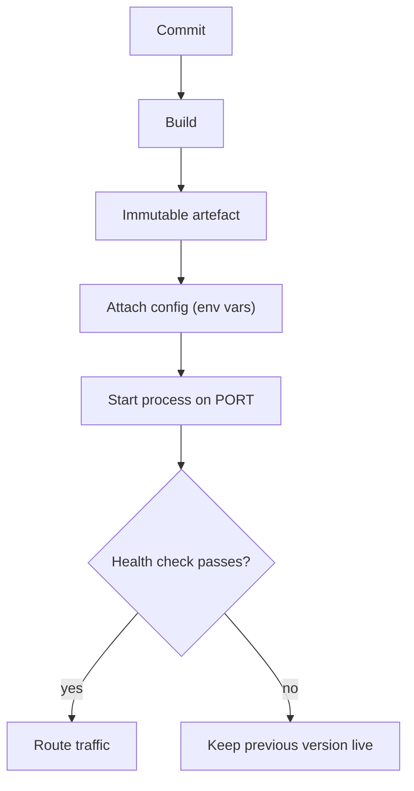

> **Section 07 · Lesson 1** · Level: beginner · ~15 min · Prereq: [Branching and pull requests](05-Branching-And-Pull-Requests)

## Why this matters

Your laptop has your files, your `.env`, your Python version and your half-installed packages on it. A server has none of that. Deployment is the work of turning "it runs here" into "it runs there, every time, without me watching". First deploys rarely fail because the code is wrong; they fail because something the code assumed — a port, a variable, a database that already had the right table — was only true on your machine.


## Build, then run

Deployment is two jobs people say in one breath. **Build** turns source into an artefact: a directory, a tarball, or a container image. **Run** starts that artefact with configuration. Splitting them is what gives you immutability — once built, the artefact never changes, and changing behaviour means producing a new one. That gives you a stable thing to roll back to, and it means a build that passed once cannot be quietly altered later by an environment variable.

```bash
docker build -t my-api:1.4.0 .
# => Successfully tagged my-api:1.4.0
```

That tag is the artefact's identity. Log it on startup, so a running process can tell you which build you are looking at when something looks odd.

## Environments and configuration

An environment is one isolated copy of your stack: its own database, its own variables, its own URL. You need at least two — **staging** (safe to break, realistic enough to trust) and **production** (real users) — plus local development.

Everything that differs between them belongs in environment variables, never in the image. The image stays identical; only the configuration changes.

```python
import os
DATABASE_URL = os.environ["DATABASE_URL"]     # crashes loudly if missing
API_KEY = os.environ["SERVICE_API_KEY"]
```

Read config with `os.environ[...]` and let boot fail when a value is absent. `os.environ.get("DATABASE_URL", "postgres://localhost/dev")` is exactly how a production process ends up talking to a database on somebody's laptop.

## Three deploy triggers — pick one

A deploy starts in one of three ways:

1. **Manual** — you run a CLI command from your machine.
2. **Git push** — the platform watches a branch and deploys every push automatically.
3. **CI pipeline** — a workflow runs tests, then deploys.

Each is fine alone. Mixing them on one service is not. With a git integration switched on *and* a pipeline deploying the same service, the autodeploy can fire first, ahead of the pipeline's migration step. The API then reaches production a version ahead of its own schema. Pick one path per environment and remove the other trigger.



## Ports, health checks, and a deploy that "succeeded"

Most platforms inject a `PORT` and expect your process to listen on it. Hard-coding `8080` is the classic first-deploy failure. Read it instead: `port = int(os.environ.get("PORT", 8000))`.

A health check is a URL the platform polls to decide whether your process is alive. `/health` returning `{"status":"ok"}` is enough, and a version that also reports the database connection is better. When a deploy says success but the app is down, it is one of three things: the build finished so the platform counted the deploy as successful, the process crashed on startup (missing variable, failed database connection), or it is listening on a port nobody probes. A health endpoint that checks the database tells you which of the three you have.

## Migrations are not the deploy

A migration changes the schema; a deploy changes running code. Fixed order, always: **schema first, code second**. And every migration must leave the *previous* version of the code still working — add columns as optional, and never drop or rename in the same step that stops using them.

Migration applies → old and new code both work → new code deploys. Skip the middle step and a rollback drags the database back with it.

## Try it

1. Create `deploy-drill/app.py` that reads `PORT` and `GREETING` and serves `/` plus `/health`:

   ```python
   import os, json
   from http.server import BaseHTTPRequestHandler, HTTPServer

   class H(BaseHTTPRequestHandler):
       def do_GET(self):
           if self.path == "/health":
               body = {"status": "ok"}
           else:
               body = {"greeting": os.environ.get("GREETING", "hello")}
           self.send_response(200)
           self.send_header("Content-Type", "application/json")
           self.end_headers()
           self.wfile.write(json.dumps(body).encode())

   HTTPServer(("0.0.0.0", int(os.environ.get("PORT", 8000))), H).serve_forever()
   ```

2. Run it three ways and note what changes: `PORT=9000 GREETING=dev python3 app.py`, then with `GREETING` unset, then with the port already in use by another process.
3. Append two lines to `deploy-drill/NOTES.md`: which trigger you will use for staging and which for production, and one migration you would consider unsafe to run in the same step as the code that stops using the old column.

## Common mistakes

- **Committing `.env`.** Once it is in git history the values are public and must be rotated. Add `.env` to `.gitignore` before the first commit, not after.
- **Hard-coding port or API URL.** The build then works in exactly one environment.
- **Two deploy paths on one service.** Autodeploy racing a gated pipeline is how the three layers of a stack drift apart.
- **Running migrations after the code.** New code queries a column that does not exist and returns 500s until someone notices.
- **Reading "build succeeded" as "app is running".** A build is not a health check.

## Key takeaways

- Build produces an immutable artefact; run attaches configuration. Keep them separate.
- All environment-specific values live in environment variables, never in the image or in git.
- One deploy trigger per environment, and a health check the platform actually polls.
- "Deploy succeeded, app is down" means a crashed process, an unprobed port, or a too-shallow health check.
- Migrations go first and must stay compatible with the code still running.

## Further learning

- [Deploying with the CLI](https://docs.railway.com/cli/deploying) — how one platform frames build, deploy and redeploy.
- [GitHub Actions documentation](https://docs.github.com/en/actions) — the pipeline trigger in detail.
- [Neon documentation](https://neon.com/docs/introduction) — the database half of a staging/production split.
- [Deployment pipelines](05-Deployment-Pipelines) — wiring the pipeline end to end.
- [Observability](06-Observability) — what to log so a failed deploy explains itself.
