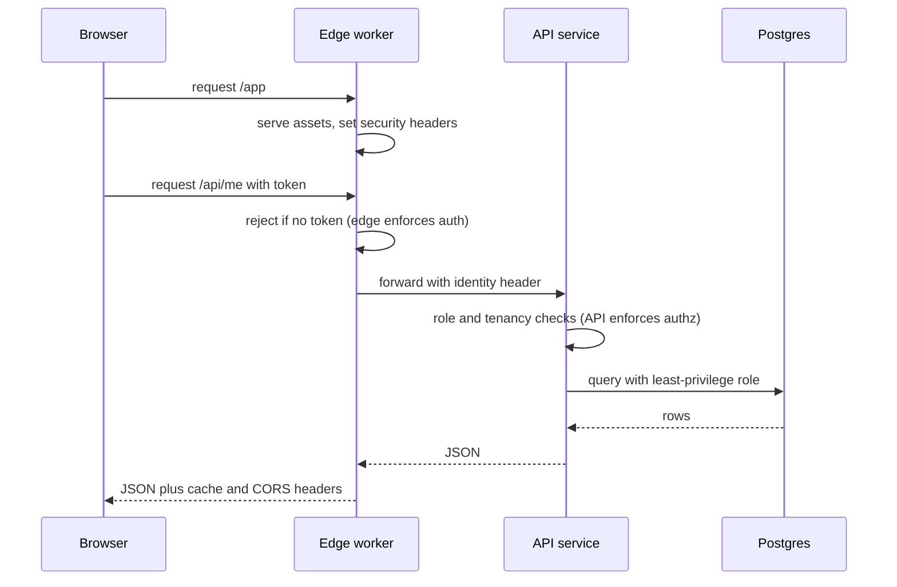

> **Section 07 · Lesson 4** · Level: intermediate · ~15 min · Prereq: [Deployment concepts](07-Deployment-Concepts)

## Why this matters

Some requests should be answered before they reach your server: a redirect, a cache miss, a security header, a check that the caller is allowed to see this at all. Running that code at the edge — on the network closest to the user — removes a round trip to your API, and it gives you exactly one place to set headers for every response instead of remembering to set them in forty handlers. A Cloudflare Worker is that place. It is also a trap if you use it for work it is bad at, which is what the last section of this page is about.

## What a worker is good at

A worker is a small program that runs per request, close to the user. Deploy it and Cloudflare serves it from its network; there is no container you manage and no server to patch. Good fits:

- **Static assets** — the built frontend, served from the edge.
- **Redirects and rewrites** — old URLs to new ones, without a server.
- **Headers** — security headers, cache policy, CORS, added once for every response.
- **Light API glue** — signing a request, reshaping a payload, proxying to one backend.
- **Per-request authorisation** — reject an unauthenticated request before it costs your API anything.

Bad fits are covered below.

## wrangler: config, environments, deploy

`wrangler` is the CLI. The config file names the worker, its assets, and its per-environment settings:

```jsonc
{
  "name": "my-web-staging",
  "main": "src/index.js",
  "compatibility_date": "2026-01-01",
  "vars": { "API_URL": "https://api-staging.example.com" }
}
```

Keep one config per environment (for example `wrangler.staging.jsonc` and `wrangler.production.jsonc`) and pass the file explicitly, so a deploy cannot silently go to the wrong place:

```bash
wrangler deploy -c wrangler.staging.jsonc
wrangler deploy -c wrangler.production.jsonc
wrangler tail --config wrangler.staging.jsonc      # live logs
wrangler secret put SERVICE_API_KEY --config wrangler.production.jsonc
wrangler rollback                                   # back to the previous version
```

Secrets are not `vars`. `vars` live in the config file in plain text and are visible in the dashboard; secrets are set with `wrangler secret put` and read the same way from your code (`env.SERVICE_API_KEY`). A key committed in `vars` is a key you must rotate. The Cloudflare Wrangler docs are the authority on which fields exist for your version — that config surface changes, so check the docs rather than copying an old example.

## Security headers and CORS, once

The point of putting headers at the edge is that one code path produces them, so no response can miss them. If your deployment serves static assets, the platform's headers file does this declaratively:

```text
/*
  X-Content-Type-Options: nosniff
  X-Frame-Options: DENY
  Referrer-Policy: strict-origin-when-cross-origin
  Strict-Transport-Security: max-age=31536000
```

For CORS, be specific. `Access-Control-Allow-Origin: *` plus credentials is invalid and browsers reject it; an origin list that includes `https://your-domain` and the staging host is what you want, and it must be updated whenever a domain is added. A refusal from a CORS check appears in the browser as a generic network failure, so when a fetch "does nothing", check the response headers before you check the code.

## Env-pinned builds

The subtle bug is a frontend built against staging's API and deployed to production. The fix is to bake environment values at build time, per environment, and make a missing value degrade safely:

```bash
# staging build
flutter build web --dart-define=API_URL=https://api-staging.example.com
# production build
flutter build web --dart-define=API_URL=https://api.example.com
```

If a value like a hosted verification link can be empty, design the empty case to fall back to something safe (a server-minted token) rather than to a hard-coded URL that might point at the wrong environment. Two workers, two builds, two configs — never one build serving both.



Read that diagram as a division of labour: the edge rejects cheaply and shapes responses; the API decides what a caller may actually see; the database holds the data. Putting authorisation only at the edge means anyone who finds your API's real address bypasses it.

## When not to use the edge

- **Long-running work.** Per-request execution has a time budget. A job that runs for minutes needs a worker queue or an ordinary service, not a request handler.
- **Heavy compute.** Large model inference, big data transforms, anything memory-hungry: run it on a server you size for it.
- **Anything needing a filesystem.** There is no durable local disk. Use object storage (see [Object storage and artifacts](07-Object-Storage-And-Artifacts)).
- **Stateful protocols you expect to keep.** In-memory state per instance is not shared and does not survive.

## Try it

1. `npm create cloudflare@latest` (or install wrangler in an existing project) and get the default worker deployed with `wrangler deploy`.
2. Add a `/health` route returning JSON, redeploy, and `curl -i` it. Confirm your security headers appear.
3. Move the origin to a `vars` entry in the config, then deploy the same code with a staging config and check which origin it talks to.
4. `wrangler tail`, then hit the worker from a browser and watch the live log lines arrive.
5. Add `X-Frame-Options: DENY`, deploy, and confirm it on a 404 response as well as a 200 — headers should apply to every path.

## Common mistakes

- **Putting secrets in `vars`.** They end up in config and in the dashboard. Use `wrangler secret put`.
- **One config, two environments.** Add a staging config and pass `-c` explicitly.
- **`Access-Control-Allow-Origin: *` with credentials.** Browsers reject it; list the real origins.
- **Building once and deploying to both environments.** Environment values must be baked per environment.
- **Moving slow work to the edge to "make it faster".** It becomes a timeout instead.
- **Assuming edge auth is enough.** The API still has to enforce authorisation.

## Key takeaways

- Workers are for static assets, redirects, headers, light glue, and cheap early rejection — not long jobs.
- One config per environment, passed explicitly with `-c` on every deploy.
- Secrets go through `wrangler secret put`; `vars` is for non-secret configuration.
- Set security headers and CORS once, at the edge, for all responses.
- Authorisation is enforced at the API; the edge only makes the first refusal cheap.

## Further learning

- [Wrangler configuration](https://developers.cloudflare.com/workers/wrangler/configuration/) — the config file fields and per-environment settings.
- [Wrangler commands](https://developers.cloudflare.com/workers/wrangler/commands/) — deploy, tail, rollback and the rest.
- [Workers secrets](https://developers.cloudflare.com/workers/configuration/secrets/) — how secrets differ from plain variables.
- [Environment variables](https://developers.cloudflare.com/workers/configuration/environment-variables/) — reading configuration in the worker.
- [Security architecture](06-Security-Architecture) — where each layer should enforce what.
