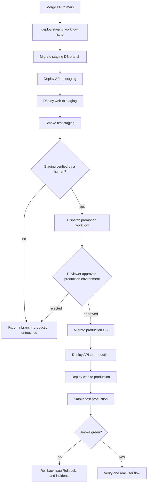

> **Section 07 · Lesson 6** · Level: advanced · ~20 min · Prereq: [Postgres on Neon](07-Postgres-On-Neon)

## Why this matters

`main` is not production. If merging a pull request ships straight to real users, the only review that matters happens after the damage. The alternative is a promotion model: every merge auto-deploys to staging, and production changes only when a human approves a workflow. It costs one extra step and buys the ability to be wrong safely.


## The promotion model

```
feature branch ──PR──► main ──(auto)──► STAGING ──(manual, gated)──► PRODUCTION
```

Two rules carry the whole model:

1. **`main` deploys to staging, automatically.** Staging is never skipped: a gate that can be bypassed will be bypassed.
2. **Production changes only through an explicit, approved promotion.** Not a push, not a tag, not someone's laptop.

Staging has to be genuinely isolated for this to mean anything: its own database branch, API service and web deployment, plus third-party sandboxes instead of live endpoints. Verify it once, deliberately — write a row on staging and confirm production cannot see it.

## What the promotion workflow does, in order

Each step exists because skipping it caused a real problem.

1. **Run the test suite.** Same gates as the pull request, so a promotion is never less verified than a merge.
2. **Migrate the production database.** Before the code, because the new API queries columns that must already exist.
3. **Seed idempotent content.** If FAQs, legal text or templates live in the database, promotion inserts them, insert-if-missing, so admin edits survive.
4. **Deploy the API.** The service that owns the wire contract.
5. **Deploy the web layer.** The shallowest dependent moves last, so it can only call an API that is already up.
6. **Sync public download pointers.** If users download a build from a stable URL, repoint it in the same run.
7. **Smoke test.** `/health`, a 200 from the web root, and one public endpoint that reads the database.

The ordering principle: **dependencies move first, dependents last.** The database is the deepest dependency; the web app is the shallowest.



## Approval gates

GitHub **environments** hold the gate. Create an environment named `production`, add required reviewers, and reference it from the promotion job. The workflow pauses until one of them approves, and because the approval is attached to the environment it applies to every workflow that uses it.

Decide who may approve and write it down. A useful default: whoever did not write the change approves, and nobody approves their own promotion. Keep the list in the repository (`CODEOWNERS` or a runbook line) so it is not decided under pressure.

## Keeping the three layers in lockstep

The failure this model exists to prevent: a platform's git integration auto-deploying the API on merge, ahead of the migration and web deploy the promotion performs. You end up with a production API on the newest commit, a database missing the column it queries, and a web app several commits behind — three layers, three versions, one outage.

So: **production services have exactly one deploy path.** If promotion deploys the API, remove the git trigger from that service and verify it in the platform's settings. The same applies to staging when a staging workflow already deploys it, because a race between two deploy paths is not reliably diagnosable.

| Layer | Deployed by | Must happen |
|---|---|---|
| Database | the promotion's migrate step | before the API |
| API | the promotion's deploy step | after migrate |
| Web | the promotion's deploy step | after the API |

## Verifying a promotion

"The workflow went green" is not verification. Four checks, cheapest first: the **health endpoint** returning 200 *and* reporting the promoted version; **one real user flow** against real infrastructure; the **API logs** for the first minutes after deploy; and the **smoke or eval suite** — a scored eval run for an AI feature, route-level tests for a CRUD app. If the change included a migration, query the schema to confirm it applied rather than trusting the step's exit code.

## Write the runbook

A promotion that lives in one person's memory is a single point of failure. The runbook answers: how to trigger it (workflow dispatch, or `gh workflow run`), who approves, what to verify, and what to do when it fails. Include exact commands. Then test it by having someone who has never promoted follow it — that is the only proof it works.

## Try it

1. In a repository of yours, create two GitHub environments, `staging` and `production`, and add a required reviewer to the latter.
2. Write a `deploy.yml` on push to `main` that echoes the environment name, and a `promote.yml` on `workflow_dispatch` that names the `production` environment.
3. Merge something to `main`, watch staging deploy automatically, then dispatch the promotion and observe the pause for approval.
4. Add a smoke step to both: `curl -fsS https://<staging-host>/health`.
5. Write `docs/runbook-promotion.md` with trigger, verify, approve and rollback sections.

## Common mistakes

- **Letting production deploy from `main`.** The gate becomes decoration.
- **A git trigger on a service your pipeline deploys.** Two writers, one of them ungated and usually faster.
- **Treating a green workflow as verification.** Read the logs and exercise one real flow.
- **Promoting a migration-only change without checking it applied.** Query the schema afterwards.

## Key takeaways

- `main` auto-deploys to staging; production only through an approved promotion.
- Promotion order is fixed: test, migrate, seed, deploy API, deploy web, sync pointers, smoke.
- Dependencies move first, dependents last — which is why migrate precedes the API deploy.
- One deploy path per production service, or the three layers will drift.
- Write the runbook, then have someone else follow it.

## Further learning

- [GitHub Actions documentation](https://docs.github.com/en/actions) — environments, required reviewers, workflow dispatch.
- [Workflow syntax for GitHub Actions](https://docs.github.com/actions/using-workflows/workflow-syntax-for-github-actions) — jobs, needs, and environment blocks.
- [Deploying with the CLI](https://docs.railway.com/cli/deploying) — the deploy command the promotion calls.
- [Neon documentation](https://neon.com/docs/introduction) — the branches behind per-environment databases.
- [Deployment pipelines](05-Deployment-Pipelines) — the section 05 treatment of the same pipeline.
