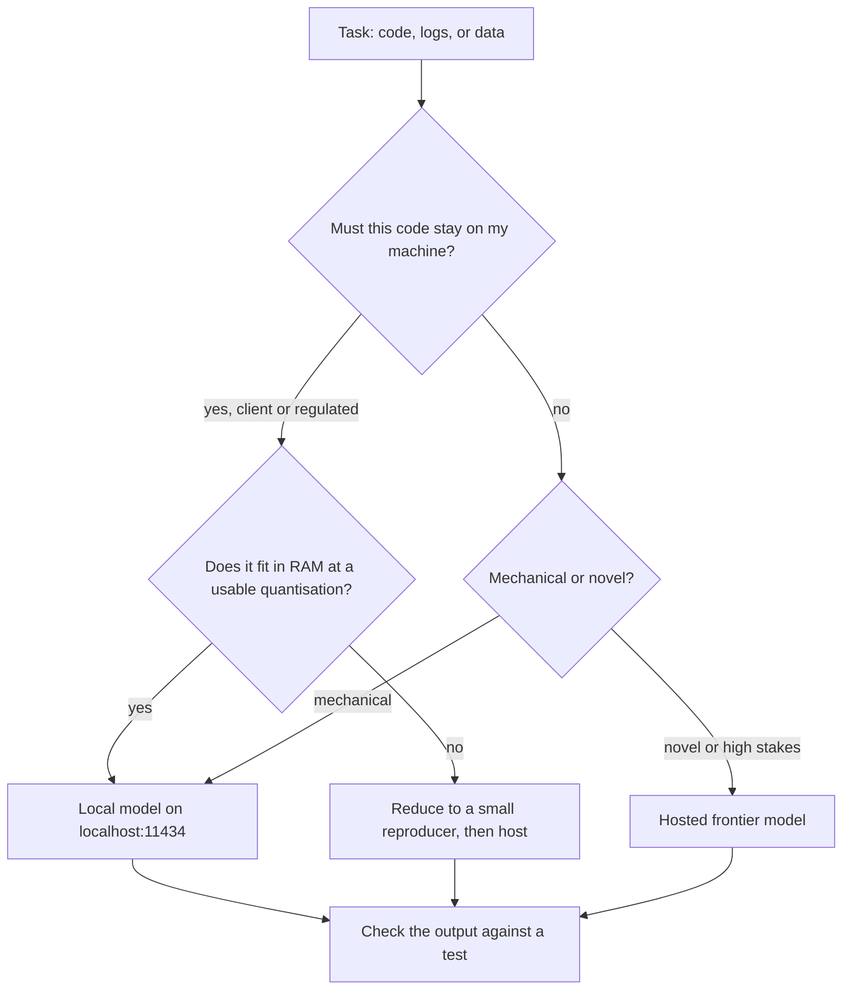

> **Section 7 · Lesson 13** · Level: intermediate · ~18 min · Prereq: [Choosing a model](01-Choosing-Models)

## Why this matters

Some code cannot be sent anywhere. A client audit repository, a compliance-bound service, an air-gapped machine: a hosted model there is not a cheaper option, it is a breach. Running a model locally turns "I cannot use AI here" into "I use a smaller model here."

## When local wins

Local is the only option when the code must not leave the machine: client or employer code under contract, a regulated environment, anything air-gapped.

It also wins for reasons unrelated to secrecy:

- **No per-token bill.** You pay in electricity, hardware and time, not per million tokens. See [Cost control](07-Cost-Control).
- **No rate limits or queues.** Nothing throttles you at 3pm on a deadline.
- **Offline work.** On a plane or a flaky connection, the model still answers.
- **Learning how inference behaves.** Latency that grows with answer length, a context window that fills and forgets, a format that holds on a short prompt and breaks on a long one.

## The one-line switch

Ollama serves an OpenAI-compatible endpoint at `http://localhost:11434/v1`. Tools that speak the OpenAI API — coding CLIs, agent frameworks, your scripts — reach your machine by changing the base URL and passing any non-empty string as the API key.

```bash
ollama pull <model-tag>      # a 7B-class instruct model from the library page
ollama list
# NAME                  ID           SIZE     MODIFIED
# <model-tag>:latest    ...          4.7 GB   2 minutes ago
```

```bash
curl http://localhost:11434/v1/chat/completions \
  -H "Content-Type: application/json" \
  -H "Authorization: Bearer local" \
  -d '{
    "model": "<model-tag>:latest",
    "messages": [
      {"role": "user", "content": "Return only the diff that renames parse_amount to parse_total."}
    ]
  }'
```

The reply uses the OpenAI shape, with the answer at `choices[0].message.content`. To point a CLI or agent at it, set the variables it reads:

```bash
export OPENAI_BASE_URL=http://localhost:11434/v1
export OPENAI_API_KEY=local     # any non-empty string; Ollama ignores the value
```

Keep those lines in a file you source on demand, and switching stays a one-line edit.

## Which tasks go local

Ask these about the task, not the project — see the flow.



1. **Does the data leave the machine?** If it must not, go local and design around a smaller model.
2. **Mechanical or novel?** Renames, formatting, summaries and classification suit a small local model. Architecture and tricky debugging want capability.
3. **Can I wait?** A slow answer you can run offline may beat a fast one you cannot send.
4. **What does a wrong answer cost?** Cheap and checked means the smaller model; expensive and unchecked is a different problem — see [Evaluating AI features](10-Evaluating-AI-Features).

## What you trade, honestly

- **Quality.** A 7B-class model is not a drop-in frontier replacement on multi-step reasoning, large refactors or tool use; on mechanical edits the gap narrows a lot.
- **Context window.** Local models commonly offer a much smaller usable window, and the largest advertised numbers often do not survive the hardware.
- **Hardware.** RAM caps the largest model you can run. As an approximate rule, budget roughly 0.6–1 GB of RAM per billion parameters at a 4-bit quantisation, plus context headroom: an 8B model lands near 6–10 GB, a 32B model near 25–40 GB. All approximate: quantiser, context length and runtime move them.
- **Speed.** On CPU only, expect single-digit to low-double-digit tokens per second from a mid-size model: fine for a rename, painful in an agent loop.
- **Licensing.** Weights carry their own licences: some permissive, some restricting commercial use. Read the model card before you ship.
- **No automatic updates.** Nothing patches your model: the tag you pulled keeps behaving the way you tested it until you pull another.

## The hybrid that works

Local for the bulk, hosted for the hard part. Run local for searches, renames, summaries, docstrings, log triage and sensitive text. When a problem genuinely needs the frontier model, reduce it first: a forty-line reproducer, a stack trace with identifiers stripped, a generalised snippet that no longer names the client.

The reduction is the security control. Once the code is boiled down, the hosted call is a normal decision, and the switch back is the base URL you already set. Keep both configurations in one place, next to [Secrets hygiene](09-Secrets-Hygiene) and the data map in [Privacy and compliance](09-Privacy-And-Compliance).

## Try it

1. Install Ollama, run `ollama pull <model-tag>` for a 7B-class instruct model, and confirm it appears in `ollama list`.
2. Send the `curl` request above and read the JSON — that shape is the compatibility contract.
3. Export the two variables, then run one agent task you would normally send to a hosted provider, with the network off.
4. Point a genuinely sensitive task at local — a rename across a compliance-bound repo — and keep the diff small.
5. Reduce one hard bug to a forty-line reproducer, send it to a hosted model, and compare with the local result on the full file.

## Common mistakes

- **Treating a small local model as a drop-in frontier replacement.** It is not. Give it mechanical work with a check, not architecture decisions.
- **Running a model that does not fit in RAM, then blaming the tool.** If the machine swaps, speed collapses and quality does not improve.
- **Sending the whole repository when a forty-line reproducer would do.** Bulk is not accuracy — the reduced version is the privacy control.
- **Forgetting the server has to be running.** `Connection refused` on `localhost:11434` usually means the Ollama service is down, not that your config is wrong.
- **Assuming "local" means you can stop redacting.** Prompts, logs and shell history are still files on disk — local removes the network hop, not the hygiene.

## Key takeaways

- Local is the answer when code legally or contractually cannot leave the machine; it also wins on offline work, no rate limits and no per-token bill.
- Ollama's OpenAI-compatible endpoint switches most OpenAI-speaking tools with `OPENAI_BASE_URL` plus a placeholder key.
- You trade quality, context size, speed and updates for privacy and predictable cost.
- Hybrid: local for the bulk and the sensitive work, hosted for the hard part once the code is reduced to a reproducer.
- Decide per task — may the data leave, mechanical or novel, can you wait, what does a wrong answer cost.

## Further learning

- [Ollama: OpenAI compatibility](https://docs.ollama.com/openai) — base URL, supported endpoints and the API-key rule.
- [Ollama API reference](https://docs.ollama.com/api) — the native API for what the compatibility layer does not cover.
- [Ollama: OpenAI compatibility announcement](https://ollama.com/blog/openai-compatibility) — why the endpoint exists.
- [Choosing a model](01-Choosing-Models) — the capability tiers this page trades against.
- [Privacy and compliance](09-Privacy-And-Compliance) — the obligations that make local the only option.
