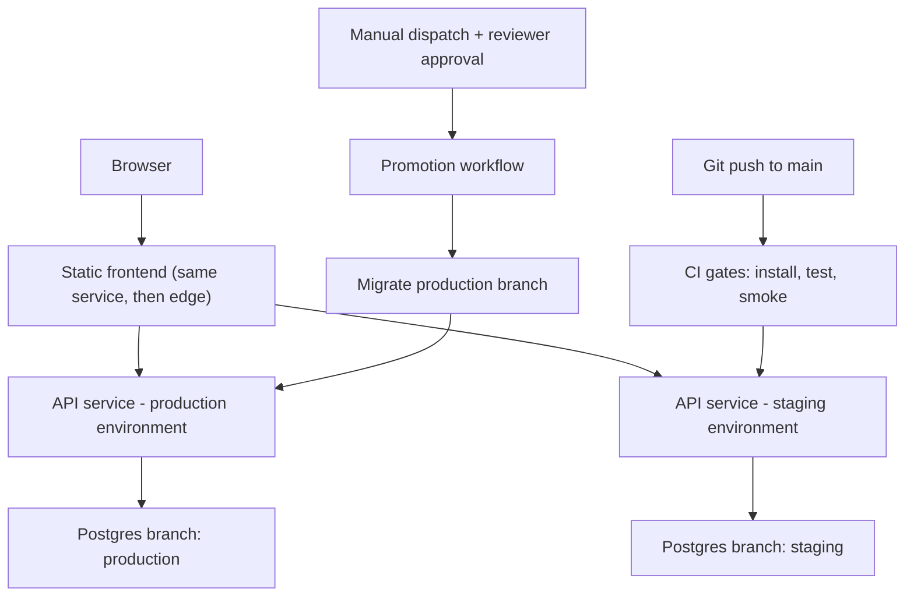

> **Section 07 · Lesson 9** · Level: beginner · ~25 min · Prereq: [Deploy on Railway](07-Deploy-On-Railway)

## Why this matters

You have read about builds, variables, migrations, staging and gates. This page is where they all run in order, on one tiny project, until a URL you can send to a friend responds with data from a cloud database. Do it once end to end and the next project is a checklist instead of a research project. Expect one deliberate failure in the middle: you will deploy code before its database is ready, see it break, and fix it from the logs.


## Step 1 — a local API in an empty folder

```bash
mkdir hello-cloud && cd hello-cloud
npm init -y
npm install express pg
```

`server.js`:

```js
const express = require("express");
const { Pool } = require("pg");
const app = express();
const pool = new Pool({ connectionString: process.env.DATABASE_URL });

app.get("/health", async (_req, res) => {
  try { await pool.query("SELECT 1"); res.json({ status: "ok", db: "connected" }); }
  catch { res.status(503).json({ status: "degraded", db: "unreachable" }); }
});

app.get("/greetings", async (_req, res) => {
  const { rows } = await pool.query("SELECT id, text FROM greetings ORDER BY id");
  res.json(rows);
});

app.use(express.static("public"));
app.listen(process.env.PORT || 8080, () => console.log("listening"));
```

Note what it does **not** do: it never hard-codes a port, and it never falls back to a default connection string.

## Step 2 — a database in the cloud

Create a project in your Postgres provider and copy the **pooled** connection string. Write it to `.env` and ignore that file now, before your first commit:

```bash
printf 'DATABASE_URL=%s\n' "<pooled-connection-string>" > .env
printf 'node_modules/\n.env\n' > .gitignore
```

Create the schema as a migration file, then apply it:

```sql
-- infra/migrations/0001_greetings.sql
CREATE TABLE IF NOT EXISTS greetings (
  id   BIGSERIAL PRIMARY KEY,
  text TEXT NOT NULL
);

INSERT INTO greetings (text)
SELECT 'hello from the cloud'
WHERE NOT EXISTS (SELECT 1 FROM greetings);
```

```bash
psql "$DATABASE_URL" -f infra/migrations/0001_greetings.sql
# CREATE TABLE
# INSERT 0 1
```

## Step 3 — the deliberate failure

Run the API **without** `DATABASE_URL`, exactly as a misconfigured deploy would:

```bash
env -u DATABASE_URL npm start
# listening
curl -s http://localhost:8080/health
# {"status":"degraded","db":"unreachable"}
```

The process started, so this is not a build failure — it is a configuration failure, and the health endpoint says so. Now fix it and watch the same endpoint change state:

```bash
npm start                                   # with .env loaded by your shell
curl -s http://localhost:8080/health
# {"status":"ok","db":"connected"}
curl -s http://localhost:8080/greetings
# [{"id":1,"text":"hello from the cloud"}]
```

That difference — started but degraded versus connected — is the reason a health check should touch the database. This is the failure you will meet most often in production, and you now know its signature.

## Step 4 — deploy the API

```bash
railway login
railway init                                # create a project, environment "staging" first
railway variable set DATABASE_URL="<pooled-connection-string>" --service hello-cloud
railway up --ci                             # build logs, exits when the build ends
railway domain                              # prints the public hostname
curl -s https://<your-host>/health
# {"status":"ok","db":"connected"}
```

If the build fails, read the build logs; if the deploy succeeds and `/health` returns 503, your variable is wrong or missing — the runtime logs will show the connection error.

## Step 5 — a static frontend

Add `public/index.html` that fetches `/greetings` and renders the list, commit it, and `railway up` again. Same service, one URL, no CORS problem — good enough for a first deploy. When the frontend grows, move it to an edge worker (`wrangler deploy`) and keep the API where it is; see [Edge with Cloudflare Workers](07-Edge-With-Cloudflare-Workers).

## Step 6 — CI on pull requests

Create `.github/workflows/ci.yml` that runs on `pull_request`, installs dependencies and hits `/health` on a locally started server against a test database. The point is not completeness; it is that no pull request merges without at least one automated check. Then protect `main` so the check is required (see [Branch protection and required checks](05-Branch-Protection-And-Required-Checks)).

## Step 7 — a staging environment

Create a second environment in the platform and a **branch** of the database for it, then deploy the same code there with staging variables:

```bash
railway environment new staging
railway up --environment staging --service hello-cloud
```

Verify one thing that proves isolation: insert a row on staging and confirm production's `/greetings` does not show it.

## Step 8 — a gated promotion

Add `.github/workflows/promote.yml` triggered by `workflow_dispatch` and referencing a GitHub environment named `production` with a required reviewer. The job runs the test suite, applies pending migrations to the production database branch, deploys the API, then smoke tests `/health` and `/greetings`. Run it once with `gh workflow run promote.yml --ref main` and watch it pause for approval.



## The checklist for your next project

1. One deploy trigger per environment; a `/health` that checks the database.
2. Every environment-specific value in variables, never in code; `.env` ignored from commit one.
3. Migrations are files, idempotent, and applied before the code that needs them.
4. `main` deploys to staging automatically; production only through an approved workflow.
5. A smoke test after every deploy, and one real flow checked by a human before you relax.
6. A spend limit and an alert on every account with a card attached.

## Try it

1. Work through steps 1–8 above in order. Do not skip step 3; the failure is the lesson.
2. After each step, append the command and its output to `docs/deploy-log.md`, so you can diff a failing deploy against a working one later.
3. Prove isolation by inserting a row on staging and confirming production does not show it.
4. Send the production URL to one person and have them load the page on their own device.

## Common mistakes

- **Fixing the deliberate failure by adding a default connection string.** That converts a loud 503 into silent data going to the wrong database.
- **Deploying before the migration.** The API starts, `/health` may even pass, and `/greetings` returns a 500 about a missing relation.
- **Committing `.env` in the first commit.** Rotate the credential; assume it is public.
- **Using the direct database host from the API.** Use the pooled connection string for application traffic.
- **Testing "isolation" by intuition.** Write a row on staging and look for it in production.
- **Leaving the promotion ungated because it is only your project.** The gate is what makes the habit survive a second person.

## Key takeaways

- The whole loop is short: folder, migration, deploy, health check, frontend, CI, staging, gate.
- A degraded-but-running process is a configuration failure; a health check that queries the database names it.
- Migrations are pruned files applied before the code, and the order is not negotiable.
- Staging is only staging if its data is isolated; prove it once.
- Keep the deploy log; the second project goes faster because the first one is written down.

## Further learning

- [Railway Quick Start](https://docs.railway.com/quick-start) — the platform's own guided version of steps 4–7.
- [Deploying with the CLI](https://docs.railway.com/cli/deploying) — every flag used above.
- [Neon documentation](https://neon.com/docs/introduction) — creating the project and branching for staging.
- [GitHub Actions documentation](https://docs.github.com/en/actions) — writing `ci.yml` and `promote.yml`.
- [CI troubleshooting](05-CI-Troubleshooting) — what to do when the pipeline itself is the problem.
