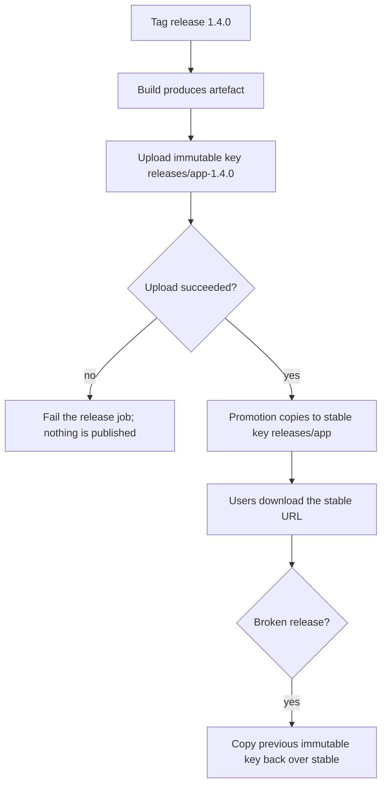

> **Section 07 · Lesson 5** · Level: intermediate · ~12 min · Prereq: [Edge with Cloudflare Workers](07-Edge-With-Cloudflare-Workers)

## Why this matters

Two things do not belong in git and do not belong on a container's disk: large files your users download, and build outputs your pipeline produces. A 90 MB mobile build committed to a repository makes every clone slow forever, and an artefact that lives only on your laptop is not a rollback plan. Object storage is where both go: a private bucket with a stable URL, so a download link keeps working after your laptop has been wiped.

## Buckets and objects

Object storage is a key-to-bytes store with an HTTP API: you `PUT` an object at a key and `GET` it back. The de facto API is S3's, so most providers (Cloudflare R2, and the storage products on the big clouds) accept the same client code. Uses:

- **User files** — uploads, generated documents, images.
- **Downloads** — installers, mobile builds, data exports.
- **Build artefacts** — what your pipeline produced and may need to redeploy.
- **Model and data files** — anything too big for the repository.
- **Backups** — periodic dumps that must outlive a single machine.

It is not a filesystem. Objects are written whole, there is no rename (a "move" is copy-plus-delete), and no locking. Code that expects to seek inside a file or hold a write handle will not work; code that expects `put` and `get` will.

## Versioned artefacts and one stable pointer

The pattern that makes downloads reliable is two keys per release:

- an **immutable** key that names the version, and
- a **stable** key that always points at the current one.

```bash
# 1. the build uploads an immutable artefact
aws s3 cp dist/app-1.4.0.apk s3://my-bucket/releases/app-1.4.0.apk

# 2. the promotion copies it over the stable key
aws s3 cp s3://my-bucket/releases/app-1.4.0.apk s3://my-bucket/releases/app.apk

# 3. the footer has linked to /releases/app.apk since day one
```

The stable key never changes, so the link on your landing page never needs editing. The immutable key is what you tell a support ticket to download when the current release is broken. Because both exist, rolling the download back is one copy command.

Wire this into the promotion, not into your habits: the promotion step should fail with an explicit instruction ("no production artefact exists for version 1.4.0 — run the release job first") when the immutable object is missing, rather than copying a stale file or silently skipping. A pipeline that fails loudly here is doing exactly what you want.



## Signed URLs and access control

Private is the default. A bucket that is public because "the download needed to work" exposes every other object in it too, and public buckets are indexed by crawlers within days. Three ways to keep it private and still serve files:

1. **Signed URLs.** Your API — which already knows who the caller is — generates a URL valid for a few minutes and returns it. Anyone without it gets nothing.
2. **A gateway service.** Your API streams the object, applying its own authorisation. Slower and costs bandwidth twice, but the access rules are ordinary application code.
3. **Per-user prefixes.** Keys under `users/<id>/...`, with a policy that only allows that prefix. Combine with signed URLs to avoid hand-writing policies.

Whichever you choose, the bucket is never the place where authorisation is decided. When a download breaks, the fix is a correct signature or a correct policy — not a public-read grant.

## Retention, and a rollback that outlives your laptop

Keep the last N releases and expire the rest with a lifecycle rule, so storage does not grow forever — and never expire the version you might roll back to.

Then test the assumption that makes this page worth reading: can somebody who has never seen your laptop roll back? They need (a) the repository and its tags, (b) the bucket name for artefacts, (c) a written command for repointing the stable key. If step (c) is in your head, and not in the runbook, you do not have a rollback — you have a personal skill.

```bash
# expiry policy, expressed as a rule rather than a manual chore
aws s3api put-bucket-lifecycle-configuration --bucket my-bucket \
  --lifecycle-configuration file://lifecycle.json
```

## Try it

1. Create a bucket. Keep it private.
2. Upload the same file to two keys: `releases/ping-1.0.0.txt` and `releases/ping.txt`.
3. Confirm a plain `curl` of the stable key fails (403) — that is proof the bucket is private.
4. Generate a short-lived signed URL for `releases/ping.txt` with your provider's CLI or SDK, `curl` it, and note the expiry time.
5. Append to your runbook: the exact commands for uploading a version, repointing the stable key, and rolling the pointer back one release. Include the bucket name and who holds credentials.

## Common mistakes

- **Making the bucket public to fix one download.** Everything in the bucket becomes public, and crawlers keep the links.
- **Committing large artefacts to git.** The history carries them forever. Upload to the bucket and keep only the build recipe in the repository.
- **Linking the versioned key from the landing page.** Now every release requires editing the site. Link the stable key.
- **No retention rule.** Monthly dumps accumulate until storage costs more than the app.
- **Repointing the stable key by hand from a laptop.** That is a rollback path with one point of failure and no record.
- **Treating object storage as a filesystem.** No rename, no partial writes, no locks — design around it.

## Key takeaways

- Object storage holds the things git and container disks should not: downloads, build artefacts, backups.
- Every release gets an immutable key plus one stable key that the world links to.
- Repoint the stable key inside a pipeline step that fails loudly when the artefact is missing.
- Keep buckets private; hand out short-lived signed URLs from code that already checks permissions.
- A rollback is only real if the artefact and the command live somewhere other than your laptop.

## Further learning

- [Cloudflare developer documentation](https://developers.cloudflare.com/) — object storage, Workers and their bindings in one place.
- [Railway documentation](https://docs.railway.com/) — its storage buckets and their upload/serving model.
- [GitHub Actions documentation](https://docs.github.com/en/actions) — releasing artefacts from a workflow.
- [Releases, tags and versioning](05-Releases-Tags-And-Versioning) — naming the versions these keys point at.
- [Rollbacks and incidents](07-Rollbacks-And-Incidents) — what happens when the pointer needs to move back.
