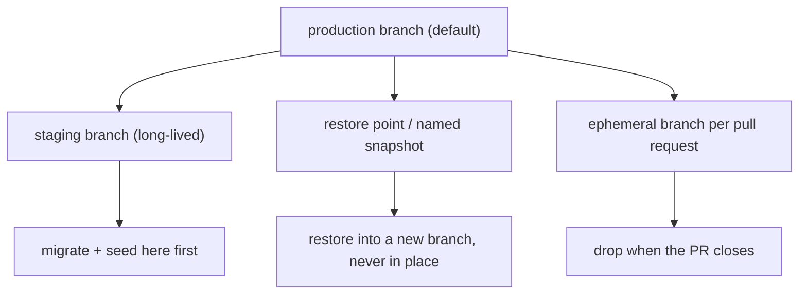

> **Section 07 · Lesson 3** · Level: intermediate · ~20 min · Prereq: [Deploy on Railway](07-Deploy-On-Railway)

## Why this matters

A database that runs on your laptop and one that runs for users are different problems. You need a database you can branch for a test, scale down to nothing when nobody is using it, and restore when a migration was wrong. Serverless Postgres gives you all three, but each one changes how you connect, migrate and pay — and getting the connection string or the migration order wrong produces failures that look like application bugs.


## Compute and storage are separate

Storage is one durable thing; compute is a process that attaches to it and can pause and resume without touching your data. That is what makes branching, autoscaling and instant restore possible, and it is why **cold starts** exist: after a pause, the first connection waits for compute to spin up. A request arriving in that window is slower, not broken. Expect the effect on the first request after idle periods and set client timeouts generously — a 2-second timeout on a connection that takes longer to resume fails against a database that is perfectly healthy.

## Branches are environments

A branch is a copy-on-write database: it starts as a pointer to the parent's data, and only pages you change get duplicated. Branching production gives you a realistic database in seconds without copying gigabytes.



This changes how you test migrations. Run a new migration against a branch of production, not against a local database with three rows in it — that is how you discover a `NOT NULL` column that 40,000 existing rows cannot satisfy. Ephemeral branches give each pull request its own database; delete them when the PR closes so forgotten copies do not pile up.

## Connection pooling

Serverless functions and short-lived processes open a connection per invocation. Without pooling, a burst of 200 concurrent invocations tries to open 200 Postgres connections and the database refuses most of them. The pooled endpoint exists for this: it multiplexes many clients onto few server connections, and it is a different host in the connection string from the direct endpoint. Use the pooled string for application traffic, the direct one only for migrations and admin work.

Pooling has a ceiling. The cap on the pooled endpoint was modest when one team measured it in 2026 — a fleet of replicas or serverless functions can saturate it, and the symptom is timeouts under load rather than an error at connect time. Check current limits in your project settings and watch connection counts before you scale replicas.

## Migrations in the pipeline

Three rules cover almost everything.

1. **Order.** Migrations run before the code that needs the schema. An API querying a column that does not exist yet returns 500s on every affected route.
2. **Idempotency.** Write every statement so re-running is safe: `CREATE TABLE IF NOT EXISTS`, `ADD COLUMN IF NOT EXISTS`, `CREATE INDEX IF NOT EXISTS`. Then a runner interrupted halfway can simply be run again.
3. **Schema only.** Test data does not belong in a migration. Seed it separately against the staging branch; migrations run against production during a promotion, and you do not want test rows there.

```sql
-- infra/migrations/0005_add_request_status.sql
ALTER TABLE payment_requests ADD COLUMN IF NOT EXISTS updated_at TIMESTAMPTZ;

CREATE TABLE IF NOT EXISTS webhook_events (
  id            BIGSERIAL PRIMARY KEY,
  processed     BOOLEAN NOT NULL DEFAULT FALSE,
  received_at   TIMESTAMPTZ NOT NULL DEFAULT NOW()
);
```

One trap for hand-rolled runners: a script that splits a `.sql` file on semicolons will mangle dollar-quoted function bodies (`DO $$ ... $$`), because it sees semicolons inside the body. Use a real migration tool, or keep function definitions out of the statement-splitting path.

## Backup and restore, actually tested

A backup you have never restored is a hope. The drill is cheap:

1. Create a branch from production at the restore point you want.
2. Point a throwaway connection at it and run `SELECT count(*)` on two or three core tables.
3. Run your migration runner against the branch and confirm it applies cleanly.

Do that monthly. The failure this catches is quiet: a restore that succeeds but is missing a table discovers itself during an incident.

## Cost, and toggling scale-to-zero

Scale-to-zero is what makes a side project affordable: an idle database costs storage, not compute. The trade is a resume delay — invisible for a hobby app, unacceptable for a paid product with a latency budget. Write that decision down next to the cost numbers. Pricing and free-tier limits change; confirm current numbers in the Neon docs.

## Try it

1. Create a project and note both connection strings: pooled and direct.
2. Run `psql "$DIRECT_URL" -c "CREATE TABLE IF NOT EXISTS t (id int)"` twice — the second run must succeed.
3. Branch production into `staging`, connect to it, and confirm the table exists there while the parent is unchanged.
4. Time a query, wait for the database to go idle, then time the next one and compare.
5. Write `infra/runbook-restore.md`: the branch-from-restore-point commands, the three tables you check, and who to tell when a restore is real.

## Common mistakes

- **Using the direct connection string in serverless handlers.** You will hit the server's connection limit under any real traffic.
- **Migrating production without rehearsing on a branch.** Rehearsal costs minutes; a broken production migration costs hours.
- **Non-idempotent migrations.** `ADD COLUMN` without `IF NOT EXISTS` fails on the second run and hides the real error behind a duplicate-column message.

## Key takeaways

- Compute and storage are separate: expect cold starts and set timeouts for them.
- Branch production to test migrations against real data; delete ephemeral branches with their pull requests.
- Pooled endpoint for application traffic, direct endpoint for migrations.
- Migrations are idempotent, schema-only, and always run before the code that needs them.
- Rehearse a restore on a schedule, because an untested backup is a hope rather than a plan.

## Further learning

- [Neon documentation](https://neon.com/docs/introduction) — branching, connection pooling, restore, and current pricing.
- [Neon on GitHub](https://github.com/neondatabase/neon) — how compute/storage separation works underneath.
- [Railway and Neon cheat sheet](16-Railway-And-Neon-Cheat-Sheet) — the commands for both platforms.
- [Data modeling basics](06-Data-Modeling-Basics) — designing the schema these migrations change.
