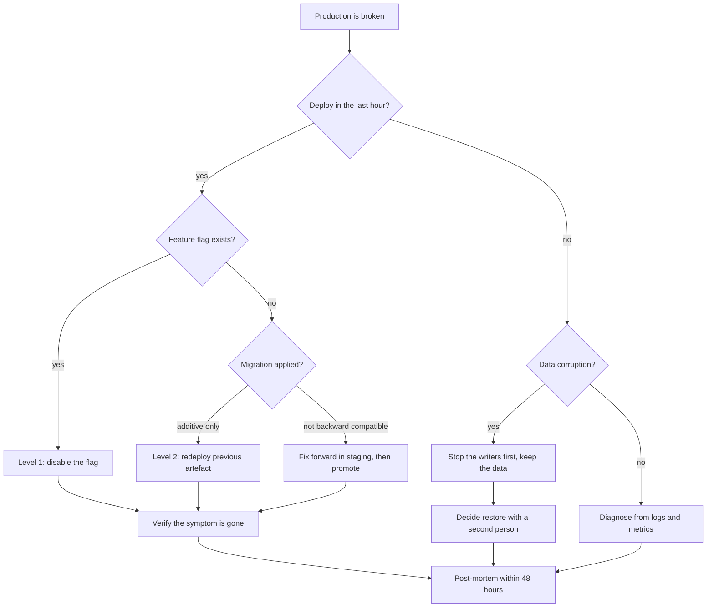

> **Section 07 · Lesson 7** · Level: intermediate · ~18 min · Prereq: [Environments and promotion](07-Environments-And-Promotion)

## Why this matters

Every deploy bets that the new version is better than the one running. Sometimes the bet loses, and the only question left is how long users stay affected. Teams that recover in three minutes prepared the retreat before advancing. This page is that preparation, plus what to actually do while production is broken.

## Design for rollback before you need it

Three properties make rollback possible, and all three are decided at design time.

**Immutable artefacts.** Every deploy produces a new, addressable artefact and keeps the previous one. Rolling back means redeploying an earlier artefact by its identity, not reverting files and hoping the build reproduces.

```bash
railway redeploy --service my-api --yes       # redeploy the previous build
wrangler rollback                             # previous worker version
```

**Backward-compatible migrations.** A schema change must leave the *previous* code working: add columns as optional and nullable, backfill separately, and only later drop or tighten. Which leads to the hard rule: **migration rollback is not code rollback.** Old code plus a new schema usually works; new code plus an old schema usually does not. So keep schema changes additive, and roll back the code, not the data.

**Feature flags.** A flag decouples "deployed" from "enabled". A risky feature ships dark, gets enabled for one account, then everyone. If it misbehaves you flip a boolean — seconds, no deploy, no build queue.

## Three rollback levels

| Level | Action | Time | Cost of being wrong |
|---|---|---|---|
| 1. Flip the flag | disable the feature | seconds | near zero |
| 2. Revert the code | redeploy the previous artefact | minutes | a second deploy |
| 3. Restore the data | restore a snapshot, replay what was lost | tens of minutes to hours | every write since the snapshot |

Always reach for the lowest level that fixes the symptom. Going to level 3 first turns a twenty-minute incident into a day of reconciliation, and it is the only level where you can lose data — so it needs a second person and a written decision.

## Write the rollback section in the same PR

The review that approves a risky change should approve its retreat. Add a `## Rollback` section to the pull request, not a separate document nobody will find at 22:00.

```markdown
## Rollback
- Feature flag: `new_checkout` (off = old path, no deploy needed)
- Code: `railway redeploy --service web-api` (previous image is retained)
- Data: none — migration 0047 is additive only
- Watch after rollback: `checkout_failure_rate` returns to baseline within 5 min
```

If you cannot write that section, the change is not ready. The exercise exposes the migration that is not additive, or the feature with no flag.

## During an incident

**Stop the bleeding before you diagnose.** Diagnosing with users affected is the expensive way to learn. If a deploy is the suspected cause, revert it, then investigate. The exception is a data-corrupting bug, where reverting can make things worse — stop the writer, keep the data, then think.

**Communicate on a schedule, not on news.** Pick a cadence (every 15 minutes) and post even when the update is "still investigating". Silence reads as abandonment.

**Keep a timeline as you go.** Timestamps, what you observed, what you changed. Reconstructing it later from memory produces fiction.

**Fix forward or roll back?** Roll back when the cause is a recent deploy and the artefact still exists. Fix forward when a rollback would break something else (an applied data migration, a contract other clients use) or when the fix is one line you can verify in staging within minutes. Say which you chose.



## After: a blameless post-mortem that changes something

Write it within a couple of days, while the timeline is fresh. Blameless does not mean consequence-free; it means the target is the system, because a process that lets one tired human break production will do it again with a different human.

The document is short: what happened, what users experienced, the timeline, the cause, then **one checkable change** a reviewer can verify:

- a **gate** — "CI blocks a migration that drops a column without a two-step plan"
- an **alert** — "page when `checkout_failure_rate` exceeds 2% for five minutes"
- a **rule** — "no production deploy after 16:00 Friday without a second engineer available"

One change, implemented, beats nine listed. A post-mortem whose action items have no owner and no date produces the same incident again.

## Try it

1. Take a real change in one of your repositories and write its `## Rollback` section as a pull request comment before merging.
2. Put one feature behind a flag driven by a single environment variable, defaulting to off.
3. Practise level 2: deploy something, roll the deployment back, and time it. Record the number in your runbook.
4. Write `docs/incident-template.md` with the five sections above plus the one-change field.
5. Run a five-minute tabletop: a teammate reads "the deploy broke production" and you narrate which level you would use and what you would check first.

## Common mistakes

- **Diagnosing before reverting.** Users stay broken while you read code for twenty minutes.
- **Rolling back code without checking the migration.** Old code against a schema the migration changed can be worse than the new code.
- **Silent incidents.** No updates means everyone else builds their own theory of the outage.
- **A post-mortem with a nine-item action list.** Nothing gets done. Ship one checkable change.

## Key takeaways

- Prepare rollback at design time: immutable artefacts, additive migrations, feature flags.
- Escalate through the levels in order — flag, code, data. Fewest writes lost wins.
- The migration is the part that cannot be rolled back casually; keep it additive.
- During an incident: stop the bleeding, communicate on a schedule, keep a timeline, state your strategy.
- Every post-mortem ends in one checkable change with an owner and a date.

## Further learning

- [Deploying with the CLI](https://docs.railway.com/cli/deploying) — redeploy semantics and where previous deployments live.
- [Railway documentation](https://docs.railway.com/) — deployment history, volumes and backups.
- [Neon documentation](https://neon.com/docs/introduction) — restore points and branching for the data-level rollback.
- [CI troubleshooting](05-CI-Troubleshooting) — reading a red pipeline before you blame the app.
- [Observability](06-Observability) — the alerts and metrics an incident depends on.
