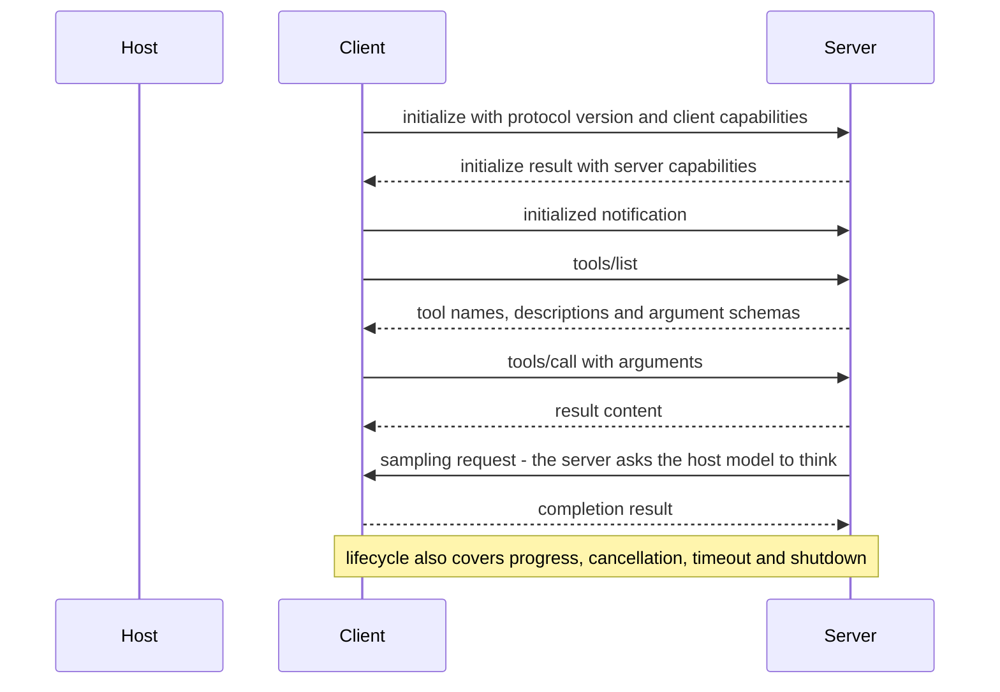

> **Section 08 · Lesson 2** · Level: advanced · ~18 min · Prereq: [What is MCP](08-What-Is-MCP)

## Why this matters

Two questions decide how much damage a server can do: how it connects to your machine, and what it was granted when it did. Transports answer the first. The handshake and scopes answer the second. Get them wrong and a convenience feature becomes a process you never watch, holding credentials you never remember issuing, with a path out to the network.

## Transports: stdio or HTTP

The 2025-06-18 revision of the specification defines two standard transports.

**stdio** — the client launches the server as a child process and speaks JSON-RPC over standard input and output. It is code running on your machine, under your account.

**HTTP** — the client talks to a server over the network: a hosted service, or something you run that other machines can reach.

The distinction is not cosmetic:

| | stdio | HTTP |
|---|---|---|
| Where the code runs | your machine, your user | wherever the server lives |
| Filesystem reach | whatever your user can read | none, unless the server has its own |
| Credentials | environment variables you pass at launch | usually a token on each request |
| Network exposure | nothing inbound | reachable by others, so auth matters |
| Typical failure | the process crashes, you see it | hangs, timeouts, 5xx responses |
| The trust question | should I run this program? | should I send my data there? |

One detail that bites people: unless the client passes an explicit environment, a stdio server inherits yours. Give it the two variables it needs.

## The handshake and capability negotiation

Connections are stateful and start with an initialisation exchange: the client sends a protocol version and its capabilities, the server answers with its version and its features. Both sides then know what is on the table.

Read the consequences off that diagram. A capability the server never declares is unavailable; a capability the host does not declare — sampling, roots, elicitation — cannot be used even if the server wants it. And `tools/list` can answer differently tomorrow, which is the mechanism behind a rug pull: [MCP Security Risks](08-MCP-Security-Risks).

## Beyond tools: sampling, roots, elicitation

- **Sampling** lets a server ask the host's model to complete a prompt, so it gets reasoning without holding its own model credentials. The specification requires users to approve sampling requests and control the prompt sent, and it deliberately limits what the server can see. Practically, sampling spends your tokens: treat it as spending.
- **Roots** let the host declare which filesystem paths or URIs a server should operate in. The server asks; the host answers. This is a declaration, not enforcement: nothing stops a server touching a path outside its roots. Enforce it with file permissions and a container.
- **Elicitation** lets a server ask the user for input mid-task. Convenient, and a social-engineering surface: a request arriving through a server can look more authoritative than it is. Keep server-initiated prompts visually distinct, and never paste a credential into one.

## Scoping and blast radius

A server's blast radius is exactly the access you handed it. Four dials:

- **Filesystem** — one project directory, not `$HOME`.
- **Credentials** — a read-only token first, scoped to one repository or table set, short-lived and revocable. Never the credential your production application uses.
- **Data** — staging or a throwaway dataset first. A destructive call against a copy is a lesson; against production it is an incident.
- **Egress** — decide whether it may reach the internet at all. Many useful servers never need it.

Rotation has an order: update the non-production copy first, verify one real end-to-end action, then production, then watch the logs for authentication failures. Audit the other direction too — stale credentials from an old experiment are still live credentials.

## Lifecycle and failure modes

- **A hung server** looks like a frozen agent. Make sure the client times out tool calls, and that you know where cancel is.
- **A crashed server** kills the connection mid-session. Before retrying, ask whether the failed call was safe to repeat: a read is, a payment is not.
- **A restarted server** may present different tools. Diff the tool list after every update; a changed description is a fresh approval.
- **A version mismatch** is usually a clear initialisation error. Read it rather than reinstalling in a loop.
- **Shutdown** is part of the lifecycle. A process still running after the agent exits is a leak worth investigating.

## Try it

1. In your config, note the transport of every server: a command line means stdio, a URL means HTTP.
2. For one stdio server, read the environment block it receives. Delete anything it does not demonstrably use, then restart and re-test.
3. Snapshot the tool list to a date-stamped file. That file is your rug-pull baseline.
4. Break it on purpose: set one launch argument to something invalid, restart, and compare how the agent reports an unreachable server versus a tool that ran and returned an error.
5. Note the data each server can see: staging or production, one path or many.

## Common mistakes

- **Handing a stdio server your entire environment** — it inherits whatever you launched it with. Pass the two variables it needs.
- **Believing roots constrain a server** — roots are a declaration. Enforcement is file permissions and containers.
- **Treating sampling as free** — a server can spend your tokens.
- **No timeout on tool calls** — a hung server then reads as a broken agent, and you debug the wrong layer.
- **Reinstalling to "latest" without diffing tools** — that is the window a rug pull needs.

## Key takeaways

- Two transports: stdio for a local process, HTTP for a networked server. Each carries a different credential and trust story.
- Connections are stateful and start with a capability negotiation; undeclared capabilities are unavailable.
- sampling, roots and elicitation are server-initiated. All three are useful; none is a safety control.
- Blast radius equals granted access: filesystem root, credential scope, data environment, egress.
- Plan for hangs, crashes and restarts, and diff the tool list after every update.

## Further learning

- [MCP specification, 2025-06-18](https://modelcontextprotocol.io/specification/2025-06-18) — transports, lifecycle and the client features described above.
- [Model Context Protocol](https://modelcontextprotocol.io/) — per-feature documentation for sampling, roots and elicitation.
- [MCP Tool Poisoning (OWASP)](https://owasp.org/www-community/attacks/MCP_Tool_Poisoning) — why the trust gap between connect time and run time matters.
- [Secure use reference (GitHub Docs)](https://docs.github.com/en/actions/reference/security/secure-use) — pinning third-party code applies here too.
