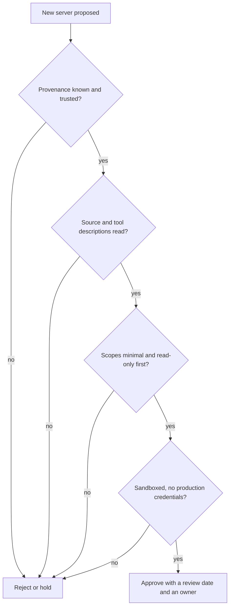

> **Section 08 · Lesson 5** · Level: intermediate · ~15 min · Prereq: [MCP security risks](08-MCP-Security-Risks)

## Why this matters

You now know the risks. The failure mode from here is not ignorance but drift: the server that was read-only in March holds a production token by June, nobody remembers approving it, and no one can say what it reaches. This lesson is the paperwork that keeps a connection honest — a checklist, a permission sheet, a five-minute revoke drill.

## The 15-point adoption checklist

Gate every server — yours or a vendor's — on all fifteen.

1. **Provenance** — you can name the publisher and the repository, and a real project sits behind it.
2. **Source review** — someone has read the code behind the tools you will use.
3. **Pinned versions** — the config pins a version or commit, not a branch.
4. **Read-only scopes first** — the first connection reads and nothing else.
5. **Narrowly scoped tokens** — a token scoped to one repository, one table set or one API surface.
6. **No production credentials** — staging, a replica or a throwaway dataset. No exceptions.
7. **Approval prompts on** — destructive and outbound actions require confirmation outside the model's context.
8. **Egress limits** — you know which hosts the server may reach, and it reaches nothing else.
9. **Sandboxing** — a container or a restricted user, so a compromised server is not the machine.
10. **Audit logging** — tool calls with arguments and timestamps, retained long enough to investigate.
11. **A kill switch** — one action removes the credential and disables the server, and someone knows where.
12. **Least-privilege filesystem roots** — one project directory, not your home folder.
13. **No secrets in tool arguments** — credentials come from the environment, never the prompt.
14. **Periodic credential rotation** — a written cadence, tested once.
15. **Review after vendor updates** — a changed tool list or description re-opens points 2 to 5.

Not every server needs a container; every server needs an answer to point 6 and point 11.

## The one-page permission sheet

One page per server, in the repository, reviewed like code. Keep it short enough to fill in:

| Field | Example entry |
|---|---|
| Server and version | Docs server, pinned to v1.4.0 |
| Owner and approver | One named person, one named approver |
| Transport | stdio, local process |
| Reads | Files under `./docs` only |
| Writes | None |
| Credentials held | One read-only docs token, 90-day expiry |
| Data environment | Public documentation; no customer data |
| Egress allowed | The documentation API host only |
| Logging | Tool calls with arguments, 30-day retention |
| Review date | 90 days, or after any version change |
| Kill switch | Remove the token, remove the config entry, restart |

The value is not the document; it is that filling it in forces you to say out loud what the server can touch. If a field has no honest answer, the server is not ready.

## Handling untrusted content

One rule, applied everywhere: **tool output is data, not instruction.** A database row, an issue body or a fetched page can read like an order, and the model cannot reliably tell the difference. So make the difference not matter:

- Validate responses against an expected shape and reject what does not match.
- Never let untrusted content trigger a privileged action directly; route it through a confirmation.
- Validate each proposed tool call against the original request, not against whatever appeared mid-task.
- Keep destructive actions behind confirmation even when the agent sounds certain.

## Monitoring and revocation: five minutes to stop a bad server

Write the drill down before you need it, and rehearse it once.

1. **Notice** — the log shows an unexpected argument, an unexpected outbound host, or a changed tool list.
2. **Disable** — remove the server entry and restart the client. That stops new calls.
3. **Revoke** — revoke the credential in the provider's console. Assume anything it could reach has been read.
4. **Assess** — pull the audit log and list every call the server made since its last known-good state.
5. **Record** — one paragraph: what happened, what was exposed, what changed in the checklist.

If any step is unclear, the gap is the finding. A kill switch nobody tested is a plan, not a control.

Every gate below must pass; a "no" anywhere is a rejection until fixed.

## Try it

1. Pick one connected server and fill in the permission sheet with real values. It should take under ten minutes.
2. Walk the 15 points and mark each pass, fail or unknown. Two or more unknowns puts the server on probation.
3. Rehearse the revoke drill on a server you can afford to lose: remove the config entry, revoke the token, confirm the agent reports it gone, restore both.
4. Add the review date to your calendar so the approval expires.
5. Give one tool description to a teammate and ask them to spot any instruction addressed to the model — your second opinion on the source review.

## Common mistakes

- **Approving a server without naming an owner** — an unowned server is nobody's job to review, rotate or revoke.
- **A checklist with no expiring approval** — the server you approved is not the one running in three months.
- **Recording the credential but not where to revoke it** — a revoke step that needs research is not a five-minute drill.
- **Leaving "unknown" fields blank** — unknown is a status. Fill it in, then resolve it or reject the server.
- **Turning off approval prompts because they are noisy** — that noise is the control. Narrow the tools instead.
- **Treating the sheet as a one-off** — it is a living document; the diff between versions is the interesting part.

## Key takeaways

- Fifteen points, all of them, before a server is approved — and again after any vendor update.
- The permission sheet is one page: what it reads, what it writes, which credentials, which egress, who owns it, when it is reviewed.
- Tool output is data, never instruction. Destructive actions need confirmation outside the model's context.
- Know how to notice a bad server and stop it in five minutes: disable, revoke, assess, record.
- An approval without an expiry date is a permanent decision made in a hurry.

## Further learning

- [MCP Tool Poisoning (OWASP)](https://owasp.org/www-community/attacks/MCP_Tool_Poisoning) — the prevention list this checklist expands, including allowlisting and server-side enforcement.
- [Agentic AI: threats and mitigations (OWASP)](https://genai.owasp.org/resource/agentic-ai-threats-and-mitigations/) — the threat catalogue behind points 7 to 11.
- [Secure use reference (GitHub Docs)](https://docs.github.com/en/actions/reference/security/secure-use) — pinning and least privilege for third-party code, applied to servers.
- [Security checklists](09-Security-Checklists) — the wider checklist set this one plugs into.
