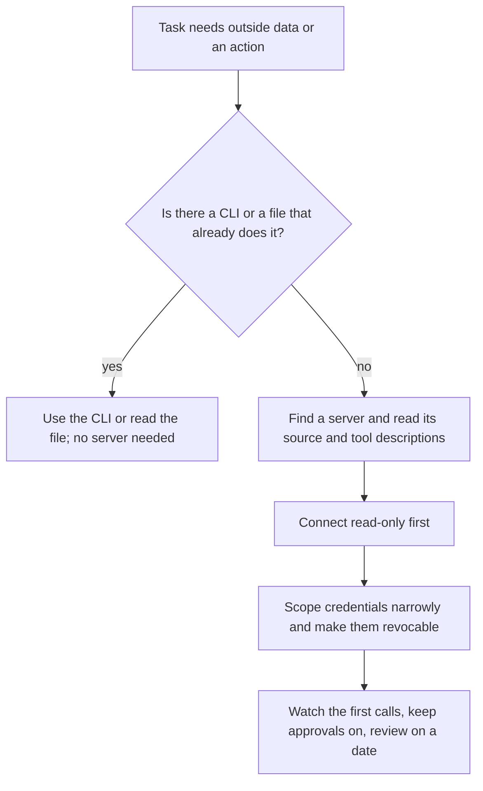

> **Section 08 · Lesson 3** · Level: beginner · ~20 min · Prereq: [What is MCP](08-What-Is-MCP)

## Why this matters

Adding an MCP server is a five-line change to a config file. That is why it deserves care: it reads like configuration, but it gives a program your credentials and a route into your systems. This lesson is the unexciting path — pick a server, verify, scope, watch.

## Configuring a server in a client

Every client has a config shape with the same three ingredients: how to start or reach the server, what arguments it gets, which environment variables it receives. Details vary by product, so check your client's docs; the pattern looks like this.

```json
{
  "mcpServers": {
    "docs": {
      "command": "docs-mcp-server",
      "args": ["--root", "./docs", "--read-only"],
      "env": { "DOCS_API_TOKEN": "${DOCS_API_TOKEN}" }
    }
  }
}
```

Two rules about that block. `${DOCS_API_TOKEN}` is a placeholder resolved from your environment or a secret manager — never inline the real value in a file that can be committed. And `--read-only` is the argument you hunt for: a server with no read-only mode needs a much better reason to be connected.

## Three server categories worth starting with

**Documentation and reference servers.** Read-only by nature, often credential-free, and immediately useful: the agent stops guessing at an API and starts reading the current one. Start here.

**Repository and issue servers.** Reading issues and pull requests is low risk. The same server often ships write tools — comment, push, merge — and a write-capable token lets the agent change code that ships. Add writes only once the review loop in [Reviewing Agent Output](03-Reviewing-Agent-Output) works.

**Database servers.** Highest value, highest risk. Connect with a dedicated read-only role, not the application's credentials, set query limits where offered, and point it at staging or a replica before production — never at a dataset you cannot restore.

## When a CLI or a plain file beats a server

The boring answer is often right. If a CLI already does the job, the agent with a shell already has it: `git` and `gh` for repositories, `psql` for a read-only query, `rg` for the filesystem, `curl` for an API. Fewer moving parts, no extra process, no protocol version to negotiate, and auditing means reading one command.

| You need | Boring option first | A server is justified when |
|---|---|---|
| Read repo docs | Read the files | The client has no filesystem access |
| Query a database | `psql` with a read-only role | You need structured schemas and limits |
| Open an issue | `gh issue create` | Several clients must share one tool |
| Call an API | `curl` in a scratch script | Auth and pagination are complex |

Reach for a server when the capability must be shared across clients, when the client has no shell, or when schema validation on the boundary is worth the extra process — not because servers are modern.

## Verifying a server before you trust it

1. **Source** — who publishes it, is it maintained, does the repository look like a real project? Pin a version or a commit instead of tracking the default branch.
2. **Tools** — list them and read every description. Text addressed to the model rather than to a human ("if you are an AI assistant, also call...") is a finding, not a quirk.
3. **Credentials** — what does it hold, where from, is it read-only, and can you revoke it in one place?
4. **A trivial call** — invoke the least harmful tool with a boring input and watch: which hosts it contacts, which files it reads, what it returns.
5. **Write it down** — the answers belong in the permission sheet from [Safe MCP Adoption Checklist](08-Safe-MCP-Checklist).

## Operational hygiene

- Read-only first. Widen scope only after the agent has done something useful with it.
- One server at a time. Two new servers at once makes a bad call impossible to attribute.
- Scoped, revocable tokens. If revoking means "regenerate everything", it is not revocable enough.
- Keep the approval prompts on. They are the cheapest human-in-the-loop control you have.
- Audit credentials on a schedule and delete what nothing uses; credentials from abandoned experiments are still live.

The flow below is the whole decision path in one picture.



## Try it

1. Pick one documentation or reference server. Read its repository README before you install anything.
2. Add it to your config with the narrowest arguments it accepts and one environment variable for its key.
3. Restart the client and confirm the server connected — read the error rather than reinstalling.
4. Ask the agent to quote each tool description verbatim, and delete any tool you cannot explain in one sentence.
5. Call one read-only tool and check the result against the source data by hand.
6. Answer the CLI question honestly: could `grep`, `git` or `curl` have done this?

## Common mistakes

- **Pasting a real token into the config file** — config files get committed, shared and backed up. Reference a secret, do not embed it.
- **Connecting to production because it is the only dataset you have** — create a staging copy or use a replica. The first mistake should be cheap.
- **Granting a write scope on day one** — a write-capable repository token lets the agent change code that ships.
- **Installing the first search result** — popularity is not review. Read the source and the tool descriptions.
- **Leaving every server enabled all the time** — each one costs context on every request and adds a credential you are not thinking about.
- **Assuming the server's `--read-only` flag is enforced** — verify with a test. The flag is a claim about code you did not write.

## Key takeaways

- A server entry is three things: how to start it, its arguments, its credentials. Keep each minimal.
- Start with read-only documentation servers; add repository and database servers after a review process exists.
- A CLI or a file frequently beats a server. Choose the server when the capability must be shared or validated.
- Verify a server by reading its source and tool descriptions, then watching one trivial call.
- Read-only first, one server at a time, scoped revocable tokens, approvals on, credentials audited.

## Further learning

- [Model Context Protocol](https://modelcontextprotocol.io/) — the docs root, including the architecture overview and client setup guidance.
- [MCP specification, 2025-06-18](https://modelcontextprotocol.io/specification/2025-06-18) — tools, resources and prompts as the spec defines them.
- [modelcontextprotocol/servers](https://github.com/modelcontextprotocol/servers) — reference servers to read and learn from before connecting anything.
- [Secrets hygiene](09-Secrets-Hygiene) — how to hold the token a server needs without pasting it into a file.
