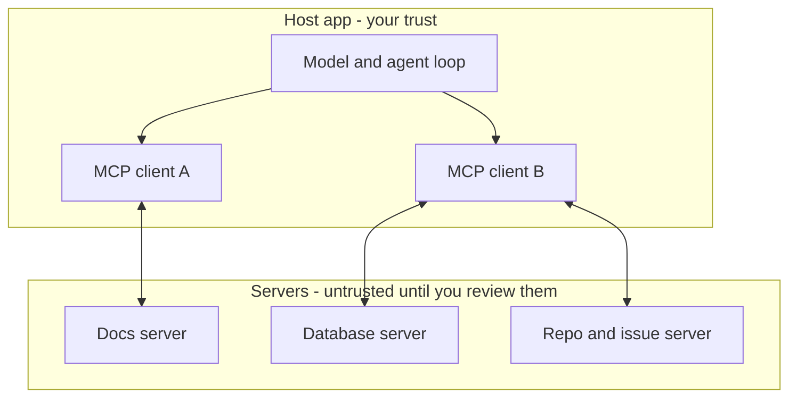

> **Section 08 · Lesson 1** · Level: beginner · ~12 min · Prereq: [The agent loop](01-The-Agent-Loop)

## Why this matters

An agent is only as useful as the things it can reach. Reading files in your repo is table stakes. Asking a live database a question, pulling a page from your docs site, opening an issue — each of those used to mean a custom connector for every agent product you used. MCP replaces that grid of one-off integrations with a single plug shape.

## The problem it solves

Every agent product already knows how to describe and call a tool. That was never the hard part — reuse was. A connector written to let one agent read your documentation worked in that one agent. Move to another product, or move the docs, and you rewrote it.

MCP (Model Context Protocol) is an open standard for that connection: how an AI application discovers what external systems can do, and how it asks them to do it. The 2025-06-18 revision of the specification puts the shape plainly: messages are JSON-RPC 2.0, connections are stateful, and the two sides negotiate which features they each support. The stated inspiration is the Language Server Protocol, which lets one language server work across many editors.

## The three roles

- **Host** — the application you actually run: an IDE assistant, a CLI coding agent, a chat app. The host owns the conversation and the model.
- **Client** — the connector inside the host. One client per server, holding that server's connection and state.
- **Server** — the process that provides the capability: your docs, your database, a code-hosting API.

The line between those two blocks is the point of the diagram. A client talks to a server, and the server runs with whatever access you granted it: its own credentials, its own network reach, its own view of the filesystem. Nothing in the protocol forces it to be honest.

## What a server can expose

Three kinds of capability, per the specification:

- **Tools** — actions the model can invoke: run a query, open a pull request, send a message. The spec is blunt that tools are arbitrary code execution.
- **Resources** — readable data: a file, a table, a document. Context rather than action.
- **Prompts** — reusable templates the user can invoke, like a stored procedure for a task.

The client half can offer capabilities in the other direction: **sampling** (the server asks the host's model to think), **roots** (the host declares which folders or URIs are in scope) and **elicitation** (the server asks the user for input). [MCP Architecture And Transports](08-MCP-Architecture) covers what those mean in practice.

## Why it pays off

Swap the connector, keep the agent. If your team moves documentation platforms, you change one entry in a config file instead of teaching every agent product a new API. The same server works in your editor, your CLI agent, and your CI job.

An MCP server is not a [skill](04-What-Are-Agent-Skills): a skill is instructions the agent reads, a server is a program that can act.

## What MCP is not

- **Not a sandbox.** A server is a program on your machine or a service on someone else's. The protocol does not contain it.
- **Not a security boundary.** The specification states that MCP cannot enforce its trust principles at the protocol level, and that implementors must build consent and access control into their own applications.
- **Not a trust signal.** Tool descriptions and annotations are untrusted input unless they came from a server you reviewed. The spec says so directly.
- **Not a promise about tomorrow.** A server that behaved well at approval can change later. See [MCP Security Risks](08-MCP-Security-Risks).

## Try it

1. Find where MCP servers are configured or listed in your agent's settings. Note the shape: a command plus arguments, or a URL, plus a block of environment variables.
2. Copy the current list into a scratch file. Next to each server, write down who publishes it and where it runs.
3. In a fresh session, ask: "List every MCP tool you have available right now, and quote each tool's description verbatim." Read those descriptions as if a stranger wrote them, because a stranger did.
4. Pick one tool that only reads data and call it with a trivial input. Watch what leaves your machine.

## Common mistakes

- **Treating MCP as a security feature** — "it is a standard protocol" says nothing about whether a given server is trustworthy. Review the server, not the acronym.
- **Adding servers because they look useful** — every server you connect is another program holding your access. Start with one, read it, then add a second.
- **Confusing tools, resources and prompts** — they carry different risk. Reading a resource is usually bounded; invoking a tool can write, send or delete.
- **Assuming a tool does what its name says** — `get_compliance_status` is a name, not a contract. Read the description and, ideally, the source.
- **Ignoring the client half of the handshake** — if the host does not offer sampling or roots, a server that expects them will fail or misbehave.

## Key takeaways

- MCP standardises how an AI app reaches tools and data: one protocol, many clients, many servers.
- Three roles: the host runs the agent, the client holds the connection, the server provides capability.
- Servers expose tools, resources and prompts; clients can offer sampling, roots and elicitation.
- The value is portable connectors — swap one server entry instead of rewriting the agent.
- MCP is a protocol, not a sandbox and not a security boundary. The review is yours to do.

## Further learning

- [MCP specification, 2025-06-18](https://modelcontextprotocol.io/specification/2025-06-18) — the authoritative requirements, including the security and trust section quoted above.
- [Model Context Protocol](https://modelcontextprotocol.io/) — the documentation root: architecture, transports and per-feature guides.
- [modelcontextprotocol/servers](https://github.com/modelcontextprotocol/servers) — reference servers and the community list; read the source before you connect.
- [Agent Skills](https://agentskills.io/home) — the other half of the picture: written instructions versus running capability.
