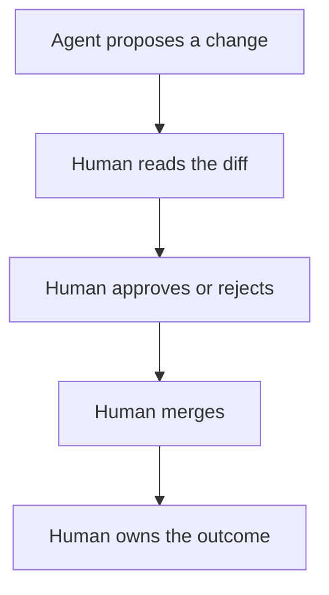

> **Section 09 · Lesson 9** · Level: beginner · ~12 min · Prereq: [Reviewing agent output](03-Reviewing-Agent-Output)

## Why this matters

An agent can write a thousand lines in four minutes. Somebody still answers for every one of them — to a customer whose money moved, to a regulator asking what controls existed, to your team at the retro. Accountability means that answer has a person's name on it, and that the person had a real chance to say no.

## The rule that decides everything

**You own every line you commit, however it was produced.** The authorship of the text is irrelevant; the commit is yours. You typed it, or you accepted it, or you merged the pull request that contained it. That single rule settles most arguments about AI code before they start.

It follows that "the AI wrote it" is not a defence anywhere it matters:

- **With a customer**, they bought a product from you, not from a model.
- **With a regulator**, the question is what controls you had, who approved what, and what you did when it broke — not which tool generated a line.
- **With your own team**, "the agent did it" just moves the question to why nobody reviewed it.

The honest version — "I merged this without reading it properly" — is a correctable process failure. The dishonest version guarantees a repeat.

## Provenance and disclosure

Provenance is recording how a change was produced, so a reviewer can calibrate their trust. Three places it matters:

**Team policy.** Most teams expect a line in the PR template: "generated with an agent, reviewed by me, tests run locally". That does not weaken your ownership; it tells the reviewer what to examine hardest — usually the tests, the error handling and anything touching auth.

**Licensing.** Code can arrive with terms attached. A snippet that closely resembles a licensed source is a risk, so prefer your own patterns over copied ones and glance twice at anything unfamiliar.

**Review standards.** If your team requires two approvals for payment paths, that does not relax because an agent wrote the change. Mark the diff so the rule still applies. [Code review for AI code](13-Code-Review-For-AI-Code) covers what to look for.

## Gates are how accountability becomes real

A policy without a gate is a preference. A gate makes the accountable choice the default:

- **Required reviews.** Branch protection with at least one human approval on the paths that matter.
- **Environment approvals.** A production deploy that waits for a named reviewer. One payments platform required a manual promotion with an approval gate between staging and production — the pipeline could not promote itself.
- **Ownership rules.** A `CODEOWNERS` entry on `.github/workflows` means CI changes need a specific approver. GitHub's [secure use reference](https://docs.github.com/en/actions/reference/security/secure-use) recommends this for workflow files, and it works for skills, rules files and migrations too.
- **Logging who decided.** Approvals, audit logs and review comments are the record you produce when someone asks "who signed off on this, and when?". Keep that record where it cannot be quietly edited.
- **Detective controls when prevention is unavailable.** Without branch protection, one team ran a job on every push to `main` that checked whether the commit arrived via a pull request, and filed a violation issue plus failed the run if not. It is detective — the commit already landed — but the alarm and record are worth having.

## Keeping the skills

Review is how somebody still understands the system. If you merge diffs you cannot explain, the knowledge leaks out of the team and into the agent, and at 2am nobody can diagnose the outage without asking a model that cannot see your logs. Review the diff, not the summary. Run the thing yourself. If you cannot say what breaks when this is wrong, do not approve.

## A short AI-usage policy for a small team

One page is enough, and it must cover:

1. **Ownership** — a human owns every committed line.
2. **Disclosure** — changes produced with an agent are marked in the PR description.
3. **Review** — agent-authored changes get the same or stricter review as human ones; list the paths that require two people.
4. **Data** — what may never be pasted into a prompt: credentials, production customer data, internal documents.
5. **Tools and permissions** — which agents and MCP servers are approved, and what credentials they may hold.
6. **Provenance and licensing** — do not accept code you cannot explain or license.
7. **Incidents** — if an agent caused a production change, report it like any other incident, without blame-shifting to the tool.

## Try it

1. Take the last agent-authored commit you merged. Read the diff line by line and write one sentence on what each hunk does. If you cannot, that is a review gap.
2. Add a `CODEOWNERS` entry for `.github/workflows` and your rules/skills directory, then open a trivial PR to confirm it requests a reviewer.
3. Write your own one-page policy from the seven headings above. Have one teammate review it.
4. Write the provenance line your PR template will use, and use it on your next change.

## Common mistakes

- **Approving a summary instead of a diff.** "The agent explained what it did" is not review: the explanation comes from the same misunderstanding that produced the bug.
- **Letting an agent push or approve its own PR.** Approve-loop automation removes the human from the accountability chain.
- **Relaxing review because tests are green.** Green tests prove the tests ran, not that the tests are right.
- **No record of decisions.** If you cannot reconstruct who approved a production change last month, you do not have accountability, you have memory.
- **Writing a policy nobody enforces.** An unenforced policy teaches the team that policies are decorative.

## Key takeaways

- You own every line you commit, however it was produced.
- "The AI wrote it" fails with customers, regulators and teammates alike.
- Disclose agent involvement where it changes how a reviewer should read the diff.
- Turn accountability into gates: required reviews, environment approvals, ownership rules, decision logs.

## Further learning

- [Reviewing agent output](03-Reviewing-Agent-Output) — what to check before you approve.
- [Code review for AI code](13-Code-Review-For-AI-Code) — the standards this page assumes.
- [Secure use reference (GitHub Actions)](https://docs.github.com/en/actions/reference/security/secure-use) — including `CODEOWNERS` on workflow files.
- [Agentic AI — threats and mitigations](https://genai.owasp.org/resource/agentic-ai-threats-and-mitigations/) — human-agent trust exploitation in context.
