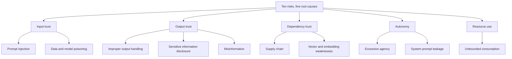

> **Section 09 · Lesson 6** · Level: intermediate · ~20 min · Prereq: [Prompt injection and exfiltration](09-Prompt-Injection-And-Exfiltration)

## Why this matters

The OWASP LLM Top 10 is the shared vocabulary for "what goes wrong when you put a model inside a product". If you build an AI feature, it is your review checklist. If you *use* a coding agent, it describes half your own working day. Knowing the names means you can search for the fix instead of rediscovering the bug.

## What the list actually is

The list is published by the OWASP GenAI Security Project, a community effort that also maintains agentic-AI guidance and cheat sheets. It is **versioned and evolving**. The 2025 edition is the widely cited one; the project has also published a 2026 edition. Item numbers move between editions, so check [the project's list page](https://genai.owasp.org/llm-top-10/) before you cite a number in a design document, and link the project rather than trusting a blog summary. Below, each risk is named and linked to the project, not numbered by guesswork.

## The ten, one at a time

**Prompt injection** — untrusted text is read as instructions instead of data. Ordinary example: a support ticket containing "ignore previous instructions" gets summarised by your assistant, which then does what the ticket said. Cheapest mitigation: clearly separate system instructions from data, and treat everything fetched from outside your code as hostile.

**Sensitive information disclosure** — the model is fed, or leaks, data it should not hold. Ordinary example: an upstream payment response gets logged in full and pasted into a prompt for "summarise this failure". Cheapest mitigation: redact before logging and before prompting.

**Supply chain** — you trust a component you never read. Ordinary example: a pinned-by-tag CI action, or a package name the agent invented, which someone else has registered. Cheapest mitigation: pin to full-length commit SHAs and verify a package exists on its registry before installing it.

**Data and model poisoning** — the material the model learns from or retrieves is corrupted. Ordinary example: someone adds a document to your knowledge base that says failures are impossible, and retrieval starts returning it. Cheapest mitigation: an allowlist for what may be written into retrieval stores and memory, with human review of additions.

**Improper output handling** — model output is used as if it were trusted input. Ordinary example: generated SQL is executed directly, or generated HTML is rendered unescaped. Cheapest mitigation: validate output against a schema and never `eval` it.

**Excessive agency** — the system can do more than the task needs. Ordinary example: a "fix the failing test" agent with a token that can also force-push to `main`. Cheapest mitigation: read-only by default, explicit approval for destructive actions, and permissions enforced in the backend rather than in the prompt.

**System prompt leakage** — your instructions become readable. Ordinary example: the system prompt contains an internal endpoint or a customer name, and a user asks the model to repeat its instructions. Cheapest mitigation: never put anything in a system prompt that you could not publish.

**Vector and embedding weaknesses** — retrieval returns content the caller should not see, or poisoned content ranks highly. Ordinary example: one tenant's document surfaces in another tenant's answer. Cheapest mitigation: filter by tenant and permission at query time, not after generation.

**Misinformation** — confident output that is simply wrong. Ordinary example: a generated summary of a policy document that reverses the policy. Cheapest mitigation: require citations back to the source and verify claims that a human will act on.

**Unbounded consumption** — cost and load grow without limit. Ordinary example: an agent loop that retries an impossible task until your provider bill notices. Cheapest mitigation: per-run budget and step caps, timeouts, and per-identity rate limits.

## You are both the builder and the target

As a builder, every item applies to the product you are shipping. As an agent user, the same items describe your own workflow: your context is filled from issue text, code comments, web pages and tool output (injection); your skills, MCP servers and CI actions are dependencies (supply chain); your agent has a shell and a token (excessive agency); a runaway loop spends real money (unbounded consumption); and a wrong lesson written into a rules file poisons every later session. The controls you build for the product are the controls worth applying to yourself.

## Using it as a pre-ship review

Do not turn the ten into a compliance badge. Walk them once, per feature, with three columns: applies / does not apply, the cheapest control, and who owns it. Anything marked "does not apply" deserves one sentence of justification, because that sentence is what a reviewer will challenge.

## Try it

1. Write the ten risk names on one page, in your own words.
2. For your current project, mark each one applies or does-not-apply, with one clause of justification.
3. For each "applies", write the cheapest control you already have. If there is none, that line is your backlog — put it in an issue today.
4. Paste the list into your agent and ask: "For each risk, name where in this repo untrusted input reaches the model, and say when you are unsure." Then verify its claims by reading the code yourself.

## Common mistakes

- **Treating the list as a certification.** It is a review aid, not a standard you "pass". The project states the content is provided without warranty.
- **Citing item numbers from a stale summary.** Editions change and numbering shifts; link the project's list page instead of quoting LLM0x from a blog post.
- **Filtering only user input.** The dangerous injections usually arrive in content the agent *reads* — an issue body, a README, a tool response, a fetched page.
- **Putting secrets in the system prompt and calling it private.** If the model can see it, the model can be asked to repeat it.
- **Granting a broad token "because it is only staging".** Staging credentials are the ones most often copied into production config.

## Key takeaways

- Learn the ten names; they are how you search for the fix.
- Every risk has a cheapest control, and the cheap controls cover most of the exposure.
- Untrusted *content your agent reads* is the injection surface, not just the user's message.
- The list is versioned — link the source of truth before citing it.
- Apply the same ten to your product and to your own agent workflow.

## Further learning

- [OWASP GenAI Security Project — LLM Top 10](https://genai.owasp.org/llm-top-10/) — the current list, archives and per-risk pages.
- [OWASP Top 10 for LLM Applications (project page)](https://owasp.org/projects/top-10-for-large-language-model-applications) — the OWASP project entry point.
- [LLM Prompt Injection Prevention Cheat Sheet](https://cheatsheetseries.owasp.org/cheatsheets/LLM_Prompt_Injection_Prevention_Cheat_Sheet.html) — concrete input, output and action defences.
