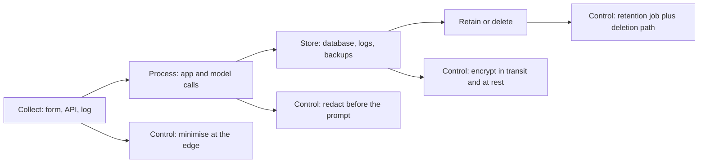

> **Section 09 · Lesson 8** · Level: intermediate · ~20 min · Prereq: [Threat-modeling your workflow](09-Threat-Modeling-Your-Workflow)

## Why this matters

The moment your product handles a real person's name, phone number or payment detail, obligations attach — and AI blurs them, because data leaves your infrastructure in a prompt and returns as text nobody structured. Getting this wrong costs more than a bug: you cannot patch a complaint away.

**This page is not legal advice.** It is an engineering orientation, so you know what to ask. Laws differ by country and change: read the official texts and talk to your regulator or a lawyer before launching something that touches personal data.

## What counts as personal data

Personal data identifies, or can identify, a living person: a name, phone number, email, account number, device identifier, often an IP address or location. It can be one field, or a combination that only becomes identifying together.

"It is just a log line" is not a defence. A log line is a copy: stored, backed up, kept longer than the request, readable by whoever has log access, and often where personal data escapes. On a payments platform we reviewed, full upstream responses — customer phone numbers, names, internal banking identifiers — went to application logs and back to merchants who did not need them, with no retention limit. The request was long gone; the data was not. The fix: redact at the log boundary, strip the field from responses, add a job that clears it after a fixed period.

Data minimisation is an engineering habit, not a policy sentence: collect the field you need, log a masked reference, delete by default. If no feature reads a field this quarter, do not store it.

## The obligations that shape design

Most data-protection regimes share a skeleton:

- **Lawful basis** — a reason to process the data (consent, contract, legal duty). "It was convenient" is not one.
- **Purpose limitation** — data is used for the reason it was collected. Training a model on billing data needs its own justification.
- **Retention limits** — keep data only as long as the purpose requires. "Forever, in case we need it" fails the test.
- **Subject access and deletion** — a person can ask what you hold and ask you to delete it. You need tooling that answers, including for data in a provider or vector store.
- **Breach notification** — if data is exposed, tell the regulator, and usually the affected people, within the deadline the law sets. You cannot meet a deadline you discover late, so alerts and an incident plan are compliance work.

## Kenya's Data Protection Act and the GDPR

At a high level they ask for the same things: a lawful basis, minimal and accurate data, retention only as long as needed, security safeguards, and rights including access and deletion. A design that satisfies the principles of one tends to satisfy the other.

The specifics differ — controller registration, data protection officers, cross-border transfers, breach timelines, remedies. Do not learn those from a blog post or a model's summary. Read the official text of the Act and the Regulation, and the official GDPR text, on the regulator's and the EU's own sites, and check what applies to you with the Office of the Data Protection Commissioner in Kenya or your own supervisory authority.

## Where AI changes the picture

**Prompts leave your infrastructure.** A request that looks local is a network call carrying personal data to a provider, often logged at both ends.

**Provider retention and training settings.** These control whether inputs are stored or used to improve models. That is configuration, not law: choose deliberately, write the choice down, re-check after any plan change.

**Customer data in context.** The point of an AI feature is putting real data in the prompt, so it now exists in request logs, caches and vector stores — each needing the same access control and delete path as your database.

**Generated content that resembles real people.** A model can produce text that looks like a real person's data, or invent one. Test for it, label it, and never store generated identifiers as real records.

## Practices that hold up

Keep a short PII inventory: field, where it lives, why, who reads it, when it is deleted. Encrypt in transit and at rest. Redact before logging, with a test that fails if a known-shaped value reaches a log line. Document retention as a scheduled job with a name. Choose providers and regions deliberately, and record the reason in an ADR — same discipline as [Secrets hygiene](09-Secrets-Hygiene).

## Try it

1. Pick one feature that touches customer data. Write a five-column table: field, stored where, purpose, who reads it, deletion date.
2. Add one redaction test asserting a sample phone number never appears in a captured log line.
3. Check your model provider's retention and training settings, screenshot the values, and paste them into a short ADR.
4. Write the delete path for one field end to end: request, database, backups, logs, vector store. Every place you cannot delete is your risk.

## Common mistakes

- **Logging the whole provider response.** The fastest way to accumulate data you never meant to keep.
- **Assuming a privacy policy page is compliance.** A published policy is a promise; it still needs a retention job, a delete path and access control behind it.
- **Letting the model summarise the law.** It produces confident, plausible, possibly wrong summaries. Read the official text.
- **Forgetting cross-border transfer when picking a host.** Database region, app platform and messaging provider may be in three jurisdictions.
- **No deletion path into the vector store.** Deleting the row in Postgres does not remove the embedding.

## Key takeaways

- Personal data is a storage obligation, not a formatting choice — logs count.
- Lawful basis, purpose limitation, retention, subject rights and breach notice are design requirements, not paperwork.
- Kenya's Data Protection Act and the GDPR share principles and differ in specifics; check the official texts.
- AI features add prompt paths, provider retention settings and vector stores to your data map.

## Further learning

- [OWASP GenAI Security Project](https://genai.owasp.org/) — the project's AI data security work sits alongside its threat lists.
- [OWASP](https://owasp.org/) — hosts the AI Security and Privacy Guide; search the site for it.
- Your national data-protection regulator's own website — the authoritative text of the law you are actually subject to.
