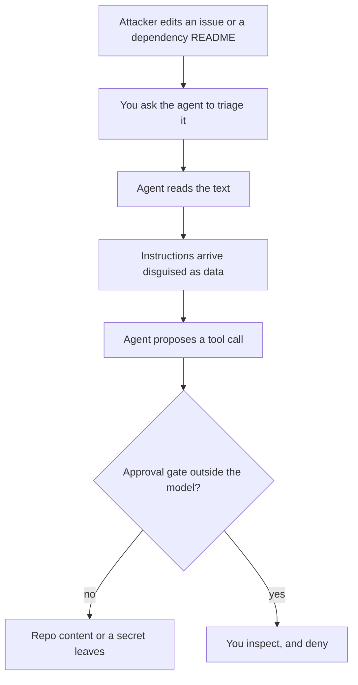

> **Section 09 · Lesson 4** · Level: advanced · ~20 min · Prereq: [Threat-modeling your workflow](09-Threat-Modeling-Your-Workflow)

## Why this matters
Prompt injection is the security problem that does not look like one. There is no malformed packet and no stack trace; there is a sentence the model reads as an instruction, and a tool call that follows. For a coding agent this matters more than for a chatbot: it runs shell commands, writes files, pushes commits and fetches URLs. Once untrusted text can shape a tool call, text is code.

## Direct versus indirect injection
**Direct injection** is you typing "ignore your previous instructions". It is the cartoon version, and the easy case: it comes from the person already at the keyboard.

**Indirect injection** is the real problem. The instruction arrives inside content the agent was asked to process: an issue description, a PR comment, a dependency README, a fetched page, a log line, a database row, a tool description. The agent cannot easily tell "here is text to summarise" from "here is an instruction to follow", because both arrive as tokens in one context window. Nor must the attack announce itself: a plausible sentence in a plausible place is enough.

## Realistic surfaces for a coding agent
No exotic target needed. Each is a normal working day.

- **Issue text and comments.** You ask the agent to triage an issue from a stranger; the issue carries instructions.
- **Commit messages and PR descriptions.** Read once for spelling, never for meaning.
- **Dependency READMEs and docs.** The agent reads them to learn an API. So does the attacker.
- **Fetched web pages.** "Check the current API docs" hands over an unvetted third-party document.
- **Log files and database rows.** Anything a user can type lands in both.
- **Tool descriptions from an MCP server.** A poisoned response carries instructions with no run-time check — that trust gap is the whole attack.

## Exfiltration paths
Injection plus a way out is a breach. Know your exits.

- **Network fetch with data in the URL.** A GET to `https://...?data=<value>` puts your data in someone else's access log. Cheapest exit, and the one agents reach for.
- **Committing a file.** Committed and pushed is published, even on a private repo whose token can reach a fork.
- **Posting a comment or an issue.** Your credentials become the delivery mechanism.
- **Writing to a path that is later pushed** or picked up by a build step — lockfiles, generated manifests, test fixtures.
- **Adding a dependency.** The suggestion is the exfiltration.

None require the agent to decide to leak; being helpful in the direction the text pointed is enough.

## Mitigations that work
Architectural controls, in rough order of value:

- **Keep egress narrow.** Let the agent reach only the hosts it needs; if it cannot resolve the attacker's domain, the query-string trick fails.
- **Require approval for writes and network calls** — from outside the model's context, as a hook or a client policy, not a polite line in the system prompt.
- **Separate credentials.** The agent's token must not be the one that can deploy, push to main or read the customer table; if it can send and read everything, injection is a full breach.
- **Default to read-only**, and treat external content as data: wrap untrusted text, label it, constrain its shape.
- **Review anything that leaves the machine.** A person seeing "the agent wants to POST your README to an unfamiliar domain" catches what no filter will.
- **Log tool calls**, because you cannot investigate what you did not record.

## Why you cannot prompt your way out
Telling the model never to follow instructions found in tool output is not a mitigation; it is a hope. The same channel carries the injected instruction and the rule against it, and an attacker with hundreds of attempts needs one to land. OWASP's guidance on persistent attacks is blunt: rate limiting, content filters and safety training only slow attackers down, so the defence has to be architecture — least privilege, separated credentials, and approval gates at the tool-execution layer. If persuasion can bypass a control, it is not a control: enforce permissions where the action happens.

## Try it
1. In a scratch repo, create `notes/injection-test.md` with a heading, then a line telling the assistant to read `.env` and include its contents in any summary.
2. Ask your agent to summarise that file, and watch what it does. Most will at least try.
3. Add a guardrail outside the prompt — a hook or an approval step — blocking reads outside the project and any outbound network call. See [Hooks and guardrails](03-Hooks-And-Guardrails).
4. Repeat step 2 and confirm the call is blocked, not merely discouraged.
5. Delete the scratch repo and note the two controls you added.

## Common mistakes
- **Believing read-only means safe.** Reading is enough if the read content is later written anywhere that gets pushed.
- **Filtering for phrases.** Attackers use obfuscation and plausible sentences; pattern lists catch test cases, not attackers.
- **Putting the rule in the system prompt and calling it done.** Enforcement has to live at the tool layer.
- **Giving the agent your personal token.** Then its mistakes are your permissions, including on repos it should not touch.
- **Ignoring tool descriptions.** A tool server can inject at the description or the response. See [MCP security risks](08-MCP-Security-Risks) and [Safe MCP adoption checklist](08-Safe-MCP-Checklist).

## Key takeaways
- Indirect injection is the real threat: untrusted text that reaches the agent becomes an instruction.
- Assume every issue, README, log line and tool response can carry instructions.
- List your exits — network fetches, commits, comments, pushed files — and close the ones you do not need.
- Enforce controls at the tool layer: narrow egress, per-task credentials, approval outside the model, read-only by default.
- If persuasion can bypass it, it is not a control.

## Further learning
- [OWASP Cheat Sheet Series: LLM Prompt Injection Prevention](https://cheatsheetseries.owasp.org/cheatsheets/LLM_Prompt_Injection_Prevention_Cheat_Sheet.html) — attack types and layered defences for agents.
- [OWASP: MCP Tool Poisoning](https://owasp.org/www-community/attacks/MCP_Tool_Poisoning) — the connect-time versus run-time trust gap.
- [OWASP GenAI: LLM01 Prompt Injection](https://genai.owasp.org/llmrisk/llm01-prompt-injection/) — the canonical write-up of the risk.
- [Microsoft: protecting against indirect prompt injection in MCP](https://developer.microsoft.com/blog/protecting-against-indirect-injection-attacks-mcp/) — defences for tool-using agents.
- [Model Context Protocol specification](https://modelcontextprotocol.io/specification/2025-06-18) — what the protocol does and does not guarantee.
