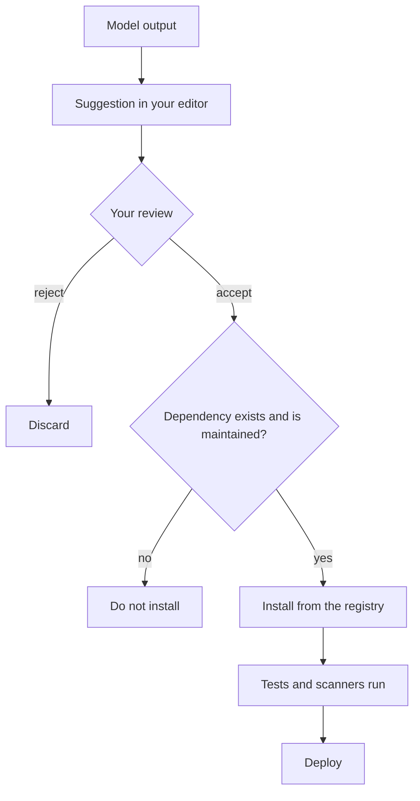

> **Section 09 · Lesson 3** · Level: intermediate · ~20 min · Prereq: [Secrets hygiene](09-Secrets-Hygiene)

## Why this matters
Generated code arrives looking finished. It is formatted, it names variables reasonably, and it often runs on the first try. That polish is not evidence of correctness, and it is definitely not evidence of safety. Security researchers have repeatedly found that code assistants emit insecure patterns at a meaningful rate — string-built queries, disabled certificate checks, permissive CORS, secrets written into logs — so the working assumption is this: every suggestion is an untrusted patch from a fast, confident stranger. You are the reviewer, and the reviewer owns the diff.

## The trust chain
Generated code passes through five hands before it can hurt anyone. Every hand is a place to catch something.



Review is the hand that matters most, because it is the only one that can say no for a reason. Scanners are a backstop for the patterns you forgot to look for, not a substitute for reading the change.


## Slopsquatting: verify every dependency
Language models generate plausible package names, and sometimes the plausible name does not exist. Attackers know this. They watch for invented names, register them on the public registry, and wait for someone to install a package the model made up. This is slopsquatting: the hallucination is the model's, the malware is theirs, and the install is yours.

The mitigation is one habit, applied to every new dependency: **verify before you install.**

```bash
npm view some-package name version repository.url   # does it exist, and is that the real repo?
pip index versions some-package                     # is it published, and how old is the latest release?
```

Then check three things before accepting the suggestion:

- **It exists**, with a release history rather than a single publish from last week.
- **It is the one you meant.** The name is a character or a hyphen away from a popular package — compare against the official docs, not the suggestion.
- **It is maintained.** Recent releases, a real repository, more than one publisher. Your private package names are a target too: if your repo is public and the names are guessable, register the namespace first.

## Insecure defaults to check for
These patterns turn up often enough to be a fixed part of your review.

- **String-concatenated queries.** Parameterise, always. If the diff builds SQL with `+` or an f-string, stop.
- **Disabled TLS verification.** `verify=False`, `rejectUnauthorized: false`, `--insecure`. Convenient in a notebook, wrong everywhere else.
- **Permissive CORS.** `Access-Control-Allow-Origin: *` on an authenticated endpoint.
- **Secrets in logs.** Debug lines printing a token, a full request body, or an environment dump.
- **Missing authorisation on new endpoints.** A generated route checks that someone is logged in but never that this user may read this record.
- **Over-broad file permissions.** `chmod 777`, `0o666`, or writing outside the project directory.
- **Validation that is computed but not enforced.** A payments platform audit found a webhook handler that calculated a signature check and then processed the payload anyway. The check existed; nobody used its result. Read the branch, not the check.

## Licence and provenance
Generated code can reproduce licensed snippets from its training data, and a model has no idea which licence came with the code it echoed. You ship it, so you carry it. Two rules: check the licence of every dependency you add (permissive licences with attribution requirements are common; some copyleft licences constrain how you distribute), and treat a large block of unfamiliar, unusually specific code as something to understand before you keep it. If you cannot explain what a function does, you cannot ship it with a clear conscience or a clear licence.

## The review checklist
For any AI-written change, before you merge:

1. Read the whole diff, not the summary. Agents describe what they intended, not always what they wrote.
2. Ask what inputs this code trusts. Then check it does not trust them.
3. Check authorisation on every new endpoint or query, not just authentication.
4. Check what it logs and what it returns to a client.
5. Confirm every new dependency exists, is maintained, and is the one you meant.
6. Run your tests and your scanners. Treat a clean scan as "no obvious problem found", never as "safe".

## Try it
1. Take a recent AI-written commit and read it end to end without running it. Note every value that enters from outside the function.
2. Pick one new dependency from that diff and verify it: `npm view <name> version` or `pip index versions <name>`, then check the repository URL matches the official one.
3. Add a scanner to CI — static analysis plus a dependency check — and make both required. See [Checks that actually matter](05-Checks-That-Actually-Matter).
4. Rewrite one insecure pattern you found, then add it to your rules file so the next suggestion does not repeat it.
5. Repeat on the next agent PR. The checklist gets faster the second time.

## Common mistakes
- **Reading the agent's summary instead of the diff.** The summary is a description; only the diff is the change.
- **Installing the suggested package because the import worked.** The import works because the package exists — possibly because an attacker registered it last week.
- **Trusting `it's just a prototype`.** Prototypes get promoted. Keys, queries and endpoints survive refactors.
- **Assuming the scanner found everything.** Scanners know patterns. They do not know your business rules, your authorisation model, or the difference between a test and production.
- **Accepting a large diff in one pass.** Big generated changes hide the one line that matters. Ask for smaller diffs.

## Key takeaways
- Treat every suggestion as an untrusted patch: you are the reviewer and you own the result.
- Verify each new dependency exists, is maintained, and is the package you meant — slopsquatting waits on the ones you skip.
- Check the same seven or eight insecure defaults every time; they repeat constantly.
- Confirm the licence of anything you ship, including code a model reproduced.
- Scanners are a backstop; reading the branch is the control.

## Further learning
- [OWASP Top 10 for LLM Applications](https://genai.owasp.org/llm-top-10/) — supply chain and improper output handling, in context.
- [CSA research note: slopsquatting](https://labs.cloudsecurityalliance.org/research/csa-research-note-slopsquatting-ai-supply-chain-20260419-csa/) — how hallucinated packages become a supply-chain attack.
- [Aikido: slopsquatting and AI package hallucination](https://www.aikido.dev/blog/slopsquatting-ai-package-hallucination-attacks) — the attack, and the checks that stop it.
- [OWASP Cheat Sheet: LLM Prompt Injection Prevention](https://cheatsheetseries.owasp.org/cheatsheets/LLM_Prompt_Injection_Prevention_Cheat_Sheet.html) — relevant when a suggestion came from untrusted content.
