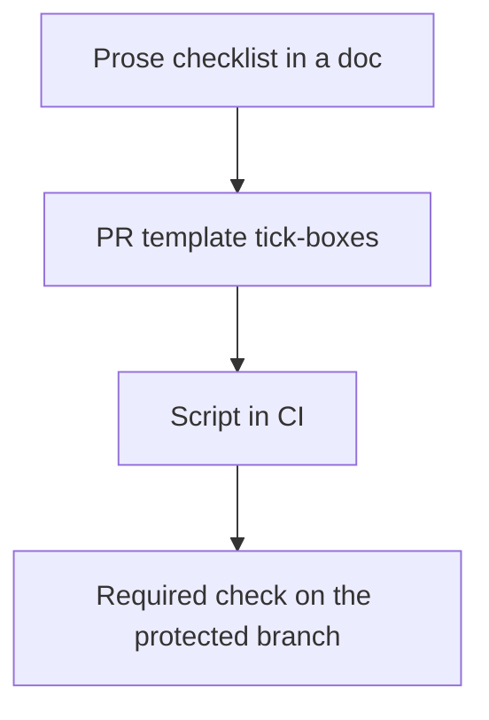

> **Section 09 · Lesson 10** · Level: intermediate · ~15 min · Prereq: [Secure code generation](09-Secure-Code-Generation)

## Why this matters

Security advice is easy to read and impossible to remember at the moment it matters — three minutes before you push, with an agent asking whether it can also "tidy up the config". A checklist fixes that, not because lists are magic but because each item is a verification you can run in under a minute.

## New repository

Copy this the day you create the repo, before the first commit.

- [ ] `.gitignore` covers `.env`, keys and local databases. Verify: `git status --short` shows nothing sensitive about to be added.
- [ ] No secret has ever been committed: run a secret scanner over full history (`fetch-depth: 0` in CI), not just the latest commit.
- [ ] CI actions are pinned to full-length commit SHAs. Verify: `grep -rn "uses:" .github/workflows | grep -vE "@[0-9a-f]{40}"` returns nothing (or only local `./` actions).
- [ ] `GITHUB_TOKEN` defaults to read-only, with permissions raised per job. See [Hardening GitHub Actions](05-Hardening-GitHub-Actions).
- [ ] `CODEOWNERS` lists `.github/workflows` so CI changes need a named reviewer. GitHub documents this in the [secure use reference](https://docs.github.com/en/actions/reference/security/secure-use).
- [ ] The lockfile is committed and your dependency audit runs in CI.
- [ ] One branch is protected: pull requests required, no direct pushes.

## New API endpoint

Run these against the endpoint before you call it done.

- [ ] Call it with no credentials: expect `401`/`403`, not data.
- [ ] Call it as user B asking for user A's resource: expect `403`/`404`, never A's record. This is the single most common AI-authored bug.
- [ ] Send a wrong-typed or oversized body: expect `400`, not a `500` and not a stack trace.
- [ ] Hit it 20 times in a loop: expect `429` before the twentieth request on anything that authenticates or sends messages.
- [ ] `grep -rn "SELECT.*+.*" src/` (or your language's equivalent): string-built queries must be parameterised.
- [ ] Confirm the response contains only fields the caller needs. Upstream payloads and internal identifiers stay server-side.

## New external integration

Integrations are where trust is handed out. Verify each of these by reading the code, not the docs.

- [ ] Signature verification is **asserted**, not just computed. A verified boolean that is never checked is no verification.
- [ ] Every inbound webhook is rejected when its signature fails, and the rejection is logged.
- [ ] Retrying the same request produces one effect, not two — and an ambiguous timeout never releases the idempotency record.
- [ ] Outbound calls have an explicit timeout and a defined failure path.
- [ ] The destination host is allowlisted; the integration cannot be pointed elsewhere by configuration alone.
- [ ] Credentials live in your platform's secret store, not in a committed file, and are separate from production's for staging.
- [ ] Logs record a masked destination and a status, never the full request or response body.

## New AI feature

Work through the OWASP list for this one feature, in this order.

- [ ] Write down every place untrusted text enters the prompt: user input, retrieved documents, issue bodies, tool responses, fetched pages.
- [ ] System instructions are structurally separated from data, and external content is treated as data even when it reads like an instruction.
- [ ] No model output reaches a shell, a SQL string, an `eval`, or unescaped HTML. Verify by grepping the call sites.
- [ ] Tool responses are schema-validated and privileged tools are isolated from untrusted servers.
- [ ] You can name what the feature does without asking a human, and each worst case is reversible.
- [ ] A step cap, token budget and timeout exist, and fail loudly.
- [ ] You listed the personal data that enters the prompt, and justified each field.
- [ ] One injection test exists in the suite: a hostile line in a fixture, asserting the agent does not act on it.

## Before production, for a small product

- [ ] Secrets are in the platform store; anything ever committed has been rotated and removed from history.
- [ ] Security headers are set. Verify: `curl -sI "$APP_URL" | grep -iE 'strict-transport|x-content-type|x-frame|content-security|referrer'` returns the headers you expect.
- [ ] One endpoint has been tested as two different roles, with a negative case.
- [ ] Login and message-sending endpoints are rate limited per identity and per IP.
- [ ] You have restored a backup into a scratch database at least once.
- [ ] At least two alerts exist: error rate and failed logins.
- [ ] You have rehearsed a rollback, and you know the command.
- [ ] Payment or email paths are idempotent, so a retry cannot double-charge or double-send.

## From checklist to gate

A checklist in a document depends on someone remembering. Move it up the ladder as the item earns it:

The bottom rung is where a control stops depending on memory. Two items above are scriptable in an afternoon — the pinned-action grep and the secret scanner — and both should be CI checks. See [Checks that actually matter](05-Checks-That-Actually-Matter).

## Try it

1. Copy the five checklists into `docs/security-checklists.md` in your repo.
2. Implement one of them as a PR template (`.github/pull_request_template.md`) with real tick-boxes.
3. Script the pinned-action grep as a CI job and make it a required check.
4. Run the "new AI feature" list against the most recent AI feature you shipped and file an issue for every unchecked box.

## Common mistakes

- **Building the checklist but not the gate.** Docs get skimmed; required checks do not.
- **Checking only the latest commit for secrets.** The secret is usually in history, where a scanner without `fetch-depth: 0` will never look.
- **Assuming a computed signature check means enforcement.** If nothing asserts the boolean, nothing is verified.
- **Rate limiting only the UI.** Attackers call the API directly; limits belong on the endpoint.
- **Treating "no test failures" as "no failures".** Two of these items — authz negatives and injection tests — fail silently without a test that asserts them.

## Key takeaways

- Every item on these lists is a verification, not a policy statement.
- Start with the repository list; it is cheap and it prevents the expensive category.
- Authorisation negative tests and secret scanning catch the two most common AI-assisted mistakes.
- Promote a checklist item to a CI gate as soon as it can be scripted.
- Checklist in a doc, then PR template, then CI, then a required check.

## Further learning

- [Secure use reference (GitHub Actions)](https://docs.github.com/en/actions/reference/security/secure-use) — pinning, token permissions, secrets handling.
- [Secrets hygiene](09-Secrets-Hygiene) — rotation, storage and what to do when one leaks.
- [Supply chain security](09-Supply-Chain-Security) — the dependency decisions behind the repository list.
- [LLM Prompt Injection Prevention Cheat Sheet](https://cheatsheetseries.owasp.org/cheatsheets/LLM_Prompt_Injection_Prevention_Cheat_Sheet.html) — the source for the AI feature items.
