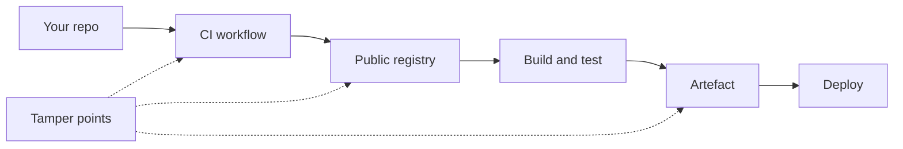

> **Section 09 · Lesson 5** · Level: advanced · ~20 min · Prereq: [Secure code generation](09-Secure-Code-Generation)

## Why this matters
Your codebase is mostly other people's code. Every dependency, every action your pipeline calls and every base image your build pulls is a package someone else can change without asking you. That is fine when the change is a bug fix. It is a breach when a maintainer account is hijacked, a tag is moved, or a postinstall script appears. Supply-chain security is knowing what you ship and making the path to production hard to tamper with.

## Dependencies are the attack surface
Three habits shrink that surface.

- **Commit your lockfile.** It pins the resolved versions and hashes, so an install is reproducible and a silent version bump shows up in review instead of in production.
- **Pin what you deploy.** Let an updater open a pull request instead; a version range that floats to whatever is newest is not a pin.
- **Keep the dependency count small.** Each package is a maintainer you do not control and a transitive tree you cannot see. If five lines of your own code remove a dependency, write them.

## Automated review
Most of this is configuration.

- **Dependency review on pull requests.** A check that reads the manifest and lockfile diff and reports added, changed and removed dependencies with their vulnerability data. It turns "someone added a package" into a reviewable event.
- **Vulnerability alerts.** Enable them so a newly disclosed advisory in something you already use reaches you.
- **Automated update pull requests.** Let a bot open the version bumps with your CI as the test, and read them — an update that changes more than a version string deserves a longer look.
- **Gate on every scan.** A scan nobody must pass is a report nobody reads. See [Checks that actually matter](05-Checks-That-Actually-Matter).




## CI/CD as a supply chain
The pipeline holds your deploy credentials, so it is the highest-value thing to compromise.

- **Pin third-party actions to a full-length commit SHA.** A tag can be moved by anyone who reaches the action's repository; a SHA cannot. As of 2026 GitHub can require this by policy, so a check enforces it instead of your memory.
- **Protect the workflow files.** Put `.github/workflows` under code owners so a change needs a named reviewer. Whoever can edit a workflow can run code with your secrets.
- **Never run untrusted code with secrets.** Privileged triggers that check out code from forks run a stranger's commit where your tokens are readable. Keep that in a job with no secrets and no write permission.
- **Give the workflow token the least it needs.** Default it to read-only repository contents, then raise permissions per job.
- **Prefer short-lived credentials.** Exchange an identity for a short-lived token rather than storing a long-lived cloud key.

## Artefact integrity
Know that what you deployed is what you built.

- **Build once, promote the same artefact.** Rebuilding between staging and production means production runs a binary nobody tested.
- **Publish checksums or signatures with releases** and verify them at deploy. This does not stop a compromise, but it makes a swapped artefact loud instead of silent.
- **Keep provenance.** Record the commit, the run and the inputs that produced the artefact, so "where did this come from?" is a lookup.
- **Let only your deploy path write artefacts.** Read access for many, write access for the pipeline.

## Typosquatting, hallucinated packages and internal names
A model that invents a plausible package name creates an opening for anyone watching the registry. Two checks catch most of it: confirm every new dependency exists, is maintained and is the package the official docs name, and make a human accept every new dependency rather than letting an agent add one mid-task. Your own private names are a target too — if your repo is public and the names are guessable, register placeholders on the public registry first.

## The 10-minute monthly routine
Once a month:

1. Read every open dependency or update pull request, and merge or close it.
2. Clear the vulnerability alerts list.
3. Skim the workflows: actions pinned, permissions minimal, secrets referenced by name?
4. Confirm the current artefact traces to a commit and a run.
5. Delete credentials and variables that no longer have an owner.

## Try it
1. Confirm you commit a lockfile and that CI installs from it, not from a floating range.
2. Enable dependency alerts and automatic update pull requests for the repository.
3. Run a local audit on what you have now:

   ```bash
   npm audit --omit=dev
   pip-audit
   ```

4. Open `.github/workflows/*.yml` and change every third-party `uses:` from a tag to a full-length commit SHA, verifying the SHA belongs to the action's own repository. See [Hardening GitHub Actions](05-Hardening-GitHub-Actions).
5. Add `.github/workflows` to your code owners file, then run the monthly routine once, on a timer.

## Common mistakes
- **Pinning an action to a tag and calling it pinned.** Tags move. Only a full commit SHA is immutable.
- **Letting the updater merge itself.** Automatic updates are useful; automatic merges with no test result and no reader are how a compromised release reaches production.
- **No lockfile, or a lockfile gitignored.** Then your build is a lottery, and a compromise looks like a normal install.
- **Rebuilding for production.** Two builds, two artefacts, one tested.
- **Approving a new dependency because the import resolved.** It resolved because something with that name exists. Verify it is the one you meant.

## Key takeaways
- Commit your lockfile, pin what you deploy, and keep the dependency count small.
- Automate review: dependency review on PRs, alerts, and update PRs that must pass CI.
- Pin third-party actions to a full-length commit SHA and protect workflow files with code owners.
- Build once, promote that artefact, publish a checksum or attestation, keep provenance.
- Verify every new dependency by hand; a wired-up routine beats good intentions.

## Further learning
- [GitHub Docs: secure use reference](https://docs.github.com/en/actions/reference/security/secure-use) — pinning, token permissions, untrusted checkout and reuse risks.
- [GitHub Changelog: SHA pinning policies](https://github.blog/changelog/2025-08-15-github-actions-policy-now-supports-blocking-and-sha-pinning-actions/) — enforcing pinning at repository and organisation level.
- [OWASP Top 10 for LLM Applications](https://genai.owasp.org/llm-top-10/) — supply chain risk, including dependencies and model artefacts.
- [Trend Micro: slopsquatting](https://www.trendmicro.com/vinfo/us/security/news/cybercrime-and-digital-threats/slopsquatting-when-ai-agents-hallucinate-malicious-packages) — how hallucinated package names get registered and exploited.
- [GitHub Actions documentation](https://docs.github.com/en/actions) — workflow syntax, permissions and dependency configuration.
