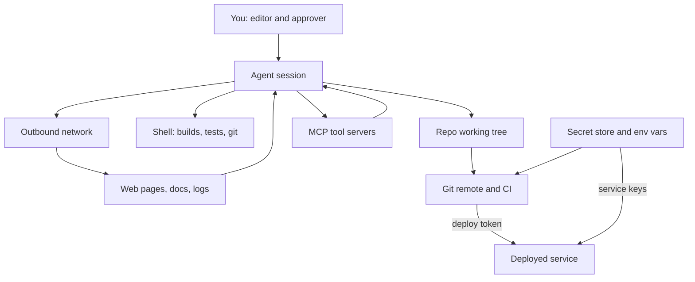

> **Section 09 · Lesson 1** · Level: intermediate · ~18 min · Prereq: [Security architecture](06-Security-Architecture)

## Why this matters
An agent is a new actor in your workflow. It reads files, runs shell commands, installs packages and calls APIs using credentials issued to you. That is what makes it useful, and what makes it risky: the permissions you handed over were sized for a person who hesitates, not for a tool that executes in milliseconds. A threat model is the twenty-minute exercise that turns "the agent can do things" into "the agent can do these five things, here is what breaks if one goes wrong, and here is what I am doing about it."

## The four questions
Every threat model answers four questions, however small it is.

1. **What am I protecting?** Name assets, not "the app": the repo, the API keys, user data, the production database, the domain, your reputation.
2. **Who wants it?** A stranger, a scanner, a competitor, a compromised dependency — or nobody yet, which is a valid answer if you can say why.
3. **How would they get it?** Trace a path, not a feeling. "They would need my CI token, which is a repository secret."
4. **What happens if they do?** Money moved, data exposed, downtime, a client lost, a legal duty. This ranks the work.

Write the answers down; a threat model that lives in your head vanishes the first time the agent does something you did not ask for.

## Draw the data flow with the agent inside it
Draw boxes for the systems, then label every credential on an edge. The point is to see where the agent sits.

The agent straddles a trust boundary. It reads your code, which you trust, and it reads issue text, web pages and tool output, which you do not. Any path that connects the second box to the first through the agent is a path an attacker can try to walk. The defence-in-depth arrangement below is what stops one failure becoming the whole story.

## What is worth protecting
Name the assets before you rank the risks.

- **Credentials.** API keys, database URLs, deploy tokens, signing keys, OAuth secrets. Highest value, lowest effort to steal: one leaked token often reaches everything else.
- **Personal and customer data.** Names, phone numbers, addresses, payment identifiers. A full upstream vendor payload stored in a table and echoed back to a client counts — a payments platform audit found exactly that, and the fix was to stop returning it and age it out.
- **Production access.** Write access to the live database, the ability to deploy, to move money, to change DNS.
- **The codebase itself.** Your source, your private dependencies, your unreleased roadmap.
- **Your reputation.** A breach costs more than the bug; this is the asset that makes you do the boring work.

## The uncomfortable input problem
The agent treats most of what it reads as instructions. Issue bodies, commit messages, README files in dependencies, web pages it fetches, log lines and database rows are all text that arrives from outside your trust boundary, and all of it can carry directives. This is the indirect prompt-injection channel, and it is the reason "the agent only reads, it cannot do anything" is wrong the moment the agent also has a shell. [Prompt injection and exfiltration](09-Prompt-Injection-And-Exfiltration) covers the mechanics; for now, mark every untrusted input arrow on your diagram.

## One page, ranked by effort and impact
You do not need a document. You need a page with four columns: **asset**, **path**, **mitigation**, **effort**, sorted by effort against impact. Cheap, high-impact wins come first, and they are usually the same three: separate credentials per environment, make the agent ask before it writes or reaches the network, and keep a human on anything touching money, production or other people's data. Expensive items go below the line with a note that you have not done them. Owning the gap is part of the model.

## Try it
1. Draw your own version of the flow above. Use paper or `docs/threat-model.md` in the repo.
2. Circle every arrow that carries a credential, then ask of each one: does this need to be readable by the agent, or only by the deploy target?
3. List your untrusted inputs — issues, fetched pages, dependency READMEs, log files — and mark which ones your agent reads today.
4. Fill in the four columns and sort by effort versus impact.
5. Commit the page. Review it when you add a tool, a service, or a new kind of secret.

## Common mistakes
- **Modelling the app and forgetting the workstation.** The laptop holding your `.env`, SSH keys and browser session is usually the easiest thing to reach, so it belongs in the diagram.
- **Treating "the agent is read-only" as a safe state.** Read-only becomes read-and-execute as soon as tests run, a build script executes, or a fetched page is written to disk.
- **Listing threats with no assets.** "Someone might do prompt injection" is not a finding. "Issue text can make the agent POST my repo to an external URL" is.
- **Writing the model once and never again.** The model from before you added MCP servers is stale the day you add them.

## Key takeaways
- Answer the four questions in writing; the asset list is what turns worry into a ranked task list.
- Put the agent in your data-flow diagram and mark every credential and every untrusted input on an edge.
- Cheap wins first: per-environment credentials, approval before writes and network calls, human review near money and production.
- Anything the agent reads that you did not write is untrusted input, including dependency READMEs and log lines.
- Keep the threat model in the repo and revisit it whenever you add a tool or a credential.

## Further learning
- [OWASP GenAI: Agentic AI — Threats and Mitigations](https://genai.owasp.org/resource/agentic-ai-threats-and-mitigations/) — a threat catalogue built for autonomous systems.
- [OWASP GenAI: Securing Agentic Applications Guide 1.0](https://genai.owasp.org/resource/securing-agentic-applications-guide-1-0/) — practical controls for agents with tools.
- [OWASP Top 10 for LLM Applications](https://genai.owasp.org/llm-top-10/) — the named risk list, including excessive agency and sensitive information disclosure.
- [OWASP: MCP Tool Poisoning](https://owasp.org/www-community/attacks/MCP_Tool_Poisoning) — how a tool server turns into an attack path.
