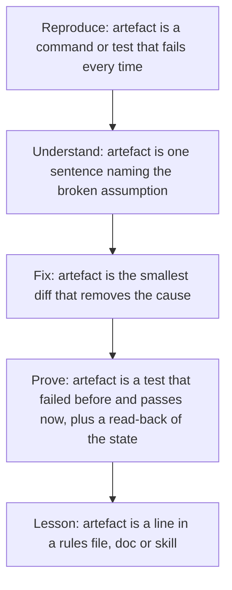

> **Section 10 · Lesson 6** · Level: intermediate · ~18 min · Prereq: [Agentic debugging](03-Agentic-Debugging)

## Why this matters

The fastest way to waste an afternoon is to change code before you can reproduce the failure. Agents make this both easier and worse: one will propose a fix within seconds of hearing a symptom, and that fix will sometimes make the bug quieter instead of removing it. Four phases, always in this order, each one producing an artefact you can point at.

## Reproduce, understand, fix, prove



- **Reproduce.** A command you can paste, and its wrong output. Not "it does not work" — the actual line and the actual result. If you cannot make the failure appear on demand, you have not found the bug yet.
- **Understand.** Name the broken assumption in one sentence: "the WHERE clause binds a parameter that is null, so zero rows match". If you cannot write that sentence, you are guessing, and this is the phase where reading beats editing.
- **Fix.** The smallest change that removes the cause. Resist the urge — yours or the agent's — to refactor three files on the way.
- **Prove.** The test failed before and passes now, and you read back the state you changed. Then write the lesson.

## Reading a stack trace properly

The useful part is usually the innermost frame that is your code. Read top-down, find the first line that belongs to your project, and treat everything above it as the framework explaining how it got there — the router, the middleware, the test harness.

Then read the message literally, because the words tell you which layer is broken:

- A certificate verification failure is a trust-store problem, not a network problem.
- "Column does not exist" is a schema problem, not a query problem.
- A type error saying a `Future` or `Promise` object arrived where a string was expected is a missing `await`, not a serialization problem.

Finally, check the "caused by" chain. The top line is often a generic wrapper your own code added; the real error is the innermost cause.

## Bisect instead of guessing

When something worked last week and is broken now, find the commit instead of theorising. Each round, `git bisect` checks out a midpoint: run your failing command there and mark that commit good or bad.

```bash
git bisect start
git bisect bad              # current commit is broken
git bisect good v1.4.0      # last known-good tag
git bisect good             # or: git bisect bad, at each midpoint
git bisect reset            # when you are done
```

Automate the middle: `git bisect run ./scripts/repro.sh` runs your script at every step and uses its exit code as the verdict. Ten steps narrow a thousand commits to one. The output is more than a hash — it is the change that caused it, its diff, its message, and the test that was not written.

Two caveats: the script must be deterministic — a one-in-five flake sends you to a random commit — and quick, or you will wait an hour.

## Make failures loud

A bug that hides is worse than a bug that crashes.

- **Fail fast, at the boundary.** Validate input and response shapes where they enter your system and raise immediately. A `null` that travels three layers before exploding is hard to read.
- **Log the decision, not the mood.** Log the branching values: "event 123 already processed, skipping". Never log a secret or personal data. And when an exception is swallowed, make the flag loud — a "processed: false" row with no error attached is the hardest kind of bug to find later.
- **Add the test that would have caught it** while the reproduction is still in front of you.

## Write the lesson where it will prevent the bug

A fix in one place does not stop the same class of bug elsewhere. After the fix is proven, ask: which file would have stopped this? The rules file (`AGENTS.md`), the doc for that subsystem, a skill, a lint rule, or a test. One line, written once, saves the next session.

## Try it

1. Break something on purpose, or take a bug you fixed recently. Write the failing command and its full output into `repro.md`.
2. Write one sentence naming the broken assumption. Do not open the editor until you have it.
3. Add a test that fails with the bug, fix it with the smallest possible diff, and confirm the test passes and the read-back is correct.
4. Run `git bisect run` on your last regression and find the exact commit.
5. Write the lesson into the file that would have prevented the bug, and add one fail-fast check at the boundary you just touched.

## Common mistakes

- **Fixing before reproducing.** You cannot tell whether the bug is gone if you cannot make it appear.
- **Accepting a plausible story as the cause.** "It was probably a race" is a hypothesis. The artefact of understanding is a sentence you can point at in the code.
- **A big "while I am here" fix.** You learn nothing about the cause, and you cannot revert one thing.
- **Silencing the symptom.** Wrapping the failing call in a try/catch, or loosening the assertion, makes the bug invisible while the data stays wrong.
- **Bisecting with a flaky repro.** You get a confident answer that is wrong. Make the reproduction deterministic first.

## Key takeaways

- Reproduce first: a failing command you can paste is the entry ticket.
- Name the broken assumption in one sentence before you edit anything.
- The innermost frame that is your code is the interesting one; read the message literally and follow the cause chain.
- `git bisect run` finds the commit in about ten steps and tells you which test was missing.
- Every fix ends with a guard test — and with a line in the file that would have prevented it.

## Further learning

- [Agentic debugging](03-Agentic-Debugging) — using an agent to investigate without letting it guess.
- [Best practices for Claude Code](https://www.anthropic.com/engineering/claude-code-best-practices) — giving the agent a reproducible check to run.
- [CI troubleshooting](05-CI-Troubleshooting) — when the failure is in the pipeline, not the code.
- [Rollbacks and incidents](07-Rollbacks-And-Incidents) — what to do when the bug is already in production.
- [Lesson banks and retros](11-Lesson-Banks-And-Retros) — where the post-fix lesson goes.
