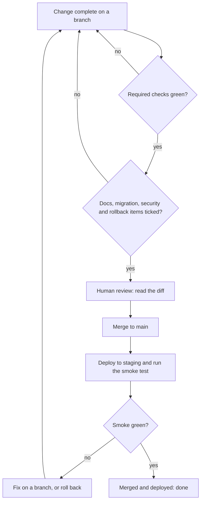

> **Section 10 · Lesson 5** · Level: beginner · ~12 min · Prereq: [Checks that actually matter](05-Checks-That-Actually-Matter)

## Why this matters

"Done" drifts. You finish the code, the agent says it is done, the tests pass locally, and two days later production is missing a migration and nobody wrote the doc. A definition of done is a short written checklist that makes "done" mean the same thing to you, your teammate and your agent.

## A definition of done for a small team

Copy this into `docs/definition-of-done.md`, cut what does not apply, and keep it short enough to read in a minute:

```markdown
A change is done when:
- [ ] Code: the smallest diff that solves the problem, read by a human.
- [ ] Tests: new behaviour has a test; the full suite is green on a clean machine.
- [ ] Migrations: schema changes live in a numbered, idempotent migration, applied on a branch first.
- [ ] Docs: the affected doc is updated; a new capability is described once, in one place.
- [ ] Security: no secret in the diff; new input validated; new endpoints check who is calling.
- [ ] Observability: a log line or metric for the new failure mode.
- [ ] Rollback: you know how to undo it, and the old version still reads the new schema.
- [ ] Deployed: staging verified by the person who wrote it, smoke test green.
```

Eight lines, each one there because somebody shipped without it.

## Why "my machine" and "the agent said so" both fail

- **"It works on my machine."** Your laptop has a different runtime, trust store, environment variables and database. A change that passes locally and fails in a container is not done, it is untested.
- **"The agent says it is done."** An agent stops when the work looks done. It cannot see your staging environment, and it will not notice that a test's expectation was edited to match the bug. A summary is a claim.

Evidence is a command and its output: the suite run from a clean checkout, the smoke result from staging, the migration confirmed as applied. And keep one thing straight: a green check is not proof that anyone read the change. The checklist exists to make the human part explicit rather than assumed.

## Making it mechanical

A checklist in a document nobody opens is decoration. Put it where the work happens:

- **Pull request template**: the items become tick-boxes in `.github/pull_request_template.md`, so the author answers them and the reviewer can see the answers.
- **Required checks**: everything a machine can verify — tests, lint, secret scan, migration lint, format — becomes a required status check. Branch protection turns a habit into a rule ([Branch protection and required checks](05-Branch-Protection-And-Required-Checks)).
- **Docs per feature**: make "no feature without a doc line" a checklist item, and at minimum a CI step that fails when a new route has no entry in the API doc.
- **A decision record for anything significant**: a new dependency, a schema change, a new external service. One page, linked from the pull request.



## Scale the bar with risk

Not every change deserves the full list. Two lanes are enough for a small team:

| Change | Bar |
| --- | --- |
| Copy or layout change | Suite green, one reviewer, staging deploy |
| New endpoint | Plus tests, docs, an authorization check, and smoke coverage |
| Schema change | Plus an idempotent migration applied on a branch, and a rollback you have thought about |
| Money movement or auth | Plus an adversarial test, a second reviewer, and an alert on the new failure mode |

The rule: the cheaper the mistake, the lighter the bar. A copy change does not need a decision record. A change that moves money does, plus a human who understands how it can fail — not just a green tick.

## Try it

1. Write `docs/definition-of-done.md` with the eight lines above, cut to six.
2. Move the machine-checkable items into `.github/pull_request_template.md`.
3. Make your best three checks required in branch protection, then try to merge a deliberately red pull request.
4. Add the docs rule to your rules file: a new capability without a doc line is not done.
5. Take the last change that broke something and find which checklist line would have caught it. If none would have, add one.
6. Write down which lane this week's work is in, and what the bar is for that lane.

## Common mistakes

- **A definition of done nobody reads.** If it is not in the pull request template and in required checks, it is a document, not a rule.
- **Treating a green check as proof of quality.** Green means the machine's questions were answered. It says nothing about whether the change should exist. Read the diff.
- **Bundling docs into "later".** Later never arrives. Make the doc line part of the same diff.
- **The same bar for every change.** A six-step ritual for a typo fix teaches people to route around the process.
- **No rollback line.** "We will fix forward" is not a plan when the fix costs another thirty minutes of downtime.
- **A checklist with twenty items.** Nobody runs it. Six to eight lines is the working range.

## Key takeaways

- Write down what done means, keep it in the repo, and wire the machine-checkable parts to CI.
- "It works on my machine" and "the agent said it is done" are claims; evidence is a command and its output.
- A green check is not proof that anyone read the change. Read the diff.
- Put the checklist in the pull request template so it is answered every time.
- Scale the bar to the risk: copy changes lightly, money and auth heavily.
- Every change needs a rollback you have thought about before you need it.

## Further learning

- [Secure use reference](https://docs.github.com/en/actions/reference/security/secure-use) — least privilege and secret handling in your pipeline.
- [Branch protection and required checks](05-Branch-Protection-And-Required-Checks) — turning checklist items into rules.
- [Documentation per feature](11-Documentation-Per-Feature) — the docs rule, in detail.
- [Environments and promotion](07-Environments-And-Promotion) — where the staging verification step lives.
