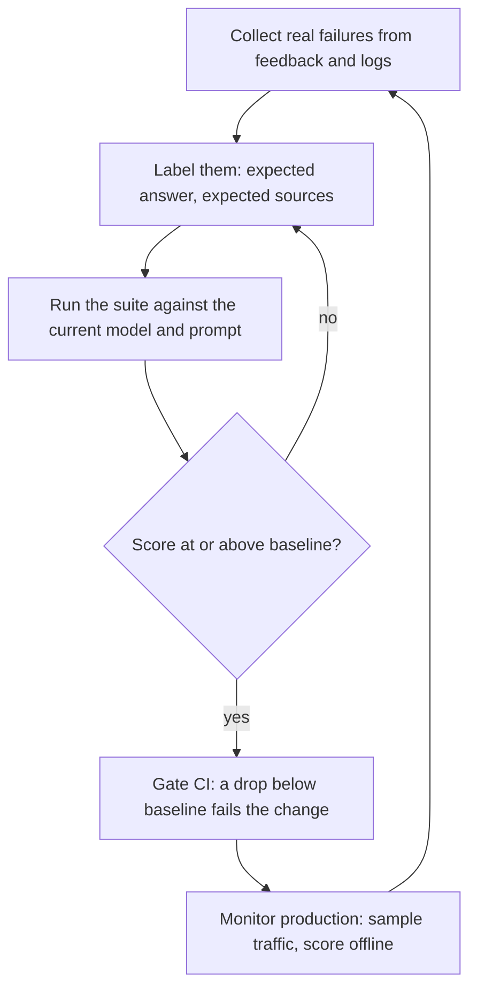

> **Section 10 · Lesson 4** · Level: advanced · ~20 min · Prereq: [Integration and smoke tests](10-Integration-And-Smoke-Tests)

## Why this matters

A normal test asserts one exact output. A feature that calls a model returns different words every time, so `assert answer == "the expected sentence"` is either flaky or useless. You still need a pass-or-fail signal you can put in CI. An eval gives you one: a fixed set of inputs, a scorer, and a threshold.

## What an eval is

Three parts, and nothing more:

- **Dataset**: 30–100 real inputs, each with the answer you expect — or, for retrieval, the documents that should come back.
- **Scorer**: a function that turns one output into a number: exact match, containment, a regex, a citation check, or a model-as-judge against a fixed rubric.
- **Threshold**: the score below which a change is rejected.

Keep the dataset in the repo as a file — JSONL is enough — versioned with the code and run by a script, like a test suite.

## Build the golden set from real failures

Your first 30 cases should not be invented. They should be the questions that already went wrong: user feedback, a support ticket, an answer that came back empty, a hallucination you noticed. Two case types earn a place:

- **Regression cases**: a failure that happened once. It stays in the set forever.
- **Canary questions**: a question whose correct answer and required source you know exactly. A canary catches what normal tests cannot — a fluent answer with nothing behind it. If the expected source is missing from the citations, the case fails even when the prose reads well.

Score these dimensions separately, because they fail separately:

- **Faithfulness** — is every claim in the answer supported by the retrieved context?
- **Relevance** — does the answer address the question that was asked?
- **Retrieval quality** — did the right chunks come back at all, independent of the wording.
- **Citation correctness** — do the cited sources exist, and do they contain the claim?

## Offline evals versus online monitoring

**Offline** means running the set on every change to the prompt, the model, the retrieval or the tools. It is your regression gate: this change must not drop faithfulness below the baseline. A shipped system wired this into CI as its own retrieval-regression workflow, separate from the ordinary test job (as of 2026).

**Online** means sampling live traffic and scoring it asynchronously. One production system sampled roughly 5% of traffic and judged it with a small model for faithfulness, answer relevance and context precision on a 0.0–1.0 scale (as of 2026). Alert on the rolling average falling, and on the share of "no useful context found" answers rising — that usually means retrieval broke, not the model.

## Cost and speed are quality dimensions

A correct answer after forty seconds is a bad answer in a chat window. Set budgets and assert them:

- **Latency budget**: p95 end to end under N seconds on the interactive path. Log p50/p95/p99 per stage so you can see which stage got slow.
- **Token budget**: a maximum prompt plus completion size per request, enforced in code. An answer that only fits by stuffing thirty chunks into the prompt is a bill, not a pass.
- Treat a budget breach as a failing case, not a log warning.

## Size, maintenance, and reporting

Thirty to a hundred examples you actually maintain beat five thousand you never open. Re-measure when the model or the prompt changes: a model upgrade is a change like any other, and a drop is a regression even if no code moved.

Report the trend. Store each run's score with the commit, the model and the date, then plot the last ten. One number in a chat message is not a report; a line that moves is.

## Try it

1. Export thirty real inputs from logs or user feedback. Label the expected answer, or the expected source documents.
2. Write a scorer that returns 0–1 per case and prints every failure with its input and output.
3. Run it once, record the baseline, and set the threshold slightly below it so noise does not fail the build.
4. Add three canary cases where you know the answer and the required citation.
5. Add the run as a required CI check for any change to the prompt, model or retrieval, with latency and token-budget asserts in the same script.
6. Save each run's score with its commit hash and plot ten of them.

## Common mistakes

- **A dataset of five hand-picked happy paths.** It passes forever and catches nothing. Start from real failures.
- **Scoring only the final answer.** Retrieval can break while the model papers over the gap with its own knowledge. Score retrieval separately.
- **An untested scorer.** Feed it an obviously wrong answer; if the score stays high, the scorer is broken, not the feature.
- **A threshold at 100%.** Non-deterministic output will never hold it, so you will disable the gate within a week.

## Key takeaways

- An eval is a dataset, a scorer and a threshold, kept in the repo like a test suite.
- Build the set from real failures; add a canary question for each way the feature can lie.
- Score faithfulness, relevance, retrieval and citations separately — they fail separately.
- Offline evals gate pull requests; sampled online scoring watches production and feeds new failures back.
- Thirty to a hundred maintained examples beat thousands you never open; re-measure when the model or prompt changes.
- Latency and token budgets are part of the score.

## Further learning

- [Evaluation best practices](https://developers.openai.com/api/docs/guides/evaluation-best-practices) — datasets, scorers and iteration.
- [OWASP Top 10 for LLM Applications](https://genai.owasp.org/llm-top-10/) — the named risks, including misinformation and unbounded consumption.
- [Observability](06-Observability) — logging the latency and cost numbers an eval needs.
- [Cost control for side projects](07-Cost-Control) — keeping per-request spend inside a budget.
