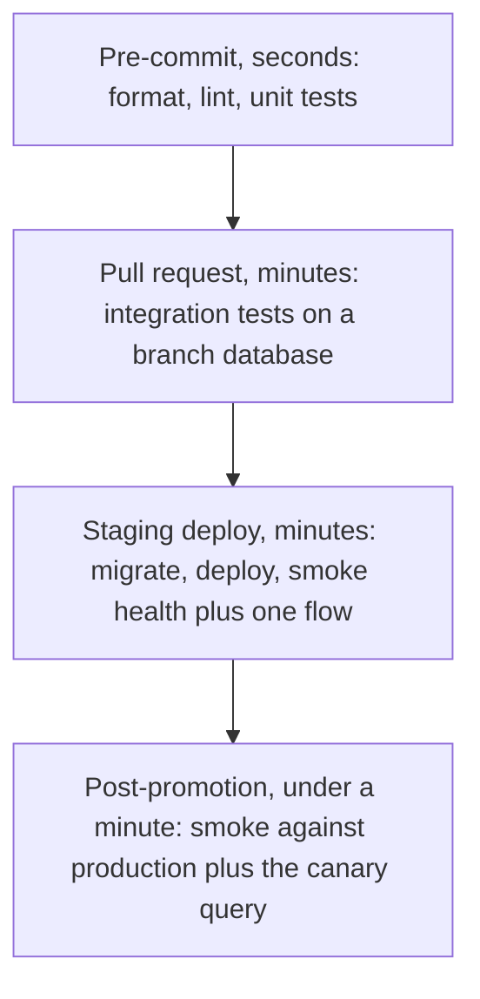

> **Section 10 · Lesson 3** · Level: intermediate · ~18 min · Prereq: [Testing with agents](10-Testing-With-Agents)

## Why this matters

A unit test runs in a process with no database, no environment variables and no network. Most of the failures that page you in staging live in those gaps: a migration that never ran, a container with no CA trust store, a wrong port, a missing secret. This lesson covers the two layers that catch them: integration tests and the deployed smoke test.

## Integration tests with a real database and real migrations

Run the same migration files production uses, against a real Postgres, then drive the route through the real driver. Bugs this catches:

- SQL placeholders bound out of order, so an update matches zero rows and reports success anyway.
- A column that does not exist because the migration was never applied.
- A migration that only fails your runner's way: a runner that splits files on `;` breaks a `DO $$` block into fragments and fails with an unterminated string.
- A response envelope the client reads wrong: one route returns a bare object, another wraps it in `{"data": ...}`, and the caller reads the wrong level, so a branch never fires.

Run migrations through the real runner, on a throwaway database. Pre-verifying with a hand-pasted statement proves nothing.

## Smoke tests against a deployed environment

A smoke test is the smallest set of assertions that proves a deployment is alive and the critical path works. Three parts:

1. **Health**: `GET /health` returns 200 and a body saying the service is up, ideally naming the commit that is running.
2. **One critical flow**: authenticate with a seeded account, perform the single action your product exists for, and assert on the real response body.
3. **A canary query**: a question whose answer you already know. For a ledger, the seeded wallet's balance is exactly X. For a retrieval feature, a known question must come back with a citation to the right document. A canary catches a confident lie, not an outage.

Keep it under a minute, run it after every deploy, and fail the promotion when it does.

## Test the deployed artefact, not the local build

This is the lesson that costs the most to learn. Three real failures, generalised:

- A container built from a slim base image shipped without CA certificates, so every outbound HTTPS call failed with `CERTIFICATE_VERIFY_FAILED` while the same code passed locally, because the local toolchain bundles its own root certificates. The honest check was a probe compiled the way the deployed binary is.
- An environment variable promised by the deploy config was never set in one environment, so the feature quietly fell back to a different code path.
- The platform exposed the service on a different port than the config assumed.

Your laptop runs a different binary, with a different trust store and a different set of variables. Build the artefact you deploy, run it — container and all — and talk to it over HTTP.

## Test data: fixtures, seeds, ephemeral branches

- **Fixtures** live in the test file: small, explicit, one per test.
- **Seeds**: a script that runs after migrations and creates the minimum rows a smoke test needs. Make it insert-if-missing and never hold a staff password in CI.
- **Ephemeral branches**: a managed Postgres with copy-on-write branching gives each pull request its own database to migrate and test against, then throw away ([Neon documentation](https://neon.com/docs/introduction)).
- **Never put test data in a migration.** Migrations run on production during promotion. Seed on branches instead.

## Smoke as the promotion gate

Wire each layer to the moment it belongs to:

A smoke run that fails on its own beats a review comment. When it goes red, the fix is a branch and a fresh deploy — never a hand-patch on the running server.

## Try it

1. Write an integration test that applies your migrations to a fresh database and exercises one route end to end.
2. Swap two placeholders in that route's query and confirm the test fails. Restore them.
3. Write `smoke.sh` with `set -euo pipefail`: health, the critical flow with a seeded account, one canary, and a runtime print.
4. Run it against your staging URL, then point it at a wrong port and confirm it exits non-zero.
5. Add the script as the last step of your deploy workflow and require it before promotion.
6. Write down the exact command or workflow that rolls back to the previous version.

## Common mistakes

- **Mocking the database in an integration test.** It now proves your mock works. Use a real Postgres — a container or a branch.
- **Testing the local build and calling it deployed.** The container has a different trust store and different variables.
- **A smoke test that only checks the process is up.** `/health` can return 200 while the data path is broken. Exercise the critical flow.
- **A smoke run that takes minutes.** Nobody waits, so somebody disables it. Cut cases until it is under a minute.
- **No rollback step.** A red smoke test with no way back means you are debugging production.

## Key takeaways

- Integration tests run against a real database and the real migrations, or they are not integration tests.
- Smoke equals health, one critical flow, one canary query — under a minute.
- Test the artefact you deploy; the container and its environment differ from your laptop.
- Keep test data out of migrations; seed insert-if-missing and use a branch per pull request.
- Make the smoke test the gate between staging and production, with a rollback written down.

## Further learning

- [Neon documentation](https://neon.com/docs/introduction) — serverless Postgres with branching for per-PR test databases.
- [Deploying with the CLI](https://docs.railway.com/cli/deploying) — deploying a service you can smoke test.
- [Deployment pipelines](05-Deployment-Pipelines) — wiring deploy, migrate and verify into one workflow.
- [Environments and promotion](07-Environments-And-Promotion) — staging, production and the approval gate between them.
