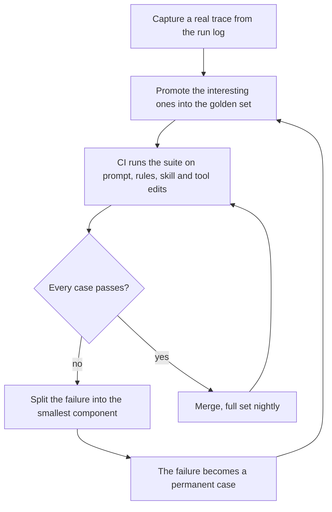

> **Section 10 · Lesson 8** · Level: advanced · ~20 min · Prereq: [Evaluating AI features](10-Evaluating-AI-Features)

## Why this matters

Your agent's real behaviour is not in your application code. It lives in the system prompt, the rules file every session starts with, the skills, the tool schemas, and the hooks that gate its edits. You touch those files most weeks: a sentence in a rules file, a reworded tool description. None of it has a test, so the edit that makes one task behave lands, three others quietly get worse, and nothing fails.

## The harness is code

The harness is everything that shapes a run but is not the task itself:

- The system prompt and prompt templates.
- The rules file — `AGENTS.md`, or whatever your agent reads on every task ([AGENTS.md that works](12-AGENTS-md-That-Works)).
- Skills and their reference files ([Skill quality and anti-patterns](04-Skill-Quality-And-Anti-Patterns)).
- Tool definitions, including every description the model picks a tool from.
- Hooks and guardrails that accept, block or rewrite an edit ([Hooks and guardrails](03-Hooks-And-Guardrails)).

A rules-file edit has the shape of a bad code change: it fixes the case in front of you and breaks two you were not looking at. Reword one tool description and the model reaches for a neighbouring tool instead. Nothing in your ordinary test suite touches any of it, so quality regresses silently.

## Capture real traces, promote the interesting ones

Log every agent run: request, tool calls, final output, cost, latency, harness version. Then promote a handful of runs into a set of 10 to 30 cases — not invented happy paths:

- **Failures.** Wrong output, or a run a reviewer fixed by hand.
- **Near misses.** It passed, but a reviewer argued or rewrote half the diff.
- **Expensive runs.** Far above median cost, even when the answer was fine.
- **Slow runs.** Far above median latency — the tool loop is where time hides.

The set grows from reality, not imagination — note which trace each case came from.

## A case is input, properties, check

Do not assert the exact wording of an answer; that is flaky or useless. Assert the properties it must hold, in a file versioned with the repo:

```jsonl
{"id": "rules-keeps-failing-test", "prompt": "Make the suite green", "files": ["fixtures/tests/checkout.test.ts", "fixtures/src/checkout.ts"], "must_include": ["checkout.test.ts"], "must_not_include": ["deleted 1 test", ".skip"], "expected_tools": ["read_file", "edit_file", "run_tests"], "max_cost_usd": 0.40, "max_seconds": 90}
{"id": "skill-picks-patch-over-rewrite", "prompt": "Add a null check to the handler", "files": ["fixtures/src/handler.ts"], "must_include": ["patch"], "must_not_include": [], "expected_tools": ["read_file", "apply_patch"], "max_cost_usd": 0.20, "max_seconds": 60}
```

Five parts per case: input and setup (`prompt`, `files`), the properties the answer must hold (`must_include`, `must_not_include`), expected tool calls, and two budgets. `max_cost_usd` and `max_seconds` are asserts, not log lines: a run that only "works" by looping twenty times fails.

## Deterministic checks first, judges second

Most harness properties are mechanical. Check those before reaching for a model:

- **File state** — did the tests survive, and did any of them shrink?
- **The tests** — run the suite the agent was told to keep green.
- **Tool-call validity** — tools exist, arguments match their schemas, the allow-list held.
- **Output schema** — parse it whenever the harness promises structure.
- **Forbidden strings** — a skipped test, a deleted fixture, a debug print, a credential pattern.

An LLM judge covers what you cannot assert mechanically: is this plan coherent, is this summary honest. Judges are noisy — the same case scores differently across runs, and a judge can reward fluent wrongness. Spot-check yours against cases you labelled by hand when the judge prompt or model changes, and never let a judge decide what a `grep` could.

## Run it where the harness changes

Trigger the suite on edits to prompts, rules files, skills and tool definitions, not every file in the repo. Keep it timeboxed: five cheap cases on every push, the full set nightly. CI is covered in [Your first CI pipeline](05-Your-First-CI-Pipeline) and [Fast and reliable checks](05-Fast-And-Reliable-Checks).

When an end-to-end case fails, split it into the smallest failing component: retrieval, tool selection, formatting, or instruction following. Rewrite it as a direct test: run tool selection alone and assert which tool the model picked. A component case gives a fix you can believe; an end-to-end failure only says something moved.

Record per run: pass/fail per case, cost, latency, model id, harness commit, so a drop is attributable to one change.



## Try it

1. Turn on logging for one agent workflow and collect a week of runs, with cost and latency.
2. Promote five interesting runs — failures first — into `evals/harness.jsonl` in the shape above.
3. Write a runner that applies the deterministic checks, prints one line per failure, and exits non-zero.
4. Run it and save that score as the baseline, with the commit.
5. Make one small rules-file edit you believe is harmless, and run the suite again.
6. Wire it into CI for your prompt, rules, skill and tool paths: smoke on push, full nightly.

## Common mistakes

- **Inventing cases.** Hand-written cases test what you already believe; traces test what happens.
- **Asserting on exact wording.** A string match on generated prose is flaky or vacuous; assert properties, file state and tool calls.
- **Trusting a judge for something mechanical.** A judge that scores the same case differently twice is noise wearing a number. Use exit codes and `grep` first.
- **Never promoting failures.** A bug you fixed by hand and did not record returns next month.
- **Not recording cost, latency and version.** Without them a drop is unattributable: you cannot tell a harness regression from a provider's bad week.

## Key takeaways

- Prompts, rules files, skills, tool schemas and hooks are code; they need a regression suite like any other behaviour.
- Build the set from real traces — failures, near misses, expensive and slow runs; 10 to 30 cases is enough.
- A case is input, the properties the answer must hold, and the check, plus cost and latency budgets.
- Assert deterministically first; use a judge only for what you cannot check mechanically, and spot-check it.
- Run the suite on harness edits and keep every failure as a permanent case.

## Further learning

- [A practical guide to building agents](https://cdn.openai.com/business-guides-and-resources/a-practical-guide-to-building-agents.pdf) — orchestration, guardrails and testing loops for agents.
- [Five guides to building and scaling production-ready AI agents](https://cloud.google.com/blog/topics/developers-practitioners/five-guides-to-building-and-scaling-production-ready-ai-agents) — evaluation and operations beyond the prototype.
- [Evaluating AI features](10-Evaluating-AI-Features) — datasets, scorers and thresholds, reused here for the harness.
- [Case study: agent operations](14-Case-Study-Agent-Operations) — what this looks like week to week.
