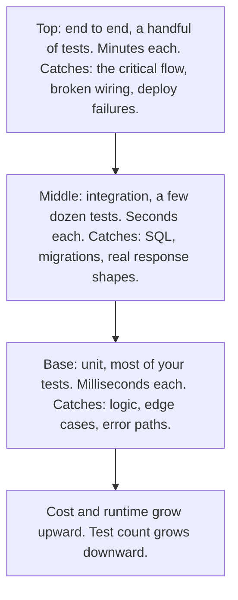

> **Section 10 · Lesson 1** · Level: beginner · ~18 min · Prereq: [TDD with agents](03-TDD-With-Agents)

## Why this matters

Tests are what let you move quickly without reading every line an agent wrote. Without them, "the agent says it works" is your entire verification story. The pyramid gives you three layers with different jobs, so you know what to assert where and which layer to reach for when something breaks.

## Three layers, three jobs

**Unit tests** call one function or class in memory. They catch broken logic: the wrong branch, an off-by-one, an empty input nobody handled. They miss everything about how your pieces fit together.

**Integration tests** run your code against the real things it talks to — a real Postgres, the real migrations, the real JSON you send and receive. This is where the bugs unit tests cannot see live: placeholders bound in the wrong order, a column that does not exist yet, a response wrapped in `{"data": ...}` when the caller reads the top level, a migration that never ran.

**End-to-end tests** drive the deployed system the way a user does: sign in, do the one flow that matters. They catch wiring and deployment failures. They are slow and fragile, so you keep very few.

Each layer exists because the layers below it cannot catch what it catches.

## Test behaviour, not implementation

A test that asserts on internals breaks every time you rename a private method, which makes refactoring expensive. Assert on what a caller can observe: given this input, this output; after this action, this stored row.

There is a stronger form, learned on a real payments project: if a function updates a row, read the row back and assert on it, never on the success flag the function just set. A callback handler set its `processed` flag to true while the row it was supposed to update was never written — the SQL bound the wrong parameter and matched zero rows. Handler and test agreed, and both were wrong.

## Fixtures and fakes: what to mock and never mock

Mock the things you do not control and cannot run locally: an SMS gateway, a payment provider, the clock. Use fakes and fixtures for your own collaborators so unit tests stay fast.

Never mock the database you use in production, and never mock the wire format you actually send. Run integration tests against a real Postgres — a container or a throwaway branch — and let the real serializer produce the bytes. Mocking those is how you get code that passes in CI and fails in staging. When you fake an external service, have the fake record the request so you can assert on what your code sent.

## Coverage is a smoke detector

Coverage says which lines ran, not whether the assertions were right: a test that calls a function and asserts nothing still raises the number. Use it as a smoke detector — a sudden drop means new code arrived untested, a suspicious rise means tests disappeared. Mutation-style thinking without installing anything: for each new test, ask "if I changed this one line to something wrong, would any test fail?" If not, you have a test-shaped object.

## The smallest useful suite for a new project

In priority order:

1. One integration test through the critical path: create the thing, do the core action, read it back.
2. Unit tests for pure logic, with the awkward inputs: empty, zero, negative, duplicate, oversized.
3. Error-path tests: the dependency times out, returns a 500, returns a shape you did not expect.
4. One smoke test against a deployed environment ([Integration and smoke tests](10-Integration-And-Smoke-Tests)).
5. End-to-end tests for the two flows you would page yourself about at 2am.

## Try it

1. Pick one function you rely on. Write a unit test asserting its return value for three inputs, one of them an edge case.
2. Change the body to return the wrong value, run the test, and confirm it fails.
3. Write one integration test against a real Postgres: insert a row, update it, read it back, assert on the stored values.
4. Swap two placeholders in the SQL and confirm the integration test catches what the unit test cannot.
5. Delete a line from the implementation. If no test fails, you have found an untested decision.

## Common mistakes

- **Mocking the database in an integration test.** The test passes and proves nothing about your SQL. Use a real database, even a throwaway one.
- **Asserting on a flag the code just set.** The code and the test agree on a lie. Read the row or the response back from the boundary.
- **Chasing a coverage percentage.** You get tests that execute code and check nothing. Ask instead whether a broken line would fail a test.
- **Deleting a failing test to make the suite green.** A deleted assertion is a changed requirement. Read the test diff first ([Testing with agents](10-Testing-With-Agents)).

## Key takeaways

- Unit tests catch logic; integration tests catch SQL, migrations and wiring; end-to-end tests catch the critical flow.
- Assert on observable outcomes, and read back what you wrote.
- Mock boundaries you do not control. Never mock your real database or your real wire format.
- Coverage is a smoke detector; "would a test fail if I broke this line?" is the real question.
- Start with one integration test through the critical path, then unit tests, error paths, a smoke test.

## Further learning

- [TDD with agents](03-TDD-With-Agents) — writing the failing test first with an agent in the loop.
- [Checks that actually matter](05-Checks-That-Actually-Matter) — which gates earn a place in your pipeline.
- [Integration and smoke tests](10-Integration-And-Smoke-Tests) — the two layers that catch deployed failures.
- [GitHub Actions documentation](https://docs.github.com/en/actions) — running each layer automatically on every change.
