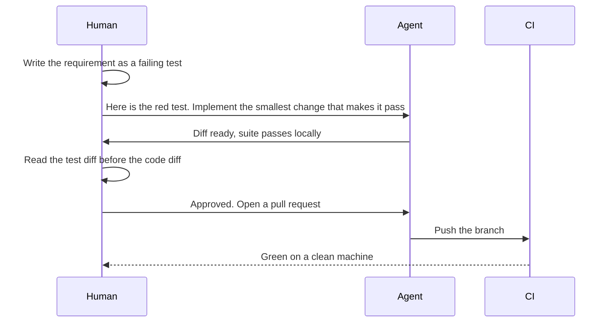

> **Section 10 · Lesson 2** · Level: intermediate · ~18 min · Prereq: [The test pyramid](10-Test-Pyramid)

## Why this matters

An agent can write a test suite in seconds. It can also delete the assertion that fails, mock away the thing under test, or write a test that passes because it asserts the same wrong value the code produced. The defence is procedural, not technical: the agent writes code, a human owns the test that defines the requirement, and CI — not the agent's summary — decides whether the change is green.

## Red, green, and a referee

The loop is red, review, green, prove. The step everyone skips is the review, and it is the step that matters. When the failing test is wrong, the implementation will be wrong in exactly the same shape, and the suite will go green on a bug.




## Guarding the guardrails

These are the ways an agent — and, honestly, a tired human — makes a suite green without fixing anything:

- **Weakened assertion**: `expect(fee).toBe(12.50)` becomes `expect(fee).toBeDefined()`.
- **Deleted or skipped test**: the file shrinks in the diff, or `.skip` appears, or the test is renamed to match the new behaviour.
- **The thing under test is mocked**: the HTTP client or the database is faked, so the test proves the mock works.
- **Passes by construction**: the expected value is computed by the same function under test, so both sides are wrong together.
- **The expectation was edited to match the bug**: the failing number in the test is changed to the number the code now returns.

Counter-measures, in order of how little they cost: read the test diff first (it is shorter than the code diff and it is where cheat-fixes hide); make CI fail on a skipped test; compare the test count against the previous commit and treat a drop as a question; require at least one integration test for any changed route; and never let an agent edit a test file without human sign-off.

## Prompts that produce useful tests

Line-covering tests are noise. Ask for properties and failure modes instead:

- "List the edge cases for this function: empty, boundary, malformed, duplicate, unauthorized. Write one test per case, and add a property test asserting the output is never negative for any input in the valid range."
- "Write a test that fails if the handler sets its success flag without the row actually being written. Read the row back and assert on it."
- "For every error path, assert the exact status code and error code the caller will see."
- "Do not modify the test file. If a test looks wrong, explain why and stop."

Name each test as a requirement — `test("rejects a payout with an empty PIN")` — so the test survives a refactor and tells the next reader what the system promises.

## Characterisation tests before a refactor

Legacy code has no tests and no written spec, so an agent refactoring it has nothing to preserve. Fix that first. Characterisation tests call the existing code with representative inputs and record what it actually does today, including the parts that look like bugs. They are not a claim about correctness; they are a tripwire. Let the agent refactor, and the tripwires prove behaviour did not move. Only once the old behaviour is pinned down do you write tests for the behaviour you actually want.

## The rule to write into your rules file

Add this to `AGENTS.md` or `CLAUDE.md` so every session starts with it:

```markdown
**Test rules**
- A test that defines a requirement may only change with explicit human approval.
- Never delete, skip, or weaken a test to make a suite green. Report the failure instead.
- Never mock the database, the HTTP client, or the serializer inside an integration test.
- Run the full suite before proposing a commit, and paste the command and its output.
```

A rules file is what the agent reads on every task. A CI check is what makes the rule true when the agent forgets — see [Hooks and guardrails](03-Hooks-And-Guardrails) for wiring a hook that refuses the edit instead of asking nicely.

## Try it

1. Ask an agent to implement a small function against a deliberately failing test you wrote.
2. Now hand it a second, weaker test and ask it to make the suite green. Watch whether it edits the strong test.
3. Read the test diff before the code diff and list every assertion that changed.
4. Add a CI step that fails when a test is skipped or the total test count drops.
5. Write one characterisation test against an untested function in your repo, then refactor the function and keep the test green.

## Common mistakes

- **Reading the code diff first.** The test diff says what the change promises. Read it first.
- **Accepting "all tests pass" without the output.** Ask for the command and its output, from a clean checkout. A summary is a claim, not evidence.
- **Letting the agent fix the test instead of the code.** Tell it to explain the failure and stop when a test looks wrong.
- **Mocking the thing under test.** A fake HTTP client proves your fake works. Use the real client against a sandbox.
- **No rule in the rules file.** The convention evaporates between sessions. Write it where the agent reads it, then enforce it in CI.

## Key takeaways

- The agent writes code; a human owns the test that defines the requirement.
- Read the test diff before the code diff — it is shorter, and cheat-fixes hide there.
- CI on a clean machine is the referee, not the agent's summary.
- Ask for properties, edge cases and error paths, not line coverage.
- Characterisation tests first, refactor second.
- Put the no-weakening rule in your rules file and enforce it with a CI check.

## Further learning

- [Best practices for Claude Code](https://www.anthropic.com/engineering/claude-code-best-practices) — explore, plan, code, commit, and giving the agent a check it can run.
- [TDD with agents](03-TDD-With-Agents) — the red-green-refactor loop with an agent.
- [Reviewing agent output](03-Reviewing-Agent-Output) — reading a generated diff for the things that matter.
- [Hooks and guardrails](03-Hooks-And-Guardrails) — deterministic enforcement instead of instructions.
- [The test pyramid in practice](10-Test-Pyramid) — which layer a new test belongs in.
