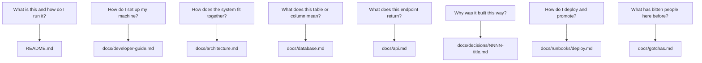

> **Section 11 · Lesson 1** · Level: beginner · ~15 min · Prereq: [Rules files](02-Rules-Files-AGENTS-and-CLAUDE-md)

## Why this matters

An agent starts every session with no memory of the last one, and so do you three weeks later. Everything the code cannot say about itself — why a retry is capped at three attempts, which column is authoritative, what you must run before promoting to production — lives in someone's head until you write it down. Docs as code is the habit of keeping that knowledge in the repository, next to the code, so it survives the session.

## Docs live in the repository

Docs as code means three things. The doc lives in the same repository as the code. It changes in the same pull request as the change. A reviewer sees both halves in one diff.

That buys you version history for free: `git log docs/api.md` shows when an endpoint changed, and checking out an old commit shows the docs as they were then. It buys review for free too, and review is the whole point — the diff is the only moment anyone still remembers why the change was made. It also means the tooling stays boring: markdown files, diagrams written as code (see [Diagrams as code](06-Diagrams-As-Code)), and a link checker in CI. A separate documentation site is optional and usually becomes a second place the same fact has to be edited.

## The doc map

The doc map answers one question: if I have question X, which file do I open? Write it down once, at the top of your docs entry point, and put the same list in your rules file so an agent finds it without being told.

Eight files cover the questions that come up most days. A real map from a shipped project is a table with one row per file and one clause of purpose: README, developer guide, architecture, database schema, API reference, capability or admin docs, a gotchas file per component, the CI/CD runbook, a decisions folder with an index, and a changelog. Add a row every time you catch yourself searching for the same thing twice — the map grows from annoyance, not from imagination.

## One source of truth per fact

Duplication is the defect to design out. If your endpoint list lives in the README, the API doc, and a saved HTTP-client collection, two of those are already wrong and a reader cannot tell which. Give every fact one home and link to it from everywhere else. Where a fact genuinely must repeat — a table of environments, the list of gates — decide which copy is authoritative and have the others say so out loud with a link.

When a section confuses you, do not append a clarification under the stale text. Delete the stale text and write what is true now. A page carrying three generations of contradiction is worse than an empty page, because a confident reader acts on the oldest paragraph.

## Docs are agent context

An agent's output quality is bounded by the context it can find. A docs tree that states "the wire format between the API and its clients is camelCase; never return raw database rows" improves every future session, and costs nothing to follow because it is read before the first line gets written. The cheapest way to raise the floor on agent work is a good docs folder plus a short rules file that points into it ([AGENTS.md that actually works](12-AGENTS-md-That-Works)). Keep the rules file thin — it is paid for on every task, including the ones that never touch architecture.

## Tooling discipline

Three habits keep the tree honest. Markdown only: plain-text diffs, renders on the repository host, greppable by you and by an agent. Diagrams as code: a mermaid block in the doc changes in the same PR as the design it describes. Link checking in CI: a workflow that fails on a broken relative path or a dead URL is about ten lines ([GitHub Actions documentation](https://docs.github.com/en/actions)).

## Try it

1. Create `docs/` in a project you own and list every question a new contributor asks you in chat. Aim for eight.
2. Write the map as a table: question, file, one clause of purpose. Create any file the table promises.
3. Add the table to your rules file under a "where facts live" heading.
4. Run a link check locally: `grep -rn '](\./' docs/ | head` and open a few targets by hand. Add the CI version when the tree is bigger than three files.
5. Commit docs and code together in one PR. From now on, no doc-only PRs where a code change was the reason.

## Common mistakes

- **A doc folder nobody reads** — `docs/` created during a burst of enthusiasm, never opened again. Fix: put the doc map in the README and the rules file, so both a human and an agent arrive through it.
- **The same fact in three files** — environment URLs in the README, the runbook and a deployment script. Fix: one home, links elsewhere, and delete the copies rather than adding a fourth.
- **Appending contradictions** — new text under old text instead of a rewrite. The page now disagrees with itself. Fix: delete and rewrite, or delete the section entirely.
- **Docs that describe the plan, not the system** — a roadmap masquerading as architecture, so nobody can tell what is real. Fix: separate status ("shipped", "prototype", "planned") from description.

## Key takeaways

- Docs live in the repo, change in the same PR as the code, and version with it.
- Publish a doc map: question → file. Eight rows cover most days.
- One source of truth per fact; duplication is a bug you will find by acting on the wrong copy.
- A good docs tree is the cheapest context upgrade for every future agent session.
- Keep tooling boring: markdown, diagrams as code, link checking in CI.

## Further learning

- [Best practices for Claude Code](https://www.anthropic.com/engineering/claude-code-best-practices) — how CLAUDE.md and repository context are meant to be written and pruned.
- [Agent Skills overview](https://agentskills.io/home) — packaging procedures so the next session does not relearn them.
- [GitHub Actions documentation](https://docs.github.com/en/actions) — for the link-check and doc-change workflows this page keeps promising.
- [Diagrams as code](06-Diagrams-As-Code) — the mermaid rules used above, applied properly.
- [Architecture decision records](06-Architecture-Decision-Records) — the `docs/decisions/` half of the map.
