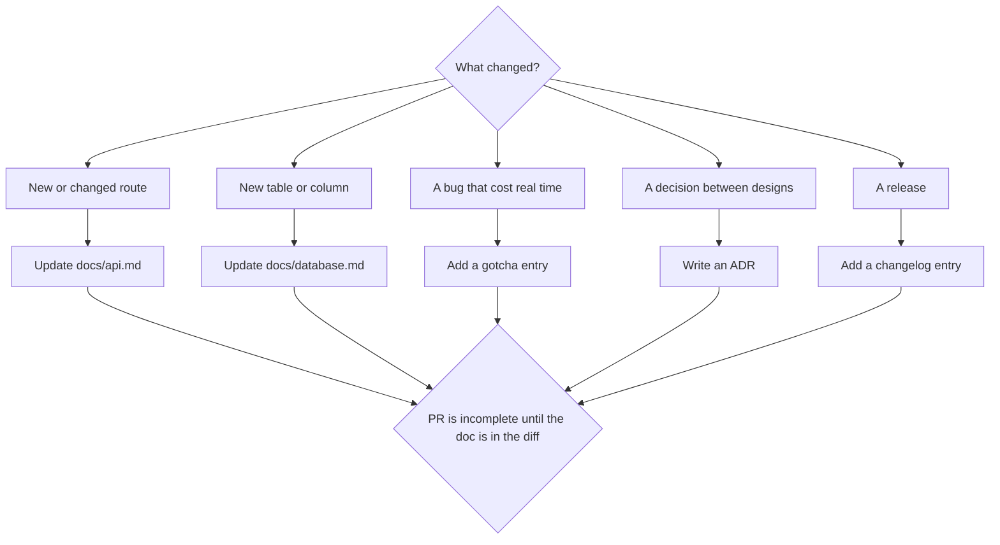

> **Section 11 · Lesson 3** · Level: intermediate · ~15 min · Prereq: [Docs as code](11-Docs-As-Code)

## Why this matters

Docs decay one feature at a time. Nobody decides to let the API reference drift; each PR just happens to be the one where the author was in a hurry. The fix is a small, mechanical rule you apply per feature: before you call the work done, update the one document a future reader would have opened and found wrong.

## The rule that works

A feature is not done until the doc that would have confused someone is updated.

Note what the rule does *not* say: it is not "document everything". Find the document that is now lying and fix it in the same commit. The test is answerable: if a teammate read the docs tomorrow and edited this code, which line would mislead them? That file goes in the diff.

This is cheap because most changes touch no document at all: a bug fix that restores documented behaviour updates nothing. When a change does cross a line, the table below tells you which one.

## The mapping table

| Change | Document to update |
|---|---|
| New or changed route, field, or status code | `docs/api.md` — request, response, error shape |
| New table, column, index, or migration rule | `docs/database.md` — schema and migration policy |
| New capability, role, or permission | capability or admin docs; the rules file if it changes how agents should work |
| New gotcha discovered the hard way | `docs/gotchas.md` for that component |
| Decision between two viable designs | an architecture decision record (ADR) plus the ADR index |
| User-visible release | `CHANGELOG.md` under the release heading |
| New operational step (deploy, promote, rotate) | the runbook in `docs/runbooks/` |

Put the table in your PR template: checklists survive deadlines better than judgement.



## Writing the gotcha entry

A gotcha entry is the one thing you cannot recover by reading the code. Four parts, in this order:

1. **Symptom** — what you actually saw, quoted. "Every outbound HTTPS call from the container fails with `CERTIFICATE_VERIFY_FAILED: unable to get local issuer certificate`, while the same call succeeds on the developer machine."
2. **Cause** — the mechanism, in one or two sentences. "The production image is a slim base with no CA bundle; the locally installed runtime ships its own root certificates, so the failure appears only in the deployed build."
3. **Fix** — the exact change. "Install the CA certificates package in the runtime stage of the Dockerfile."
4. **Detection next time** — how the next person gets a signal instead of an afternoon. "Probe the built image with one real outbound request; a unit test that mocks the client never catches this."

Two more in the same shape:

- **A wrong wire format.** Symptom: a client shows empty lists while the server logs a 200 with data. Cause: one handler bypassed the shared serializer, so response keys came back in the database's naming convention and the client's parser dropped them silently. Fix: route every response through the serializer. Detection: assert the key casing of one response per resource in integration tests.
- **A positional placeholder bug.** Symptom: an update reports success and changes nothing, or a query fails with a missing-parameter error. Cause: the driver maps each placeholder occurrence to its own parameter, so one value reused twice shifts every later value by one; in an `UPDATE` that quietly matched zero rows. Fix: distinct placeholders, the value passed once per occurrence, in the same order as the values array. Detection: a test asserting the row actually changed, not just that the call succeeded.

## Enforcing it

Three mechanisms, in increasing strictness:

- **PR template.** Add a "Docs updated?" section listing the mapping table. Low cost, works when the author is honest.
- **CI check.** A workflow step that fails the PR when source changed and nothing under `docs/` did. Keep it small, with an explicit opt-out label for genuine no-doc changes — the check should make you answer the question, not answer it for you.

```yaml
# .github/workflows/docs-check.yml (excerpt)
- name: Require a docs change when source changes
  run: |
    changed=$(git diff --name-only "origin/${{ github.base_ref }}...HEAD")
    echo "$changed" | grep -qE '^(docs/|CHANGELOG\.md|README\.md)' \
      || { echo "::error::Source changed but no docs did. Update docs/ or add the 'no-docs' label."; exit 1; }
```

- **Review habit.** Reviewers ask one question: "which doc does this make wrong?" Two weeks of that and the question stops needing to be asked.

The decision half is enforceable the same way: a small script checks ADR filenames, headings, and that the index lists every record, and CI runs it. Keep it lightweight — four recorded lines beat an unrecorded decision ([ADRs in practice](12-ADRs-In-Practice)).

## Keeping docs from lying

Prefer deletion to accumulation. When a section is wrong, replace it. When a document is obsolete, delete the file and its links in the same PR — a dead file is worse than a missing one, because search finds it and a reader trusts it. Keep historical context under a dated "superseded" heading.

## Try it

1. Copy the mapping table into `.github/pull_request_template.md`.
2. Run the check by hand on your last ten merges: `git log --name-only -10`. For each merge that changed source and no docs, name the document that is now wrong.
3. Fix the worst one by rewriting that section, not appending to it.
4. Write one gotcha entry from the last bug that cost you an hour or more.
5. Add the docs-check workflow with a `no-docs` opt-out label, and confirm on a test PR that it fails.

## Common mistakes

- **Documenting the plan, not the change** — a paragraph about what will be built sitting in the doc about what exists. Fix: status labels per section.
- **Appending a contradiction** — "note: this is now X" under a paragraph that still says Y. Fix: delete Y, write X, and keep the old text only in git history where it belongs.
- **A gotcha file with 40 unordered entries** — nobody reads it twice, so the bug returns. Fix: group by component, symptom first, and promote to a rules-file line once a bug bites twice.
- **Blocking every PR on a doc change** — including the ones no doc could describe, so people learn to bypass the check. Fix: an opt-out label with a required reason.
- **Documenting in a separate repository** — the PR that breaks the docs cannot fix them. Fix: docs live with the code.

## Key takeaways

- Done means the doc that would mislead a reader is updated in the same commit.
- The change → document mapping table removes the judgement call; put it in the PR template.
- A gotcha entry is symptom, cause, fix, and detection — detection is the part people skip.
- Enforce softly first (template, review question), then with an opt-out-able CI check.
- Rewrite or delete stale sections; never append a contradiction.

## Further learning

- [Architecture decision records](06-Architecture-Decision-Records) — the one-page format for decisions.
- [Definition of done](10-Definition-Of-Done) — where the docs step belongs in your checklist.
- [AGENTS.md that actually works](12-AGENTS-md-That-Works) — promoting repeated gotchas into rules agents obey.
- [GitHub Actions documentation](https://docs.github.com/en/actions) — building the docs-change check above.
