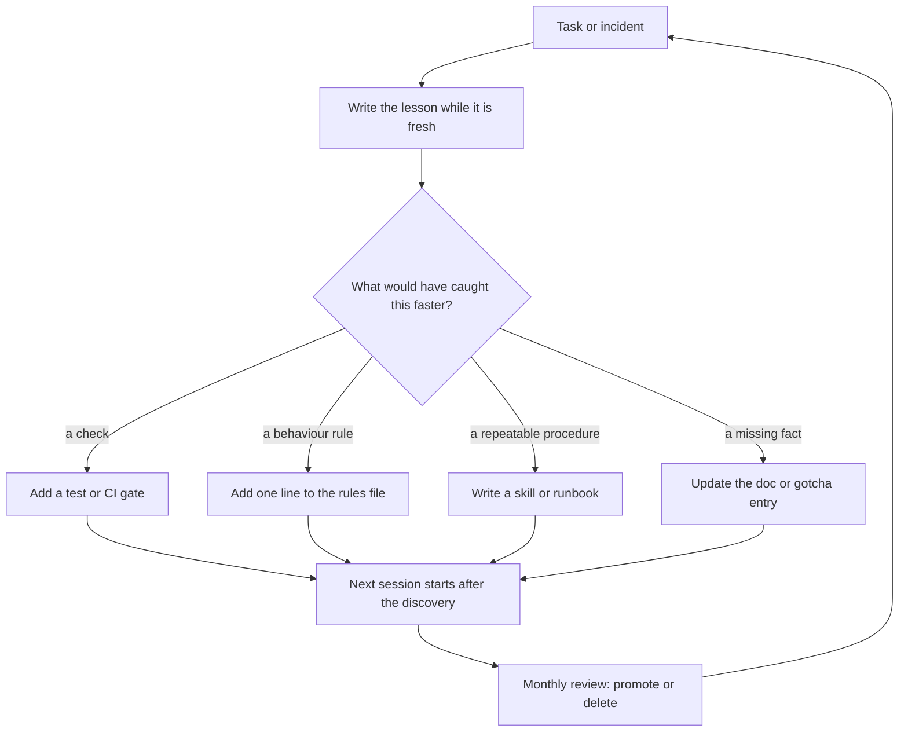

> **Section 11 · Lesson 4** · Level: intermediate · ~15 min · Prereq: [Documentation per feature](11-Documentation-Per-Feature)

## Why this matters

A gotcha entry records a fact ("the container has no CA bundle"). A lesson records the process of finding out, including what it cost — and cost is what makes it a priority. The lesson bank is where an incident becomes a rule, a test, a gate, or a document, so the next session starts after the discovery instead of before it.


## The cost-of-time lesson format

Write four lines and a tail, short enough that you do it while the tab is still open.

```markdown
### Bulk import reported success and dropped 3,000 rows (2026-04-11)
- **What happened**: a spreadsheet import of ~4,000 rows persisted ~1,000, returned 200, and logged no error.
- **What it cost**: ~5 hours across two sessions — one to notice the mismatch against the source file, one to trace it.
- **How to get there faster**: compare imported row count to source row count in one assertion. Would have caught it in 20 minutes.
- **Ends in**: test — `bulk_upload_preserves_row_count` in the integration suite.
```

The third line is the one people skip and the one that pays. "How would I have got here faster?" is a question about detection, not blame: a count assertion, a health probe, a cheaper reproduction. Answering it converts a story into a shortcut.

The **Ends in** tail is mandatory: a lesson with no artefact is a diary entry.

## A lesson bank you actually read

Keep it in the repository or in one file at a known path, in markdown, organised by theme rather than by date: build and CI, database, external integrations, agents and prompts, deployment. Each theme is a `##` heading; each lesson is a `###` heading with a date, most recent first.

Why a file and not a wiki page: it is greppable. You can search it from the terminal, and so can an agent — one line of grep beats ten minutes of an agent reinventing an approach you already abandoned. Keep entries to a few lines so a search returns something a human reads; detail belongs in the linked PR.

A lesson bank is not a doc tree: docs describe the system as it is, lessons describe how you learned it. When a lesson graduates to an enforced rule, trim the entry to a pointer so the file stays small.

## Retros that produce changes

A retrospective that ends in agreement changes nothing. The bar is an artefact:

- **a gate** — a CI check, a required approval, a blocking lint rule
- **a rule** — one line in the rules file agents read every session
- **a test** — a regression test that would have failed before the fix
- **a doc** — a gotcha entry, a runbook step, or a corrected reference



Cap it: five minutes per incident, one artefact per lesson, no meeting. The question in the middle of the loop is the valuable part.

## Monthly review

Once a month, read your own bank end to end. Roughly half of it should be trivially acted on:

- **Repeated lessons get promoted.** Two entries about the same class of bug mean the lesson is too weak. Promote it to a rules-file line, a CI check, or a skill the agent loads on demand ([Writing good skills](04-Writing-Good-Skills)).
- **Dead lessons get deleted.** The dependency was dropped, the runtime was upgraded. An entry that no longer applies is a trap, because you and your agent both trust it.
- **Long lessons get split.** The "what happened" detail moves to the PR or runbook; the bank keeps the shortcut.
- **Unacted lessons get a tickler.** An entry claiming "Ends in: gate" for two months without a gate means either write the gate or delete the claim.

## Why this compounds

Every lesson you bank is one less hour before the same starting line for the next person or session. The measure is not how many lessons you have, but how many classes of mistake you converted into something that runs without you. The same mistake twice is the only genuinely expensive mistake: the second occurrence proves the first was never turned into an artefact.

Agents sharpen the point: an agent repeats your documented mistake faithfully, every session, unless the correction lives in a file it reads. Your lesson bank is that file.

## Try it

1. Create `docs/lessons.md` (or one file at a fixed path) and add four theme headings.
2. Write three lessons from the last month using the four-line format. For each, answer "how would I have got here faster?" before writing anything else.
3. Give every lesson an **Ends in** tail naming a real artefact; create the cheap ones, tickle the rest.
4. Grep it as an agent would: `grep -ri "timeout" docs/lessons.md`. If the result is noise, shorten the entries.
5. Put a monthly review in your calendar and, on the first run, delete two lessons that no longer apply.

## Common mistakes

- **A diary, not a bank** — entries that narrate feelings and end nowhere. Fix: force the **Ends in** line; no artefact, no entry.
- **A lesson bank nobody can find** — a file with a clever name in a folder nobody opens. Fix: one path, referenced from the rules file.
- **Recording the fix but not the detection** — the entry says what changed, not how you would have noticed sooner. Fix: that third line is the lesson.
- **Never deleting stale lessons** — the bank grows past usefulness and an agent follows an obsolete constraint. Fix: monthly pass, delete without sentiment.
- **Blaming in writing** — a retro naming a person becomes a record nobody adds to again. Fix: describe the system and the signal, not the actor.

## Key takeaways

- The lesson format is what happened, what it cost in time, and how to get there faster.
- Every lesson ends in an artefact: a gate, a rule, a test, or a doc — or it is not finished.
- Keep the bank greppable, themed and short, so both you and an agent can search it.
- Monthly: promote repeated lessons into rules or skills, delete lessons that no longer apply.
- When a lesson gets quiet, its correction should be running in CI, not living in prose.

## Further learning

- [Agent memory and session hygiene](03-Agent-Memory-And-Session-Hygiene) — how session notes and durable lessons fit together.
- [Writing good skills](04-Writing-Good-Skills) — turning a repeated lesson into a procedure an agent loads on demand.
- [Equipping agents for the real world with Agent Skills](https://www.anthropic.com/engineering/equipping-agents-for-the-real-world-with-agent-skills) — when a lesson should become a skill.
- [Documentation per feature](11-Documentation-Per-Feature) — the gotcha entry format that lessons feed into.
