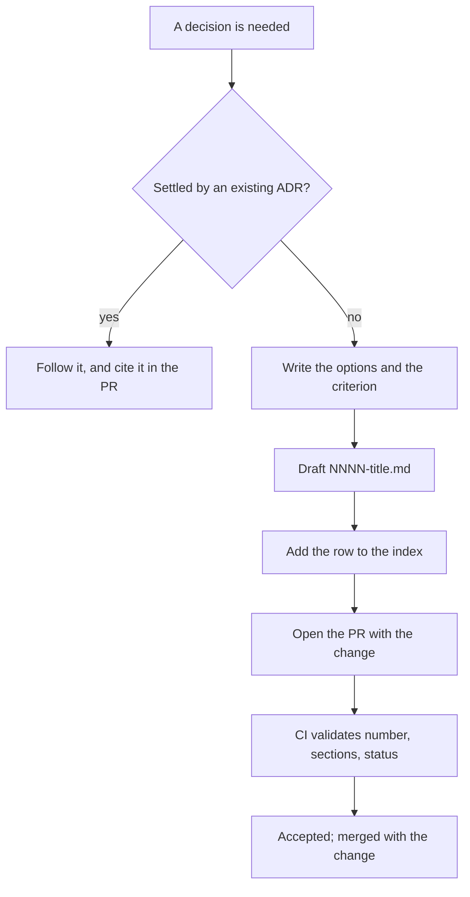

> **Section 12 · Lesson 3** · Level: intermediate · ~18 min · Prereq: [Architecture decision records](06-Architecture-Decision-Records)

## Why this matters

Six weeks after you choose an authentication scheme, an agent reads the code, decides the current approach is unusual, and proposes to "fix" it. Nothing in the repository tells it the choice was deliberate, and you have lost the argument you already won once.

An ADR (architecture decision record) is a short, numbered file that records what you decided, what you rejected, and the criterion that decided it. It is the difference between a decision that sticks and a decision that gets re-litigated every session.

## The mechanics

- **Where they live.** A directory in the repo: `docs/decisions/`, one file per decision, next to the code rather than in a wiki nobody opens.
- **Numbering.** `NNNN-title.md`, starting at `0001`, zero-padded. The number is permanent; titles can be corrected.
- **The template.** Status, date, context, decision, options considered, consequences. A lightweight MADR-shaped file is plenty:

```markdown
# 0007 — Deploy the API only from the pipeline

- **Status**: accepted
- **Date**: 2026-09-03

## Context
The host can also deploy automatically when `main` changes.

## Decision
No git trigger on the platform service. The pipeline is the only deploy path.

## Options considered
1. Keep the platform's automatic trigger — rejected.
2. Deploy only from the pipeline — chosen.

## Consequences
- Deploys are one unit (schema, API, web) instead of three racing layers.
- A migration-only change correctly deploys nothing.
- Cost: every release now goes through a manual, gated promotion.
```

- **The index.** `docs/decisions/README.md` lists every ADR with a one-line summary. It is the only file people read first, so an unlisted ADR is effectively invisible.
- **Link from the PR.** The pull request that implements a decision names the ADR. That link is what makes the decision findable from the diff six months later.




## What deserves an ADR, and what does not

**Worth one:** a dependency that is hard to swap, the wire contract between two services, the auth mechanism, which payment or infrastructure provider you talk to and at which endpoint, the deploy pattern, the hosting choice, the retrieval or caching strategy, how secrets are supplied.

**Not worth one:** bug fixes, copy and styling, version bumps, refactors that preserve behaviour, anything reversible in an afternoon. A decision log full of noise stops being read, which defeats the purpose.

## Writing the options honestly

The value of an ADR is in the rejected alternatives. An ADR that lists one option is a memo, not a decision.

Write two to four real options, then the criterion and the evidence that picked the winner. A real example, generalised: keep the platform's automatic deploy trigger, or deploy only from the pipeline. The criterion was that the three production layers — database schema, API, static web bundle — must move as one unit. The evidence was a morning when the API auto-deployed ahead of the web build while a migration had not run. The chosen option cost a manual promotion step, and the ADR says so.

That last sentence matters. Recording the cost of the choice is what stops a future reader from "improving" it back.

## Immutability and superseding

Never rewrite an accepted ADR. Write a new one that supersedes it, set the old one's status to `superseded by NNNN`, and add both rows to the index.

Rewriting history is worse than deleting it, because the next reader — especially an agent — sees a tidy file and assumes the current state was always obvious. One project's documentation records a live gateway endpoint that outsiders confidently "corrected" to an older URL that no longer resolves, with an explicit note not to change it back. That note is a one-line ADR doing its job.

## How ADRs stop agent drift

Without a written decision, every session starts from the same blank slate and each agent has a reasonable-sounding opinion. With one, you have a file to point at and a one-line answer: "settled, see `docs/decisions/0007`."

Two habits make this work:

1. Put a line in the rules file: **before proposing an architecture change, read `docs/decisions/`.**
2. When an agent proposes to undo a decision, do not argue from memory. Ask it to read the ADR and state what new evidence would change it. Often there is none, and the task closes in one turn.

## CI validation

Numbering and headings rot when they are only checked by eye. This script fails the pull request instead:

```bash
#!/usr/bin/env bash
# check-adrs.sh — fail the PR if an ADR is malformed or unlisted
set -euo pipefail
DIR=docs/decisions
[ -d "$DIR" ] || { echo "no ADR directory"; exit 0; }

status=0
for f in "$DIR"/*.md; do
  [ -f "$f" ] || continue
  base=$(basename "$f")
  [ "$base" = "README.md" ] && continue
  echo "$base" | grep -Eq '^[0-9]{4}-[a-z0-9-]+\.md$' \
    || { echo "bad ADR name: $base"; status=1; }
  for h in "## Context" "## Decision" "## Consequences"; do
    grep -qF "$h" "$f" || { echo "$base missing $h"; status=1; }
  done
  grep -Eq '^- \*\*Status\*\*: (proposed|accepted|superseded)' "$f" \
    || { echo "$base has no valid status"; status=1; }
done

for f in "$DIR"/*.md; do
  base=$(basename "$f")
  [ "$base" = "README.md" ] && continue
  grep -qF "$base" "$DIR/README.md" || { echo "$base not in the index"; status=1; }
done
exit "$status"
```

## Try it

1. Pick a decision you already made and never wrote down — a dependency, an auth method, a deploy pattern.
2. Copy the template above into `docs/decisions/0001-<slug>.md`.
3. List the two or three alternatives you actually considered, and the criterion that decided it. If you cannot recall the criterion, write the one you would use now.
4. Add the row to `docs/decisions/README.md` and mention the ADR in your next pull request.
5. Add `check-adrs.sh` to CI, and start a second ADR. Notice how much faster the second one is.

## Common mistakes

- **A single-option ADR** — "we chose Postgres because we chose Postgres". No rejected alternative means no decision was recorded.
- **Editing an accepted ADR** so today's state looks inevitable. Supersede it instead.
- **Documenting what the code does** rather than what was decided. Code changes; the decision and its criterion are what you are preserving.
- **Numbering collisions** — two pull requests both add `0012`. The uniqueness check in CI is cheap; merge conflicts in an index are not.
- **Not linking the ADR from the PR** — an unlinked, unlisted ADR is a file nobody will ever find under pressure.

## Key takeaways

- An ADR records the decision, the rejected options, the criterion and the cost — in a numbered file next to the code.
- Supersede; never rewrite. A rewritten ADR hides the reason the decision stands.
- ADRs stop agent drift: settled decisions stop being re-litigated every session.
- Validate numbering, headings, status and the index in CI, or they rot.
- Skip ADRs for anything reversible in an afternoon; a noisy decision log stops being read.

## Further learning

- [Architecture decision records](06-Architecture-Decision-Records) — the concepts behind the template.
- [Understanding spec-driven development: Kiro, spec-kit, and Tessl](https://martinfowler.com/articles/exploring-gen-ai/sdd-3-tools.html) — Martin Fowler on keeping decisions and specs as first-class artifacts.
- [Diagrams as code](06-Diagrams-As-Code) — the same check-in-the-artifact habit, applied to diagrams.
- [Best practices for Claude Code](https://www.anthropic.com/engineering/claude-code-best-practices) — what to include in a rules file so decisions get found.
