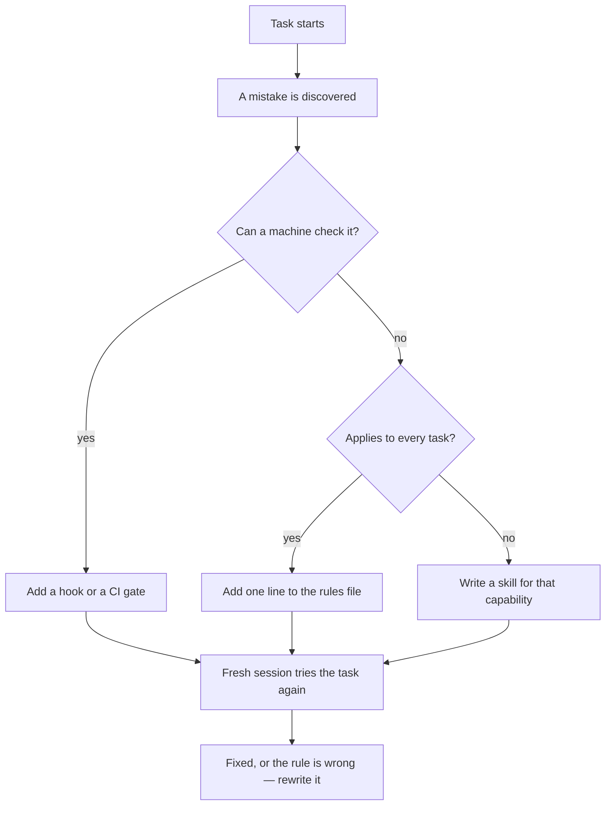

> **Section 12 · Lesson 4** · Level: intermediate · ~18 min · Prereq: [Rules files](02-Rules-Files-AGENTS-and-CLAUDE-md)

## Why this matters

The rules file is the one document your agent reads before every task. It is also the document most likely to be useless, because it grows by accretion: a line added after every mistake, never removed, until it is 800 lines of accumulated scar tissue that the model skims.

This page is the template and the pruning discipline that keep it working. The measure of success is concrete: if the same mistake happens twice, the file is missing a line — or has the wrong one.

## A structure that works

```markdown
# AGENTS.md

## Project
Payments API for a small merchant platform. Dart backend, Postgres, static web client.

## Architecture map
- `backend/` — HTTP API (routes, services, migrations)
- `packages/shared/` — DTOs and validation used by both API and client
- `db/migrations/` — one numbered, idempotent file per schema change
- `docs/decisions/` — read this before proposing a design change

## Commands
- Set up:      `dart pub get`
- Test:        `dart test`   (single file: `dart test test/foo_test.dart`)
- Lint/format: `dart pub get && dart format --set-exit-if-changed .`
- Migrate:     `dart run tool/migrate.dart`
- Deploy:      pipeline only — see `docs/sops/deploy.md`

## Conventions
- The wire format is camelCase even though the database is snake_case. Do not "fix" it.
- Migrations are schema, never data. Add a new file; never edit an applied one.
- Every HTTP client needs a timeout and a refresh-or-fail path.

## Gotchas
- SQL placeholders are positional: the values array must match the order placeholders
  appear in the SQL text. A mismatch fails silently with zero rows. (2026-09-02)
- Run the package install before the formatter; the formatter reads the language
  version from generated package metadata and reformats differently without it.
- A callback route that replies a literal success body proves nothing. Check the row
  it was supposed to change. (2026-09-02)

## Definition of done
Tests pass, formatter clean, migration applied and idempotent, changelog line added,
PR title is a Conventional Commit.

## Docs
- `README.md` — setup and overview
- `docs/decisions/` — why the design is what it is
- `docs/sops/` — runbooks for deploys and restores
```

Seven sections, under a page and a half. That is the whole shape: summary, map, real commands, conventions, gotchas, definition of done, doc map.

## Writing rules an agent can follow

Three properties, every line:

- **Imperative.** "Add a new migration file" — not "migrations are generally added".
- **Testable.** Someone can look at the result and say yes or no. "Run the formatter before committing" is testable; "write clean code" is not.
- **With the reason when it is non-obvious.** An agent that knows *why* the wire format is camelCase will not "improve" it away. A rule with no reason gets refactored by the next confident session.

What does not belong, from Anthropic's own include/exclude list: anything the agent can derive by reading the code, standard language conventions, detailed API documentation (link it instead), long tutorials, and file-by-file descriptions of the codebase. If the agent asks a question the file already answers, the phrasing is the problem, not the agent.

## The continuous-learning rule

Capture the non-obvious fact the moment you confirm it, in the same change that produced it:

1. You hit something that cost you ten minutes and was not obvious from the code.
2. You confirm it — with output, not with a theory.
3. Before you close the task, add one to three lines to the gotchas section, with a date if the fact could expire.
4. Commit it alongside the fix.

The reason this works is that knowledge evaporates between sessions. A lesson bank built this way — append-only, dated, one to five lines per entry — becomes the only place the project's hard-won facts are written down. The same discipline applies to the rules file, at a slower cadence. Review it when something goes wrong, prune it when it grows, and delete rules that no longer describe a real failure.




## Cross-tool portability

`AGENTS.md` is the emerging cross-tool convention; `CLAUDE.md` is a file one agent reads on every session, and other tools have their own filename and discovery rules. The overlap is nearly total, and the fix is simple:

- Keep one canonical file in the repository, and let the tool-specific file point at it — an import or a one-line reference, not a copy.
- Put nothing tool-specific in the shared file. If a rule only exists because of one agent's quirk, it belongs in that agent's own file.
- Check each tool's documentation for where it looks for the file and how it handles imports; those details change, and the filename alone does not guarantee it is read.

## Try it

1. Run `/init` or your tool's equivalent, or start from the template above.
2. Delete every line the agent could derive by reading the code. Keep the commands, the conventions that differ from defaults, and the gotchas.
3. Reconcile duplicates with the skills directory: one owner per rule.
4. Start a fresh session and do the task that used to fail. If it fails again, the rule is missing or ambiguous — rewrite that line only.
5. Add the date to each gotcha entry and schedule a pruning pass in a month.

## Common mistakes

- **Secrets in the rules file** — a token or connection string in a file that is committed, quoted into every session, and often pasted into bug reports. Reference `os.environ["SERVICE_API_KEY"]` instead.
- **Stale TODOs** — "temporary, remove after the migration" surviving two quarters. Every line costs attention forever; delete what is done.
- **Tool-specific trivia** — an internal helper name or an editor keybinding that only one person's setup has.
- **Contradictory rules** — "always write tests first" and "ship the fix without tests". The agent obeys whichever it read last.
- **The 3,000-line file** — nobody finishes it, including the model. If a rule keeps being ignored while others are followed, the file is too long and that rule is getting lost.

## Key takeaways

- Seven sections: project, architecture map, real commands, conventions, gotchas, definition of done, doc map.
- Imperative, testable, with the reason. No essays; a rule the agent can derive is a rule that dilutes the ones it cannot.
- Apply the continuous-learning rule: capture the non-obvious fact, dated, in the same commit that produced it.
- Keep one canonical file and let tool-specific files point at it rather than duplicating it.
- If the same mistake happens twice, fix the rules layer — do not just fix the code again.

## Further learning

- [Best practices for Claude Code](https://www.anthropic.com/engineering/claude-code-best-practices) — the include/exclude table and why bloated rules files get ignored.
- [Equipping agents for the real world with Agent Skills](https://www.anthropic.com/engineering/equipping-agents-for-the-real-world-with-agent-skills) — what to move out of an always-on file and into an on-demand skill.
- [Rules files: AGENTS.md and CLAUDE.md](02-Rules-Files-AGENTS-and-CLAUDE-md) — the mechanics of where these files live.
- [Lesson banks and retros](11-Lesson-Banks-And-Retros) — where the long-form version of your gotchas belongs.
