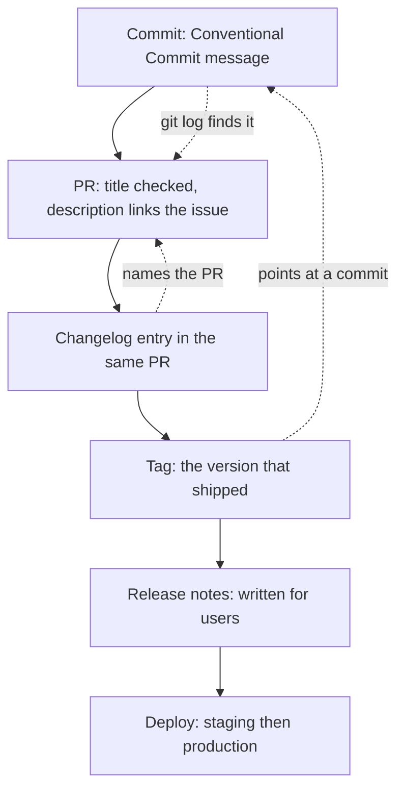

> **Section 12 · Lesson 7** · Level: beginner · ~15 min · Prereq: [Documentation per feature](11-Documentation-Per-Feature)

## Why this matters

Two weeks after a release, something breaks and nobody knows which change did it. Tracking your changes is how you answer three questions cheaply: which commit broke production, when did this ship, and what do I tell users. It is not bureaucracy — it is the difference between a five-minute lookup and a five-hour archaeology session.

You are probably already doing fragments of this. The goal is to make the fragments line up.

## The stack



Each arrow is a link someone can follow under pressure. A commit without a PR is unreviewable; a release without a tag is undebuggable; a changelog entry without a link is unverifiable.

## Conventional commits

A conventional commit is a message with a type prefix, an optional scope and a subject:

```
feat(payouts): reject short Till account numbers
fix(auth): rotate the session token on refresh
docs(sops): add the staging deploy runbook
refactor(shared): extract money validation
chore(deps): bump the HTTP client
```

A machine can parse that, which is the entire point. The prefix tells you the intent, and it maps to a version bump and a changelog section:

| Prefix | Version effect | Changelog section |
|---|---|---|
| `feat` | minor | Added |
| `fix` | patch | Fixed |
| `perf`, `refactor` | patch or none | Changed |
| `docs`, `style`, `test`, `build`, `ci`, `chore` | none | usually hidden |
| any type with `!` or a `BREAKING CHANGE:` note | major | Breaking changes, listed first |

Semantic versioning is the `MAJOR.MINOR.PATCH` scheme this table assumes. A breaking change takes the major number.

## Keeping a changes file that is honest

`CHANGELOG.md` at the repo root, newest release first, one section per version, each with a date:

```markdown
## [Unreleased]
### Added
- Payout drafts can be saved and resumed (#218)

## [1.4.0] - 2026-09-21
### Breaking
- Payout status values are now lowercase. Update any string comparison. (#204)
### Fixed
- Duplicate callback events no longer create a second ledger row (#212)
```

Three rules keep it useful: newest first, human words, and breaking changes at the very top of their section. "Small" is part of it too — a changelog nobody can read in two minutes is a commit dump with better formatting.

## Linking everything

The trail is the value. Each artifact names the next one:

- The **commit** is referenced by its PR.
- The **PR** links the issue it closes and any ADR it implements (`Closes #218`, `See docs/decisions/0011`).
- The **changelog entry** names the PR or issue number.
- The **tag** points at a commit, so a version resolves to an exact tree.
- The **release notes** link the changelog section they summarise.

With that in place, "when did this ship?" is one search. Without it, it is a guess.


## Automation that keeps the format consistent

A format only survives if something fails when it is broken. Two cheap gates cover most of it.

Validate the pull request title in CI — this needs no third-party action:

```yaml
- name: Conventional PR title
  env:
    TITLE: ${{ github.event.pull_request.title }}
  run: |
    set -e
    pattern='^(feat|fix|docs|style|refactor|perf|test|build|ci|chore|revert)(\([a-zA-Z0-9._/-]+\))?!?: .+'
    if ! printf '%s' "$TITLE" | grep -Eq "$pattern"; then
      echo "::error::PR title is not a Conventional Commit: '$TITLE'"
      exit 1
    fi
```

And add a detective control for the branch itself: a workflow on pushes to `main` that resolves the commit's pull request and fails, plus files an issue, if the commit arrived without one. That control fires after the fact, so pair it with a local pre-push hook that refuses the push to `main` in the first place. A detective gate tells you the rule was broken; a preventive hook stops it.

Other automation worth having: a changelog draft generated from merged PR titles (review it, do not publish it raw), and a release workflow that tags from the version in your manifest rather than from a hand-typed number.

## Try it

1. Add `CHANGELOG.md` with an `## Unreleased` heading.
2. Write one entry for your last change: prefix, scope, one line, the PR number.
3. Check your last five commit subjects against the regex above. Fix the message of the next commit you make.
4. Tag the commit you last deployed: `git tag -a v0.1.0 -m "First tracked release"`. Push the tag and look at it on the repo's releases page.
5. Add the PR-title check to CI.

## Common mistakes

- **A changelog generated entirely by a machine** — a raw list of commit subjects is not readable by a user and gets ignored. Generate a draft, edit it.
- **Everything under "misc"** — a section that swallows the interesting changes is the same as no changelog.
- **A breaking change buried in the middle** — it belongs at the top, with the action the reader must take.
- **No dates** — "when did this ship" is the most common question the changelog is asked.
- **Changelog and version disagree** — the changelog says 1.4.0, the tag says v1.4.1. Derive both from one source.
- **Describing the implementation** — "refactor payout handler" tells a reader nothing. "Payout status values are now lowercase" tells them what to do.

## Key takeaways

- The stack: conventional commits → a curated changelog → tags → release notes → the issue and PR trail.
- The commit prefix decides the version bump and the changelog section, which is why the format is enforced rather than suggested.
- Keep `CHANGELOG.md` newest-first, in human words, small, with breaking changes called out at the top.
- Link each artifact to the next: PR to issue and ADR, changelog to PR, tag to commit.
- Enforce the format with a failing gate; a convention nobody checks decays within a month.

## Further learning

- [GitHub Actions documentation](https://docs.github.com/en/actions) — where the PR-title check and the branch guard live.
- [Workflow syntax for GitHub Actions](https://docs.github.com/actions/using-workflows/workflow-syntax-for-github-actions) — the YAML reference for the gates above.
- [Releases, tags and versioning](05-Releases-Tags-And-Versioning) — the mechanics of tagging and publishing.
- [Versioning and release notes](12-Versioning-And-Release-Notes) — turning this history into notes a user can read.
