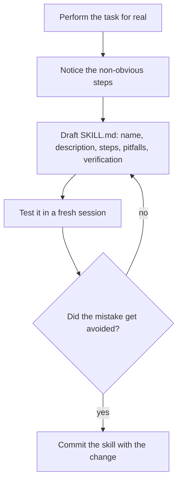

> **Section 12 · Lesson 6** · Level: intermediate · ~20 min · Prereq: [Skills as operating rules](12-Skills-As-Operating-Rules)

## Why this matters

You just spent forty minutes working out how to deploy a change without breaking the schema order, and you will forget all of it by Friday. An agent platform can write that procedure down for you — not from the documentation, which was wrong or incomplete, but from what you actually did.

This works on any agent platform that supports skills, because the format is plain files; only the command that creates or installs a skill differs.

## The pattern: capture it while it is fresh

The moment to write a skill is the moment the task ends and the non-obvious parts are still in view. The prompt is short:

> You just worked that out. Write it as a skill now: the steps in the order you ran them, the commands, what the output should look like, and the three things that surprised us. Include the check that tells us it worked.

Two things make the result good rather than generic. Capture the *observed* steps, not the documented ones — the documentation was missing the step that cost you 40 minutes. And do it in the same session or change; an hour later you are reconstructing intent instead of execution.

## The authoring loop



1. **Do the task.** With real output. A task you have not run cannot be captured honestly.
2. **Notice the non-obvious steps.** Where did you have to look something up, wait, retry, or check twice? Those are the skill.
3. **Draft `SKILL.md`** with a name and a description, the steps, the pitfalls, and the verification lines.
4. **Test it in a fresh session** that has never seen your conversation. This is the only test that matters.
5. **Refine and publish.** Fix the description if it did not trigger; fix the step if it triggered and still failed.

## The file layout

A skill is a folder. One folder per skill, in whatever skills directory your platform reads:

```
deploy-staging-runbook/
├── SKILL.md          # required: metadata + the procedure
├── references/       # optional: long detail, read only when needed
├── scripts/          # optional: deterministic scripts to run, not read
├── templates/        # optional: files the procedure copies or fills in
└── assets/           # optional: other resources
```

`SKILL.md` starts with YAML frontmatter carrying the `name` and `description`. Everything else is optional and loaded only when the agent needs it, which is what lets a skill carry a long appendix without costing context on every task.

## Portability across agents

Write the body in plain markdown and it will work anywhere that reads the format:

- **No platform-specific tool names.** Say "run the test suite", not the name of one product's internal test tool. Each agent maps the intent to its own toolset; naming tools pins the skill to one client.
- **Frontmatter with `name` and `description`, nothing exotic.** Extra metadata is fine, but the two required fields are the contract.
- **No credentials, ever.** Reference `os.environ["SERVICE_API_KEY"]` and let the environment supply it.

For how your platform creates, installs or lists skills, use its own documentation root — every platform has its own create and manage command, and the flags differ. Do not guess a command from a different tool's docs.

## A worked example: a deployment runbook skill

```markdown
---
name: deploy-staging-runbook
description: Use when promoting a change to staging, or when a staging deploy fails.
---

# Staging deploy runbook

## Before you start
- The change is merged and CI on `main` is green.
- You can list workflow runs for this repository.

## Steps
1. Trigger the deploy:
   `gh workflow run deploy-staging.yml --ref main`
   Expect a new run in `gh run list --workflow deploy-staging.yml --limit 1`.

2. Watch it:
   `gh run watch`
   Expect a green tick on every job. A *skipped* build job is success when the
   commit changed no files in that service's watch paths — do not retry it.

3. Health check:
   `curl -fsS https://<STAGING_HOST>/health`
   Expect `{"status":"ok"}` with HTTP 200.

4. Exercise the changed flow in the browser and write down the exact steps you clicked.

## Verify it worked
- Workflow green, health endpoint 200, changed flow exercised once.
- If the change included a migration, confirm the new column exists before the
  API restarted. A green deploy does not prove the schema applied.

## Pitfalls
- A skipped deploy job is not a failure. Check watch paths before retrying.
- Never deploy to production from this skill. Promotion is separate and gated.
- If the migration ran but the API did not deploy, do not re-run the migration by
  hand; fix on a branch and redeploy.
```

Note what is missing: no host credentials, no "skip the check if it is slow", and no instruction that could bypass the promotion gate. Those absences are deliberate.

## Maintenance and safety

- **Update the skill in the same change that broke it.** If step three stopped working, the pull request that fixes step three also fixes the skill.
- **Retire skills that are wrong.** A published procedure that no longer works costs everyone who follows it. Delete it or mark it superseded — do not leave it in place "for reference".
- **Treat third-party skills as untrusted code.** They can carry instructions and scripts. Read the bundled files and the dependencies before installing one, and be suspicious of anything that reaches out to a network host you did not expect.
- **Never let a skill bypass a gate.** "Commit with `--no-verify` when the formatter is slow" is not a skill, it is a hole.

## Try it

1. Do your next non-trivial task normally, with real output.
2. Ask the agent to write it as a skill: steps, expected output, pitfalls, verification.
3. Read the draft and delete every sentence that is background rather than instruction.
4. Start a fresh session, give it the same task, and watch. If it fires and succeeds, publish it. If not, fix the description or the failing step.
5. Commit the skill in the same pull request as the change it describes.

## Common mistakes

- **Writing the skill before doing the task** — you invent steps that sound right and fail under load. Capture after, not before.
- **Testing it in the same session** — the agent remembers the conversation, so the test proves nothing. Always a fresh session.
- **Naming tools instead of actions** — the skill stops working the moment someone uses a different agent.
- **Explaining why the capability matters** instead of how to perform it. The agent needs the steps.
- **Never retiring a wrong skill** — published instructions that fail are worse than no instructions, because they are trusted.
- **Putting a token, hostname or account detail in the body** — skills get shared, quoted and committed. Placeholders only.

## Key takeaways

- Capture the procedure the moment the task ends, from what you actually ran, not from the documentation.
- Author with a loop: do, notice, draft, test in a fresh session, refine.
- Layout: one folder per skill, `SKILL.md` plus optional `references/`, `scripts/` and `templates/`.
- Keep skills portable — plain markdown, no platform-specific tool names, `name` and `description` frontmatter.
- Fix a skill in the change that broke it, retire wrong skills, and never put a credential or a gate-bypass in one.

## Further learning

- [Hermes Agent documentation](https://hermes-agent.nousresearch.com/docs) — the docs root for the agent platform used to build this wiki; look for the skills section to find that platform's own create and manage commands.
- [Agent Skills Overview](https://agentskills.io/home) — the open format and the three loading stages.
- [Equipping agents for the real world with Agent Skills](https://www.anthropic.com/engineering/equipping-agents-for-the-real-world-with-agent-skills) — the authoring guidelines this page follows, including the security note on untrusted skills.
- [anthropics/skills](https://github.com/anthropics/skills) — a public repository of real skills to read as examples.
- [Writing good skills](04-Writing-Good-Skills) — quality criteria for the drafts you produce.
