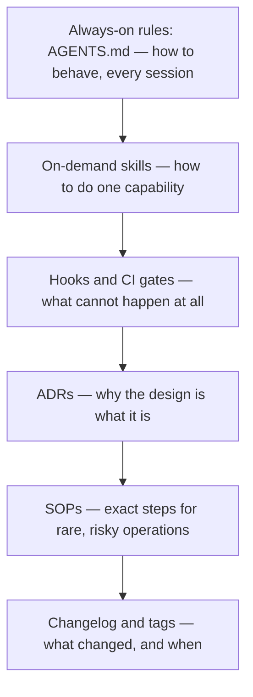

> **Section 12 · Lesson 1** · Level: beginner · ~15 min · Prereq: [Rules files](02-Rules-Files-AGENTS-and-CLAUDE-md)

## Why this matters

You tell an agent "run the formatter before you commit" and it works — for that session. Tomorrow the session starts blank, the agent commits unformatted code, and CI goes red. An instruction that lives only in a chat message dies with the chat.

Rules of operation are how an instruction survives the session it was typed in. They are a stack of layers, each cheaper to write but weaker to enforce than the one below it. Choosing the right layer is the whole skill.

## The layers

| Layer | Lives in | Loaded | Controls |
|---|---|---|---|
| Always-on rules | a rules file at the repo root | every session | how to behave here, always |
| On-demand skills | one folder per skill, `SKILL.md` inside | when the description matches the task | how to do one capability |
| Deterministic enforcement | hooks and CI workflows | every commit and PR | what cannot happen at all |
| Decisions (ADRs) | `docs/decisions/NNNN-title.md` | when someone questions the design | why the design is what it is |
| Process (SOPs) | `docs/sops/` | before risky operations | exact steps for a deploy or a restore |
| History | changelog, tags, release notes | when you write a release | what changed and when |

An ADR is an architecture decision record (a short file recording a choice and the options rejected); an SOP is a standard operating procedure (a numbered runbook for something risky and rare). Both have their own pages later in this section.

## Which layer does an instruction belong in?

The most common failure is putting everything in the rules file. It is loaded on every request, so every line competes with your actual task for the model's attention. Bloat does not just cost tokens — it makes the agent ignore the rules you care about most.

The test Anthropic's own guidance uses, applied line by line: **would removing this cause the agent to make a mistake? If not, cut it.**

Then route what survives:

- **Applies to every task, and is a preference or a fact about the repo** → rules file. "The API wire format is camelCase."
- **Belongs to one kind of task, and takes more than a few lines** → skill. A migration checklist, a release runbook.
- **Can be checked by a machine, and must never be skipped** → hook or CI gate. Formatting, secret scanning, migration lint.
- **A choice between real alternatives you do not want reopened** → ADR.
- **A procedure you run twice a year and can still get wrong** → SOP.

## Precedence and conflict

When a skill contradicts the rules file, the rules file wins. When either contradicts a gate, the gate wins — always. No skill may tell an agent to bypass a check; one that does is a bug to delete.

Never argue this mid-task; fix the loser:

1. State each rule exactly once. If a skill needs it, the skill links to the rules file.
2. When two layers disagree, decide which is correct and delete the other copy.
3. If the same contradiction appears twice, the rule is in the wrong layer — move it down until one layer owns it.

## Change tracking is the connective tissue

Every layer has a history. The rules file and the skills directory live in git, so `git log -p AGENTS.md` shows when a rule arrived and what it fixed. CI workflows are files too. ADRs are numbered and superseded rather than rewritten. SOPs carry an owner and a review date, and the changelog records what shipped.

A change that teaches you something usually touches more than one file, and one commit can carry all of them: a test, a patched rule and a changelog line is one reviewable unit.

## The 10-minute audit

Run this on a repo you already work in:

1. List every rule you have, wherever it lives.
2. For each, ask which layer is the *cheapest* that actually produces the outcome.
3. If a machine could check it, move it to a gate. Prose asks; a gate decides.
4. Delete anything the agent can derive from the code, and delete duplicates rather than clarifying them.
5. Confirm the last three mistakes the agent made are each covered, in the right layer.

## Try it

1. Open your repo's rules file, or create one. Count the lines.
2. Mark each line as: broadly applicable, one-capability, or machine-checkable.
3. Cut every line that fails the "would removing this cause a mistake?" test.
4. Write down the two lines you would move into a skill, and the one you would move into a CI gate.
5. Create `CHANGELOG.md` with one `## Unreleased` heading and one entry.

## Common mistakes

- **Everything in the rules file** — a 900-line `AGENTS.md` is ignored, not thorough. Capability instructions belong in a skill.
- **A rule that should be a gate** — "never commit secrets" as prose is a wish; a secret scan in CI is a wall.
- **The same rule in three files** — one copy gets updated and they start contradicting each other. One owner per rule.
- **A skill that overrides a gate** — "if formatting fails, commit with `--no-verify`". Delete it on sight.

## Key takeaways

- Route each instruction to the cheapest layer that produces the outcome; the rules file is loaded every session and is the wrong home for most of it.
- Rules file = behaviour, skills = capability, hooks and gates = what cannot happen, ADRs = settled decisions, SOPs = rare risky procedures, changelog = what changed.
- Deterministic enforcement beats prose. If a machine can check it, do not write a rule about it.
- State each rule once. Duplicated rules drift, and drifting rules train the agent to ignore all of them.
- Every layer has a git history. Fix a mistake in one commit, touching every layer it involves.

## Further learning

- [Equipping agents for the real world with Agent Skills](https://www.anthropic.com/engineering/equipping-agents-for-the-real-world-with-agent-skills) — how on-demand skills load only when relevant.
- [Best practices for Claude Code](https://www.anthropic.com/engineering/claude-code-best-practices) — the include/exclude test for a rules file, and why bloated rules files get ignored.
- [Steering Claude Code: when to use CLAUDE.md, skills, hooks, and subagents](https://claude.com/blog/steering-claude-code-skills-hooks-rules-subagents-and-more) — a vendor's own map of the layers.
- [Engineering at Anthropic](https://www.anthropic.com/engineering) — the root for the engineering write-ups linked above.
