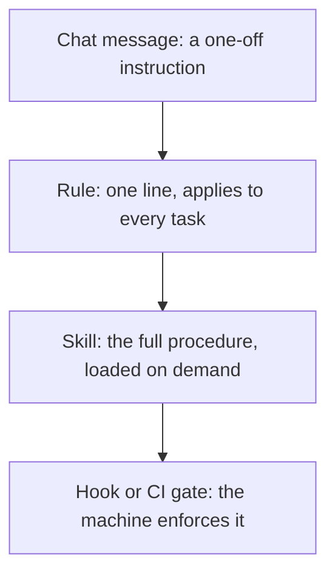

> **Section 12 · Lesson 5** · Level: intermediate · ~18 min · Prereq: [Rules of operation overview](12-Rules-Of-Operation-Overview)

## Why this matters

You have a procedure. It lives in a wiki page nobody reads, or in the head of whoever ran it last. A skill turns it into something an agent can discover and follow: a folder with a `SKILL.md` inside, loaded on demand, versioned with the code. The point is not new abilities for the agent, but that it produces the same answer you would.

## From SOP to skill

A skill is a procedure packaged for an agent:

- **Keep the trigger.** The frontmatter `description` is what the agent matches against the task. Write it as a trigger, not a title: `Use when writing or reviewing database migrations in this repo.`
- **Keep the steps, cut the prose.** Drop the background paragraph explaining why migrations matter.
- **Keep the verification and the pitfalls.** Every state-changing step says how to check it worked, and the traps are what make the skill worth loading.
- **Bundle the fixed parts as files.** If the skill has a script, run it rather than quoting it: a deterministic script costs almost nothing in context.

## One skill per capability, named for the trigger

Two failure modes:

- **The skill never fires.** The description is vague — `Migrations` or `Database help` — so the words the agent sees in the task ("add a column", "fix the schema drift") never appear in it. Put the trigger words in the description.
- **The skill fires constantly.** The description is so broad that the skill loads on unrelated tasks and its instructions bleed into work they have nothing to do with. One capability per skill is the fix.

The description loads for every task, whether or not the skill fires — the strongest argument for one sentence.

## Encoding verification

A skill that changes state without saying how to check it will report success either way. The line is short:

- After migrating: "confirm the new column exists before starting the API."
- After deploying: "`curl -fsS https://<HOST>/health` returns `{"status":"ok"}`."
- After a callback handler edit: "query the row the handler was supposed to update; the response body is not evidence."

One project went further and made verification a tool rather than a paragraph: a script that refuses a finding without pasted evidence. Prose asks; a script decides.

## Team skills versus personal skills

| | Team skill | Personal skill |
|---|---|---|
| Lives in | the repository's skills directory | your own agent config directory |
| Reviewed and owned | in a pull request, by a named owner | by you |
| Contains | procedures the team must perform identically | your habits, shortcuts, local setup |

The rule: if the team must produce the same result, the skill belongs in the repo; if it is about your machine, keep it personal. Neither may hold credentials or tell an agent to skip a check.

Not everything climbs the ladder: some instructions stop at the rules file, some skip straight to a gate — nobody needs a skill about running a formatter.

## Measuring skill quality

The cheapest measure is a fresh session. Give an agent that has never seen your conversation the task the skill covers, and watch whether the mistake you wrote it for happens. If it does, either the description did not trigger, a step was missing or hedged, or the skill grew so long that the critical step is buried.

Split long skills into reference files the agent reads only when needed, keeping `SKILL.md` as the spine. One real library cut its largest skill from roughly 11,000 words to 3,300 by splitting three reference files out, verified nothing was lost, and then set a word limit for the library. Length is a maintenance property: a skill nobody finishes is one nobody follows.

## The migration path

When you repeat an instruction, ask where it should end up:

- **Typed in chat** — the same typing every time, forgotten between sessions.
- **A line in the rules file** — loaded always; right for behaviour, wrong for a long procedure.
- **A skill** — loaded when relevant; right for any procedure with steps, pitfalls and verification.
- **A hook or gate** — deterministic; right for anything a machine can decide.

Move down the list as the instruction matures: a chat instruction that survives three sessions is a rule, a rule long enough to have steps is a skill, and a skill step that keeps being skipped is a gate.

## Try it

1. Find a procedure you have pasted into chat at least twice.
2. Write the `SKILL.md`: a trigger-shaped description, the steps in order, a verification line per state-changing step, and the pitfalls.
3. Start a fresh session and do the task, without mentioning the skill.
4. Note whether it fired and whether the mistake was avoided.
5. Fix the description or the step that failed, then commit it next to the code it operates on.

## Common mistakes

- **A skill that is documentation, not steps** — paragraphs the agent must interpret. Write imperatives in order.
- **No verification lines** — the agent declares success because nothing defined it.
- **A description that is a title** — `Deploy` says nothing about when to load it.
- **Platform-specific tool names in the body** — a skill naming one product's internal tools cannot be shared with a different agent.
- **A wrong skill left published** — a broken procedure costs everyone who follows it. Retire it where it broke.

## Key takeaways

- A skill is a procedure with a trigger-shaped description, ordered steps, verification and pitfalls, loaded on demand.
- One skill per capability; keep the always-loaded description to a single sentence with the trigger words in it.
- Every state-changing step needs a "how to check it worked" line.
- Team skills live in the repo, are reviewed like code, and have an owner; personal skills stay local.
- Measure quality with a fresh session; split long skills into reference files instead of letting them grow.

## Further learning

- [Agent Skills Overview](https://agentskills.io/home) — the open format: `SKILL.md`, metadata, progressive disclosure.
- [Equipping agents for the real world with Agent Skills](https://www.anthropic.com/engineering/equipping-agents-for-the-real-world-with-agent-skills) — three levels of detail, and when to use a skill instead of a prompt.
- [Anatomy of a SKILL.md](04-Anatomy-Of-A-Skill-File) — the file format in detail.
- [Managing a skill library](04-Managing-A-Skill-Library) — ownership, review and retirement at scale.
- [Hooks and guardrails](03-Hooks-And-Guardrails) — the layer below skills, for what must never be skipped.
