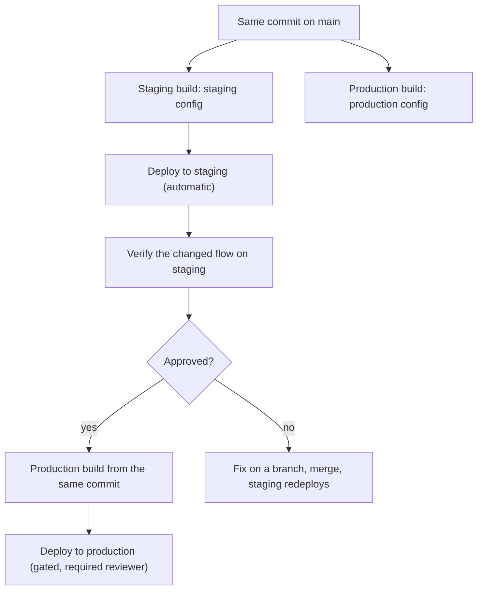

> **Section 12 · Lesson 8** · Level: intermediate · ~15 min · Prereq: [Releases, tags and versioning](05-Releases-Tags-And-Versioning)

## Why this matters

A version number is a promise. Publishing `1.4.0` tells every client, script and mobile app what it can assume about the code behind that number. Get the promise wrong and the failure is silent: a caller keeps sending a field you removed, and the first sign of trouble is a production error you cannot reproduce.

This page is about keeping that promise consistent across an API, a CLI and an app — and about releasing two environments from one source of truth without shipping the wrong one.

## Semver in practice: what "breaking" means

Semantic versioning is `MAJOR.MINOR.PATCH`. The definitions are simple; the judgement is not, because "breaking" differs per surface.

| Surface | Breaking looks like | Not breaking |
|---|---|---|
| **HTTP API** | removing or renaming a field, changing a status code, changing the wire casing, tightening validation that used to accept a value | adding an optional field, adding a new endpoint, loosening validation |
| **CLI** | removing or renaming a flag or command, changing output a script parses, changing an exit code | adding a flag, adding a subcommand, adding lines to human output |
| **Mobile app** | the installed version can no longer talk to the current API | adding a screen the old versions never see |

The app row is the one beginners get wrong. You cannot force an update: old versions keep running for months, and store review adds days to any fix. That argues for keeping the API backward compatible and gating new behaviour behind a capability check.

## One version, one source of truth

Define the version once, in the project manifest, and derive everything else from it: the git tag, the build artifact's name, the version shown in the about screen, and the release notes heading.

Concrete failure this prevents: an artifact named from one version while the app inside reports another. In one pipeline the mobile artifact key comes from the app manifest, and the promotion job **fails** when no artifact exists for the current manifest version. That failure is the feature — it ties the public download link to the promoted version, not to whatever was built last.

If the version is written in three files, you have three versions. Reduce to one and let the build stamp the rest.

## Two channels, one source

Staging and production should be the same commit built with different configuration, released through different gates.

Three rules make this safe:

1. **Configuration is baked at build time, per environment.** Values such as the API base URL are passed in at build time rather than read from a runtime environment, so the artifact cannot drift after it is built.
2. **A missing value degrades safely.** With no value, the build falls back to something harmless rather than silently pointing the staging artifact at production. A build that quietly targets the wrong environment is worse than one that errors.
3. **Separate, gated workflows.** The production promotion is its own workflow behind a required reviewer. Nobody builds production by re-running the staging job with a different variable.

One habit worth copying: a tag per environment — the last commit deployed to staging, the last promoted to production — moved by the workflows, never by hand. When the layers (schema, API, web) drift apart, those tags show it in one command.

## Release notes a user can read

Three questions, answered in order:

1. **What changed?** In user words, grouped by feature. "Payout drafts can be saved and resumed."
2. **What do I do?** The action, if any. "Re-authenticate once after upgrading."
3. **What breaks?** First, with the migration step. "Payout status values are now lowercase; update any string comparison."

Write them by editing the changelog, not pasting the commit list: the changelog is for the team, the release note for the person using the thing.

## Deprecation and support windows

Before you remove anything, announce it:

1. Ship the replacement and document it.
2. Log a warning when the old path is used, naming the date it stops working.
3. Keep it working until that date, then remove it in a major release and say so in the notes.

Publish the support window you intend to honour per channel. These numbers change constantly — decide yours, write them down, and treat them as a promise rather than a target.

## Try it

1. Search your project for every place the version appears. Reduce it to one, in the manifest.
2. Cut a tag from that value rather than typing one: `git tag -a "v$(your-manifest-version-reader)" -m "release"`.
3. Write release notes for your last release using the three questions above.
4. List the environment-specific values your build needs; confirm each is passed at build time and that a missing value fails safe. Confirm staging and production are separate, gated workflows.

## Common mistakes

- **The version in three places** — they drift, and the drift is invisible until the wrong artifact ships.
- **Release notes that are the commit log** — nobody outside the repo can act on "refactor handler".
- **One ungated workflow with a variable deciding the environment** — someone will ship staging-to-production, usually on a Friday.
- **A breaking API change in a patch release** — clients are entitled to trust the number. If it breaks, the major number changes.
- **Removing a deprecated path with no warning period** — the first you hear about the integration is that it stopped.

## Key takeaways

- Semver is a promise; what counts as breaking differs per surface, and for a mobile app it means backward compatibility rather than a number.
- Stamp one version from a single source of truth and derive the tag, the artifact name and the about screen from it.
- Release two channels from the same commit with build-time configuration, separate gated workflows, and a missing value that fails safe.
- Release notes answer three questions: what changed, what to do, what breaks.
- Announce deprecations, keep the old path alive until a published date, and remove it in a major.

## Further learning

- [Releases, tags and versioning](05-Releases-Tags-And-Versioning) — creating and publishing tags.
- [Environments and promotion](07-Environments-And-Promotion) — the staging-to-production path in more detail.
- [Change tracking](12-Change-Tracking) — the history this page turns into notes.
- [Railway Docs](https://docs.railway.com/) — environment and service configuration for one common deployment host.
