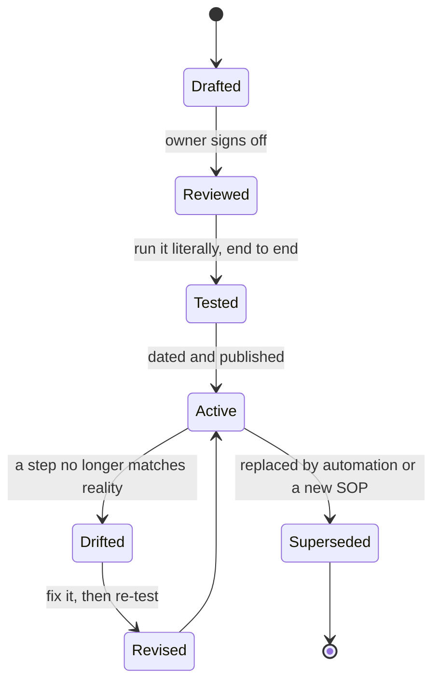

> **Section 12 · Lesson 2** · Level: intermediate · ~18 min · Prereq: [Rules of operation overview](12-Rules-Of-Operation-Overview)

## Why this matters

It is 2am, production is down, and the person who last deployed is asleep. An SOP (standard operating procedure) is the document that lets a tired human — or an agent — do the risky thing correctly anyway. It is not a page about how deploys "generally work". It is the list of commands you actually ran, in the order you ran them, with the output you expect.

An SOP you have never executed is a guess. An SOP you have executed once is a procedure.

## What an SOP contains

Six sections, always in this order:

- **Trigger** — the event that starts it. "A change is approved for staging." "A merchant reports a duplicate charge."
- **Prerequisites** — access, credentials, a green build, and a rollback point that exists *before* you start.
- **Steps** — one action per step, the exact command, and the output that means it worked.
- **Verification** — how you know the whole thing worked, not just that the commands exited zero.
- **Rollback** — how to undo it, and what to check afterwards.
- **Owner, review date, "tested on"** — a name, a date, and the date someone last ran it.

The prerequisites section is where the real engineering goes. Before one project's backend migration, the operator created three rollback artifacts first: a git tag of the pre-change commit, an archive of the working tree including uncommitted files, and a snapshot of the runtime configuration. When the migration went sideways, "we have an archive from 23:43" is the sentence that saves a night. Write the rollback point into the prerequisites.

## When to write one

Write an SOP for any operation you perform more than twice, or perform once if it is risky. The short list:

- production deploys and promotions
- database migrations and restores
- credential and key rotation
- the first 30 minutes of an incident
- rollbacks

The signal that you already needed one: you cannot remember whether you did step four last time.

## Writing for a reader at 2am

Assume the reader is exhausted, interrupted, and may be an agent with no memory of your project.

- One action per step. If a step contains "and", split it.
- Show expected output. `curl -fsS https://<API_HOST>/health` returns `{"status":"ok"}` — if you see an HTML error page instead, you have hit the wrong host.
- Turn judgement into a branch. "If the workflow is green, go to step 6. If it failed, stop and fix on a branch; do not re-run it."
- Name the escalation. A person or role, not a channel, and the two facts they will need: what you did last and what you are seeing.
- Never write "deploy the service". That is five different actions depending on who reads it.

## From SOP to automation

Every step you automate should be a step the reader no longer has to get right at 2am. Route them like this:

- **Same every time, no judgement** → a script.
- **Ordered scripts that must run on an event** → a workflow job that runs them in order.
- **A step whose failure must stop the release** → a required gate.
- **A step that needs judgement** → stays human, stays in the SOP. Approving a promotion, deciding to roll back.

What remains after automation is the decision points and the recovery paths. That is the point of it.

## Keeping an SOP honest

- **One owner.** A named person, not a team alias, or the review never happens.
- **A review date.** When you pass it, the SOP is suspect until someone confirms it.
- **"Tested on <date>".** Only update it when a human or agent actually ran the procedure end to end. A step you have never executed gets marked as unverified rather than presented as fact.
- **Same-change rule.** When the command changes, the SOP changes in the same pull request. An obsolete SOP is worse than none: step three fails, the reader improvises under pressure, and loses trust in the rest.

## Try it

1. Pick the operation you dread most. Deploying is a good first choice.
2. Write the six headings and fill them in from memory — do not aim for correct, aim for complete.
3. Run the whole thing literally on staging, from a clean shell, copy-pasting exactly what the SOP says. Do not improvise; when you cannot continue, that is the finding.
4. Mark every step where you had to guess, add a missing prerequisite, or run a command that was not written down.
5. Fix those steps, add `Tested on <date>`, and commit the SOP next to the code it operates on.

## Common mistakes

- **Writing it from memory without running it** — the missing step only shows up when you are stressed and unsupervised. Run it literally once.
- **Steps that describe intent instead of commands** — "promote the build" is not a step. "Run the promote workflow, then wait for the required reviewer to approve the production environment" is.
- **No rollback section** — an SOP without rollback is a one-way door. If the operation cannot be reversed, say so plainly and name the next best action.
- **No escalation, or a useless one** — "ask in the team channel" fails at 2am. Name a person or role.
- **A step nobody verified** — mixing tested and untested steps without marking which is which is how a confident runbook destroys a database.

## Key takeaways

- An SOP is a procedure with a trigger, prerequisites, numbered steps, verification and rollback — and an owner, a review date and a "tested on" date.
- Write one for anything you do more than twice, or anything risky even once.
- Create the rollback point before you start, and write it into the prerequisites.
- Automate the mechanical steps; keep the judgement and the recovery paths in the SOP.
- An SOP that is not run goes stale silently. A "tested on" line is what keeps it honest.

## Further learning

- [Deploying with the CLI — Railway Docs](https://docs.railway.com/cli/deploying) — the deploy commands you will be writing into a rollback-capable runbook.
- [Railway Docs](https://docs.railway.com/) — root documentation, including environment and service configuration.
- [Rollbacks and incidents](07-Rollbacks-And-Incidents) — the incident procedures these runbooks live beside.
- [Deployment pipelines](05-Deployment-Pipelines) — the workflows an SOP hands off to.
