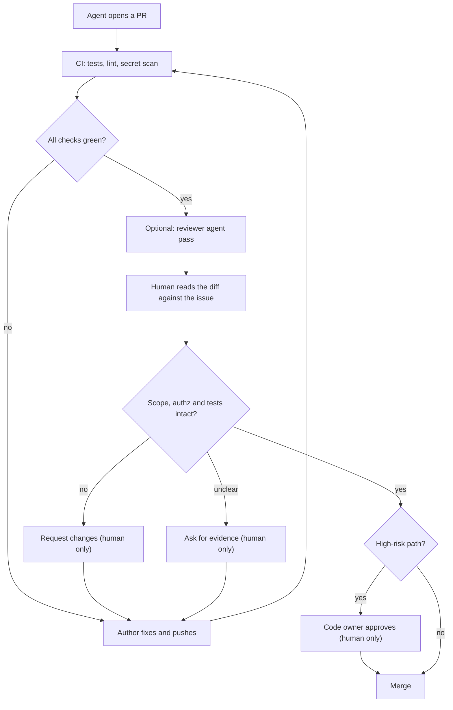

> **Section 13 · Lesson 3** · Level: intermediate · ~20 min · Prereq: [Reviewing agent output](03-Reviewing-Agent-Output)

## Why this matters

An agent can produce in twenty minutes a diff that would take you a day to write and two hours to review. That is not a bargain if you skim it. The failure mode is structural: the code is tidy, the tests pass, the description is confident, and review becomes a formality that converts plausible code into production code. Review is the last place a human decides, and it matters more now — a colleague had to be able to defend a change in the hallway, and a model does not.

## What changes when the author is a model

- **Volume.** Review load grows faster than review capacity. One session can touch twelve files.
- **Confidence.** The prose is fluent whether or not the code is right. Fluency is not evidence.
- **Plausible-but-wrong.** An invented function, a flag that does not exist on this version of the library, a migration that "adds" a column already present. It reads correctly.
- **Green does not mean correct.** Tests the same author wrote, against the same misunderstanding, pass. A green pipeline proves the code is self-consistent, not that it does what the issue asked.
- **The rubber stamp.** After the twentieth green PR you stop reading, and the twenty-first carries the bug.

## A checklist for AI-written diffs

Seven questions catch most of it. Ask them in this order.

1. **Scope** — is every changed file required by the issue? An agent that reformats a neighbouring module makes the diff unreviewable and may change behaviour you never asked about.
2. **Invented APIs** — does every imported symbol, flag and package exist? Check the names letter by letter: a hallucinated package name is an attack surface, not just a bug.
3. **Tests weakened or deleted** — diff the test files first. A relaxed assertion, a skipped case, a deleted test and a new `sleep` are how a green suite stops meaning anything.
4. **Dead code and leftovers** — unused imports, commented-out blocks, a helper nothing calls, a `TODO` describing work the PR claims to have done.
5. **Errors silently swallowed** — a bare `catch {}`, a default standing in for a failure, a function that returns success because it never checked. The interface kept its shape; the behaviour changed.
6. **Missing authorisation** — the happy path is guarded, the new route is not. Ask who can call the new code path, and where that is enforced.
7. **Documentation drift** — the README, the API table or the agent rules file still describes the old behaviour. An agent reads that file next time and believes it.

## Give the reviewer what they need

```markdown
## What changed
Reject a second submit within 5 seconds (issue #12).

## How I tested this
- `pytest tests/test_submit.py` — 14 passed (output below)
- Reproduced the duplicate manually against staging: two records before, 409 after

## Scope
`src/api/submit.py`, `tests/test_submit.py`. Nothing else.
```

Keep PRs under about 400 changed lines where you can, and split anything larger. A "how I tested this" section with raw evidence — the command and its output, a screenshot for UI changes — lets a reviewer check your reasoning instead of re-running everything. Add the checklist to your PR template so the ticks cannot be silently skipped.

## The reviewer agent as a second pass

A second agent in a fresh context is useful: it sees only the diff and the criteria, not the reasoning that produced the change. Point it at the issue, ask for gaps not style preferences, and it flags requirements that were quietly dropped. In the gate below, the steps marked *human only* are the ones an agent must not take.

Its limits are real:

- **Shared blind spots.** The model that invented the API reads the invented name as correct.
- **No product intent.** It cannot know that a third-party callback must be signature-enforced, or that this field is a customer's address.
- **It always finds something.** A reviewer asked for gaps reports gaps, sound work or not. Chasing all of them buys defensive code and tests for cases that cannot happen. Tell it to flag only findings that affect correctness or the stated requirements.



## Latency, trust and what never auto-merges

A three-day review queue means the author keeps working on the branch, the diff grows, and the next review takes longer. Cap items in review and prefer several small approvals to one large one.

Trust is earned per person and per path, not per pipeline. An approval should mean "this person is accountable for this change", so high-risk paths need a named owner — and these categories must never be auto-merged on a green build: authentication and authorisation, anything touching money, database migrations, CI workflow files, infrastructure and secrets, and dependency lockfiles.

## Reviewing review-bots

A review bot — linter, scanner, or an agent commenting on every PR — is a suggestion generator. Treat each finding as true only after you reproduce it. Its confidence score is zero by default: the useful ones save you a grep, and the noisy ones train you to ignore the column. Mute a bot that has produced nothing actionable in a month.

## Try it

1. Take an AI-written PR you already have. Diff its test files against `main` first and write down every assertion that moved.
2. Run the seven checks over the same diff and time yourself. Note which question found something.
3. Add a "how I tested this" section with a required evidence line to your PR template.
4. Ask a second agent to review the diff against the issue text, with the instruction "report gaps only; ignore style". Compare its list with yours: keep what you can verify, drop the rest.
5. Mark one high-risk path (`src/auth/**`, `migrations/**`, `.github/workflows/**`) as requiring owner approval, and confirm a PR cannot merge without it.

## Common mistakes

- **Reading the description instead of the diff** — it is generated from the same understanding that produced the bug.
- **Calling it reviewed because CI is green** — tests written by the author prove consistency, not correctness.
- **Skipping the test files** — the cheapest deception lives there. A weakened assertion looks like a small edit.
- **Accepting a reviewer agent's verdict as the review** — it shares the author's blind spots and cannot know your product rules. It produces input, not approval.
- **A 900-line PR "because the agent wrote it quickly"** — review effort grows faster than line count. Split it.
- **Chasing every lint from a bot** — that is how you get defensive code nobody asked for and a team that ignores the bot.
- **Auto-merging workflow or migration changes** — the blast radius is your deployment pipeline, not a feature.

## Key takeaways

- Fluent prose and a green pipeline are not evidence; read the diff against the acceptance criteria.
- Seven checks: scope, invented APIs, weakened tests, dead code, swallowed errors, missing authz, documentation drift.
- Demand a "how I tested this" section with raw evidence, and keep PRs small.
- A reviewer agent is useful, but it shares blind spots, cannot know intent, and over-reports by design.
- Approvals are accountability, not automation. Never auto-merge auth, money, migrations, workflows or secrets.
- Reviewer bots are suggestions with confidence zero until you reproduce the finding.

## Further learning

- [Best practices for Claude Code](https://www.anthropic.com/engineering/claude-code-best-practices) — verification criteria, the adversarial review step with a fresh subagent, and why a reviewer prompted for gaps always reports some.
- [Create custom subagents](https://code.claude.com/docs/en/sub-agents) — defining a reviewer with its own context and tool scope.
- [OWASP Top 10 for LLM applications](https://genai.owasp.org/llm-top-10/) — misinformation and supply chain risks that surface in generated code.
- [Slopsquatting: hallucinated package names](https://www.trendmicro.com/vinfo/us/security/news/cybercrime-and-digital-threats/slopsquatting-when-ai-agents-hallucinate-malicious-packages) — why an invented import is a security concern.
- [Team ownership and CODEOWNERS](13-Team-Ownership-CODEOWNERS) — routing the high-risk paths to the right approver.
