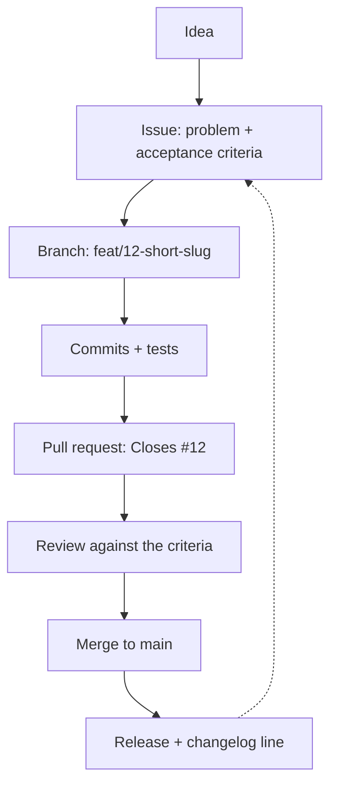

> **Section 13 · Lesson 1** · Level: beginner · ~15 min · Prereq: [Branching and pull requests](05-Branching-And-Pull-Requests)

## Why this matters

An issue is the cheapest review you will ever do. It happens before a branch exists, it takes ten minutes, and it catches the expensive class of mistake: building the wrong thing well. With an agent writing the code, that mistake gets easier to make — a vague request produces a confident, tidy, well-commented change that solves a problem you did not have. A written statement of intent is what you hold the agent to.

## The issue is the spec

Keep issues short. Six parts are enough:

- **Problem** — one or two sentences, from the user's point of view.
- **Current behaviour** — what happens today, with the exact error text or the exact screen. "Submitting the form twice creates two records" beats "the form is broken".
- **Expected behaviour** — what should happen instead.
- **Acceptance criteria** — a numbered list of testable statements. "A second submit within five seconds is rejected with 409" is a criterion. "Make it more reliable" is not.
- **Labels** — one area label and one priority label, so the issue can be found later by a query instead of by memory.
- **Definition of done** — what else must exist before it closes: a test, a doc line, a changelog entry, a migration. Link [definition of done](10-Definition-Of-Done) instead of repeating it.

Acceptance criteria are the part people skip and the part that pays for itself. They are your review checklist, your test list and the agent's brief, all in one place.




Every arrow there is a link, not a habit. The issue number is in the branch name, the branch is in the PR, the PR body says `Closes #12`, the merge closes the issue, and the release note names it. The last dashed arrow is the honest one: work generates more work. When a bug appears, it becomes a new issue, not a comment in a chat thread.

## Templates that collect the right fields

You can write issues in the web form, but a template means you do not have to remember the fields. Put them in `.github/ISSUE_TEMPLATE/` and switch blank issues off so every report arrives with the same shape.

```yaml
# .github/ISSUE_TEMPLATE/1-bug_report.yml
name: Bug report
description: Something behaves differently from what was agreed
labels: ["bug"]
body:
  - type: textarea
    id: current
    attributes:
      label: Current behaviour
      description: What happens today, with the exact error text.
    validations:
      required: true
  - type: textarea
    id: criteria
    attributes:
      label: Acceptance criteria
      description: One testable statement per line.
    validations:
      required: true
```

```yaml
# .github/ISSUE_TEMPLATE/config.yml
blank_issues_enabled: false
# contact_links sends questions to your support channel
# instead of the tracker, keeping the backlog to agreed work.
```

Three templates cover most of it: bug, feature request, task. A template that asks twelve questions gets abandoned, so keep the required fields to the three that stop vague work: current behaviour, expected behaviour, acceptance criteria.

## Linking: why the trail matters months later

Write `Closes #12` in the PR description. GitHub links the two and closes the issue when the PR lands on the default branch. Six months later that link is the only answer to "why does this code exist, and what did we agree it should do?" — and it is the first thing to paste into an agent session when you reopen the area. A repo where the trail is intact is one an agent can work in safely.

## Working with agents

The issue *is* the prompt for anything larger than a one-line fix.

1. Paste the issue body in. Do not paraphrase it from memory — the criteria are the point.
2. Ask the agent to restate the acceptance criteria as tests, and to say which ones it cannot test. That sentence tells you what you will have to check by hand.
3. One issue, one branch, one session. Two issues in one session produce a diff you cannot review.
4. Hold it to the list. When the agent changes something nobody asked about, say so and ask it to revert: later you will read phrase — "that is scope creep I asked you to undo".

## Try it

1. Pick a small toy project. Write five issues in a text file, each with problem, expected behaviour and two to four acceptance criteria.
2. Add `.github/ISSUE_TEMPLATE/1-bug_report.yml` and a `config.yml` with `blank_issues_enabled: false`, then open one issue through the form.
3. Open the same issue from the terminal: `gh issue create --title "Reject duplicate submit" --label bug`.
4. Create the branch from the issue number: `git checkout -b feat/12-reject-duplicate-submit`.
5. Paste the issue into your agent and ask for the acceptance criteria as a list of tests, plus which ones it cannot write. Then start the work.

## Common mistakes

- **No acceptance criteria** — the issue reads as a wish and the review has nothing to check against. Every issue gets a numbered list, even a small one.
- **A template that asks for everything** — twelve required fields and people file issues elsewhere. Keep it to the three that removed vagueness.
- **The symptom instead of the behaviour** — "the list is slow" cannot be tested; "the list takes 22 seconds for 200 rows" can. Record the number you saw.
- **Two features in one issue** — the PR becomes unreviewable and half of it merges. Split it before you branch.
- **Prompting the agent from memory** — the agent then optimises for the part you happened to remember. Paste the issue.
- **Merging without `Closes #12`** — the issue stays open, the trail breaks, and the next person (or agent) has no context.

## Key takeaways

- Write the intent before the branch; it is the cheapest review in the process.
- Current behaviour, expected behaviour and acceptance criteria are the three non-negotiable fields.
- Issue forms in `.github/ISSUE_TEMPLATE/` make the right shape the default; switch blank issues off.
- `Closes #12` in the PR is the link that makes the history usable later.
- For agent work, the issue is the brief: paste it, demand the criteria as tests, refuse scope creep.
- One issue, one branch, one review, one release note.

## Further learning

- [Spec-driven development with AI](https://github.blog/ai-and-ml/generative-ai/spec-driven-development-with-ai-get-started-with-a-new-open-source-toolkit/) — how teams turn a written spec into agent work, and what to keep in the spec.
- [Best practices for Claude Code](https://www.anthropic.com/engineering/claude-code-best-practices) — verification criteria you can hand an agent, and why a check it can run beats your attention.
- [GitHub Docs](https://docs.github.com/) — issues, issue forms, labels and project configuration; search from here for the feature you need.
- [Definition of done](10-Definition-Of-Done) — what must exist before an issue can close.
- [Project boards and sprints](13-Project-Boards-And-Sprints) — where a growing pile of issues stays usable.
