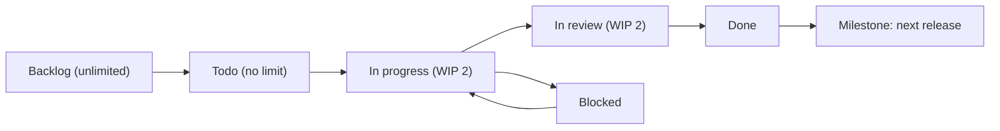

> **Section 13 · Lesson 2** · Level: beginner · ~15 min · Prereq: [Issue-driven development](13-Issue-Driven-Development)

## Why this matters

A board answers one question at a glance: what is actually moving, and what is stuck. Without one, "how is it going?" is answered from memory, and work that nobody touched for a month looks exactly like work in progress. A board is a view over issues, not a new system to maintain — and it is the difference between a backlog you can trust and a folder of good intentions.

## Four columns and two fields

Columns are status, and you need very few: **Backlog**, **Todo**, **In progress**, **In review**, **Done**. Three of them are mostly storage. The only column whose size matters is *In progress*.

Two fields do the work:

- **Status** — where the item is. It must be derivable from reality (a merged PR means Done) so it cannot quietly lie.
- **Priority** — P1/P2/P3 or High/Medium/Low. One field, one meaning.

Area labels are the third useful thing but not a field: a label like `area:auth` or `area:cli` makes the board queryable. Combined with a conventional-commit prefix in pull request titles, it also becomes machine-readable for changelogs and release notes.



The WIP limits are not decoration. Work in progress is a count of things you are paying attention to; past three or four, everything slows down, including review latency.

## A sprint is a time box, not a ceremony

A sprint is a deadline you chose, typically one or two weeks, with a scoped list of items you intend to finish. That is the whole idea. You do not need planning poker, story points, velocity charts or a daily stand-up to get the benefit — you need a date, a short list, and a review at the end.

The point of the box is that it forces the question "what will I *not* do this week?" A sprint that contains everything is a to-do list with a calendar picture.

Two habits make it real:

- **Scope is committed, date is fixed.** If work expands, cut items rather than extending the box. Otherwise the box means nothing.
- **Close the box honestly.** Move unfinished items back to Todo and delete the ones you now know you will not do. A sprint that ends with nothing carried over is usually a sprint you under-filled.

## Keeping the board honest

Boards rot in predictable ways. Three counter-moves:

- **A weekly review, fifteen minutes, same day.** Walk the columns. Every item gets one of four actions: advance it, re-scope it, block it with a note, or close it. Nothing is left untouched twice in a row.
- **Stale item rule.** An item with no activity for two weeks is either not important or not specified well enough. Both answers are useful; the status quo is not.
- **One "Blocked" column with a reason in the comment.** Blocked is a real state and hiding it inside "In progress" costs you the only signal that would have let you help.

## Automation, and where it stops

Automation should handle the mechanical transitions and nothing else:

```yaml
# .github/workflows/board.yml (sketch)
on:
  pull_request:
    types: [opened, ready_for_review, closed]
jobs:
  move:
    runs-on: ubuntu-latest
    steps:
      - run: echo "move linked issue to In review on open, Done on merge"
```

Two hard-won limits:

- A card should never move backwards automatically. Reopening a closed PR or re-running a workflow will surprise you if it does.
- The API can set status and comment, but it cannot decide. Automation that closes items on a timer will close things you meant to keep.

Keep the automations to "PR opened moves the issue to In review" and "PR merged moves it to Done". Everything else stays a human decision, because everything else needs judgement about whether the work is actually finished.

## Milestones and labels

A milestone is a release. Attach issues to it and the milestone view tells you what is genuinely fixed to ship, separately from the backlog. Labels are the taxonomy: `area:*` for what the code touches, `type:*` for what kind of work it is, `priority:*` if you prefer labels to fields. The reason to be consistent is that labels are how you find things when nobody remembers the number.

## Solo devs

If you are one person, you still got the benefit of the board when you forgot why a branch existed. Use three columns, drop the sprint, keep the weekly review, and cap *In progress* at two. A lightweight board beats no board; no board beats nothing but the appearance of process — the ten-column enterprise board that nobody updates has negative value, because it produces a confident wrong answer.

## Try it

1. Create a project board with Backlog, Todo, In progress, Blocked, In review, Done. Add the two fields: Status and Priority.
2. Move every open issue you already have onto it, and delete anything you know you will not do.
3. Set *In progress* to a limit of two, and put a note on the board saying so.
4. Label ten issues with `area:*` and `priority:*`, then run one saved query: `label:bug -label:priority:p1`.
5. Pick a one-week sprint: choose at most four items, and write down what you are not doing this week.

## Common mistakes

- **Ten columns** — every extra column is a decision you have to make each time you touch an item. Six is the ceiling for a small team.
- **A board nobody updates** — an out-of-date board is worse than none, because people act on it. Update it at the moment work changes, and review it weekly.
- **Story points and velocity theatre** — estimating in points and charting the estimate teaches you about your guesses, not your delivery. Estimate in days or not at all.
- **Closing items to make the board look green** — the board's job is to tell the truth, including the unwelcome parts.
- **Automation that closes work on a timer** — it will retire issues that were waiting on a dependency. Automate transitions, never decisions.
- **A backlog as a graveyard** — a 300-item backlog is a list of things you have decided not to do. Delete some.

## Key takeaways

- The board is a view over issues; status and priority are the only fields you must have.
- A sprint is a fixed time box with committed scope — cut scope, never extend the box.
- Cap work in progress at two or three; past that, review latency grows and quality drops.
- Review the board once a week and give every item a decision; stale items get deleted or re-specified.
- Automate transitions (PR opened, PR merged), never judgement.
- Milestones are releases, labels are the taxonomy — be consistent so the queries work.

## Further learning

- [Best practices for Claude Code](https://www.anthropic.com/engineering/claude-code-best-practices) — keeping session scope as small as a well-cut issue, which is what a WIP limit enforces on your week.
- [GitHub Docs](https://docs.github.com/) — projects, labels, milestones and the API used by the automations above.
- [Issue-driven development](13-Issue-Driven-Development) — the shape of the items that land on the board.
- [Code review for AI code](13-Code-Review-For-AI-Code) — why "In review" deserves its own WIP limit.
